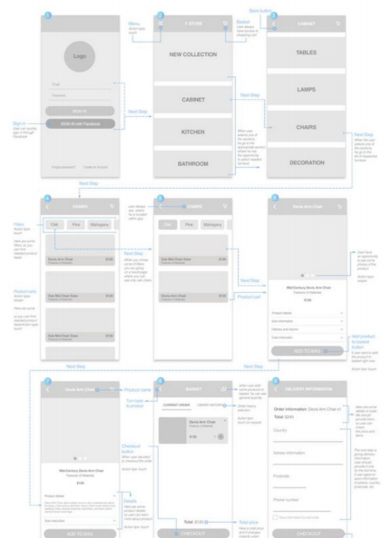

# Módulo 8. Arq. Información, UX, Wireframes, Iconos, SEO, SASS. @Media

## [Tema 1. UX - a11y - Herramientas para a11y](https://www.youtube.com/watch?v=cD-WujTzdkU)

**IxD. Diseño de interacción**
- El diseño de interacción es una disciplina que trata de armonizar la relación interactiva entre el comportamiento de las personasal utilizar productos y el comportamiento de dichos productosal ser utilizados.

**Usabilidad**
- Atributo objetivo, porque es medible y se basa en lo eficaz, eficiente y satisfactoria que sea la interfaz que estemos evaluando.

**Experiencia de usuario**
- Es un concepto importado del área del marketing, y se trata de una disciplina que intenta describir la relación entre las personas y la tecnología desde una perpestiva más global e inclusiva.

**Interfaz de usuario**
- Medio con el que el usuario se puede comunicar o intercambia información con el producto o servicio.

**Accesibilidad**
- Debe ser entendida como parte de y al mismo tiempo requisito para la usabilidad.
- Grado en el que todas las personas pueden utilizar un objeto, visitar un lugar o accededer a un servicio independientemente de sus capacidades personales.
- W3C
  - Web Accessibility Initiative
  - WCAG 2.1 - Web content Accessibility Guidelines
    - Perceptible
    - Operable
    - Comprensible
    - Robusto
  - Niveles de conformidad: A, AA, AAA
- Se puede evaluar con ACHecker.


### Tema 1. Ejercicio opcional
**Parte 1**

Elige un sitio web en el que estés trabajando o sobre el que tengas curiosidad si cumple con los estándares de la WAI para la creación de páginas web accesibles. Partiendo de la URL del sitio web elegido, selecciona al menos dos validadores de código y comprueba cuántos errores de accesibilidad tienen.

Te recomendamos pasar los siguientes validadores:

- HTML(url): https://validator.w3.org/
- CSS(url): https://jigsaw.w3.org/css-validator/
- Color(url): https://www.checkmycolours.com/
- WCAG (url): 
  - https://achecker.ca/checker/index.php
  - https://fae.disability.illinois.edu/anonymous/?Anonymous%20Report=/
- WCAG (extensión navegador): 
  - https://chrome.google.com/webstore/detail/siteimprove-accessibility/efcfolpjihicnikpmhnmphjhhpiclljc?hl
  - https://squizlabs.github.io/HTML_CodeSniffer/

**Parte 2**

Elige cualquiera de los ejercicios que has desarrollado durante este curso, pasa los test anteriores (u otros que consideres de esta lista de validadores
https://www.usableyaccesible.com/recurso_misvalidadores.php#adecuacion) y corrige el código para que sea accesible.

## [Tema 2.a Figma I. Arquitectura de información con Figma (conceptos y registro)](https://www.youtube.com/watch?v=ujGLkQpRpKY)

**Arquitectura de la información**
- Diseño estructura de los entornos de información compartidos.
- Arte y ciencia de organizar y etiquetar SW y sitios webs para apoyar la usabilidad y la facilidad de encontrar contenidos.

**Sitemap**
- Diagrama que sirve para informarnos acerca de la estructura del sitio, etiquetas y las relaciones entre páginas.
- No suelen mostrar páginas interiores o finales.
- Ayudan a mostrar gráficamente el contenido que previamente se han incluido en un inventario de contenidos.

**Wireframes**
- *Esquema de páginas o plano de pantalla*
- Guía visual que representa el esqueleto o estructura visual de un sitio web o aplicación.
- Esquematiza el diseño de la página, incluyendo elementos de la interfaz, sistema de navegación y como funciona en conjunto.
- No son exhaustivos.
- Según los detalles que se incluyan pueden ser de bajo, medio o alto nivel.
- Permiten explorar el contenido, navegación e interacciones de forma independiente a los elementos visuales.
- Herramientas
  - Adobe XD
  - Figma



**Diseño atómico**
- Metodología para crear sistemas de diseño.
- Niveles
  - **Átomos**: bloques básicos: textos, botón, colores
  - **Moléculas**: grupos de átomos (buscador)
  - **Organismos**: grupo de moléculass (cabecera de página)
  - **Plantillas**: grupo de organismos (no_sidebar_page)
  - **Páginas**: instancias de plantillas (página de inicio)


**Sistema de diseño**
- Consiste en una serie de elementos y patrones de diseño, reglas que evolucionan y rigen la composición de un producto digital.
- Tienen una **unidad mínima** de la que se parte para definir **alturas, tamaños y distancias**.
- La unidad mínima puede ser múltiplos de 8px.

**Prototipo**
- Modelo representativo o simulación del producto.
- Da paso a especificaciones sobre la interacción más complejas, como la transaición o la recarga parcial (AJAX).
- En un prototipo se ha aplicado el sistema de diseño que se haya creado, tomando como base a la identidad corporativa del proyecto.
- GUI
  - Sketch
  - InVision
  - [Figma](https://www.figma.com/)
    - Gratuito
    - Colaborativo y tiempo real
    - Bastantes plugins
    - App de escritorio + navegador
    - Vectorial (SVG)
  - AdobeXD
  - [Más info](https://uxtools.co/tools/prototyping/)

## [Tema 2b. Figma II. Arquitectura de información con Figma](https://www.youtube.com/watch?v=-LlgF1IX5Po)

- Explicación de cómo funciona Figma.

### Tema 2. Ejercicio opcional

**Sitemap con Figma**

Imagina que te estás planteando crear tu sitio web personal, en el que quieres incluir diferentes páginas con tu biografía, tus estudios y experiencia laboral, tus trabajos y colaboraciones en diferentes proyectos, tu gustos musicales y hobbies, tu contacto y un blog.

Tal y como hemos visto, el primer paso para atacar esta arquitectura de información va a ser crear un mapa del sitio con el que poder dimensionar el sitio web. Siguiendo la estructura que planteamos en este enunciado tendríamos:

- Home
- Biografía
- Estudios y experiencia laboral
- Trabajos y colaboraciones
- Hobbies
- Blog (entradas)
- Contacto
 
Con Figma crea el mapa de sitio para tu web personal. Puedes seguir la estructura que proponemos en este enunciado o crear una propia. No es necesario que tu mapa de sitio tenga mucho detalles. En las siguientes lecciones avanzaremos en el uso Figma y podrás empezar a preocuparte por los detalles de tus diseños.


## [Tema 3. Figma III. Wireframes y prototipo con navegación](https://www.youtube.com/watch?v=7oPvHXUnO2w)

- Continúa la explicación de cómo funciona Figma. 
  - Realizar más pantallas.
  - Vincular wireframes.
  - Probar una demo

### Tema 3. Ejercicio opcional

**Wireframing**

Partiendo del ejercicio anterior, en el que proponías un sitemap para tu sitio web personal, tendrás que generar unos planos de pantalla para las diferentes vistas. En nuestro caso, siguiendo con el ejemplo que proponíamos, tendríamos la siguiente estructura:

- Home
- Biografía
- Estudios y experiencia laboral
  - Trabajos y colaboraciones
- Hobbies
- Blog (entradas)
- Contacto

Tendríamos que diseñar en este caso la estructura de página principal (home), asegurándonos de incluir un menú de navegación que nos permita tener en el mismo nivel de profundidad seis páginas, a las que podremos acceder desde la propia página principal.

Es importante asegurar también que el usuario de ese menú puede moverse a cualquiera de las páginas del conjunto esté donde esté. También que sepa en qué página está en cada momento.

Otro dato a tener en cuenta a la hora de construir los menús de navegación, es que no deben ser diferentes en cada una de las páginas, sino que debemos tratar de mantener el mismo menú con las mismas opciones en todas las páginas.

Con Figma, crea una página nueva para los planos de pantalla de tu web personal. Dentro de la página crea tantos “Frames” como vistas o páginas diferentes tenga tu sitio. Crea la estructura de las páginas, incluyendo los componentes que deberían ir en cada una:
cabecera, menú o menús de navegación, imágenes, tarjetas de contenido, pie de página, etc…

En páginas como estas: http://designsnips.com/ https://ui-patterns.com/ puedes encontrar inspiración para montar las plantillas de tu sitio web.

No es necesario que tus planos de pantalla tengas muchos detalles. En la siguiente lección avanzaremos en el uso sistemas de diseño y podrás empezar a preocuparte por los detalles gráficos de tus prototipos.

## [Tema 4. Figma IV. Diseño de Interfaces Gráficas de Usuario](https://www.youtube.com/watch?v=DSwDFeqXyPw)

**Retícula**
- Sistema de reaciaonalización de espacio.
- Permite relacionar los elementos tipográficos, imágenes, formas con el formato o entre si.
- En el caso de diseño de interfaces gráficas el formato será el tamaño del *viewport* o el tamaño de un Frame.

**Tipografía**
- El sistema de proporciones en diseño gráfico siempre se establece con el tamaño de la tipografía (tamaño de interlineado).
  - Marca el ritmo para generar las proporciones.
- Si se decide tener un interlineado de 24px, conviene que **todo** sea relacionado con ese tamaño: márgenes, espacios entre columnas, sangrías, espacios entre párrafos, etc.


**Ritmo vertical**
- Se suele crear con el tamaño del interlineado, y con este ritmo vertical se puede decidir los tamaños de márgenes, paddings, otros tamaños de letra o interlineado de otros tipos de párrafo.

**Ritmo horizontal**
- Se crean columnas cuyo tamaño se desconoce.
- La proporcionalidad con el módulo de la línea base se introduce en la **medianil o gutter** (espacio entre columnas).

**Design system**
- "Cómo crear sistemas de diseño".
- Se crea un sistema de diseño sencillo, con estilos básicos que se usarán en la web o en la app.
- Esto facilita la creación y que escale de manera coherente.
- **Sistema de diseño**
  - Sistema de tipografía.
  - Retículas y espaciados.
  - Colores y degradados, así como tintas de ese color.
  - Efectos como sombras, overlays, etc.
  - Animaciones.
  - COmponentes diseñados a aprtir de lo anterior.

**Componentes**
- Pieza resusable que se diseña una vez y que se copia iterativamente.
  - Si se modifica el original, se modifica la copia.
- **Creación de un componente**
  - Seleccionar elemento > (click derecho) *create component* 
  - Quedan almacenados en la barra lateral de **Assets**. Se pueden reutilizar.
  - *Detach instance*: vuelve independiente la copia.
- **Constraint**
  - Algunos componentes son complejos con varios elementos y se quiere tener un control sobre el posicionamiento de los elementos internos del componente


- **Scale**: se relaciona proporcionalmente con el tamaño del componente entero como fue diseñado en el componente.
- **Left, right, top, bottom**: respeta las distancias a los bordes tal cual fue diseñado.
- **Center**: respeta la distancia al centro.
- **Left-Right, Top-Bottom**: respeta la distancia a izquierda y derecha al mismo tiempo sin escalar los elementos que pueda contener.
  - Se usa mucho para componentes complejos que contengan otros componentes
  - Revisar información de Figma.
- Más información
  - [Youtube - Tutorials: Create your design system in Figma](https://www.youtube.com/playlist?list=PLXDU_eVOJTx5LSjOmeBYMuvaa4UayfMe4)
  - [Youtube - Tutorials: Prototype while you design](https://www.youtube.com/playlist?list=PLXDU_eVOJTx7aqRW3Skp1aRT9ktC3ctqA)

## [Tema 5a. Incluir iconos: fuentes de iconos y SVGs](https://www.youtube.com/watch?v=Pp-rkNHBlUI)

- Fuentes
  - Fontawesome
  - Material icon
- SVG
  - En línea
  - sprites
  - Recursos
    - Flaticon
    - Iconmoon
- Recursos

### Recursos
- https://www.intechnic.com/blog/icon-usability-best-ux-tips-and-design-guidelines/
- https://dev.to/linuxfuture/icon-fonts-vs-svgs-an-ultimate-guide-to-accessible-web-icons-2lh6
- https://svgontheweb.com/
- https://glyphter.com/
- https://transfonter.org/
- https://icomoon.io/
- https://fontawesome.com/
- https://material.io/resources/icons/?style=baseline
- https://onlinefontconverter.com/

**Plugins de Figma**


## [Tema 5b. Incluir iconos: fuentes de iconos y SVGs](https://www.youtube.com/watch?v=nTAHU37GLHE)

- Ejemplo práctico

### Tema 5. Ejercicio opcional

**Iconos**

Esta práctica consiste en crear un menú vertical similar al que ha diseñado Twitter para una página ficticia a tu elección. Si no se te ocurre ningún ejemplo sobre el que podías trabajar, puedes copiar el propio menú vertical de twitter.


Como podemos apreciar en esta imágen la red social recurre a los iconos como forma de reforzar gráficamente el etiquetado de las opciones del menú. En tu caso debes hacer lo mismo. Para todas las opciones de menú, salvo para el perfil, deberás usar una fuente de iconos personalizada, generada por tí desde https://www.flaticon.com/ o https://glyphter.com/  Los iconos pueden estar diseñados por tí con algún programa vectorial como Illustrator, o puede tratarse de una recopilación de uno o varios paquetes de iconos preexistentes. En total tu fuente de iconos tendrá 8 iconos: Icono-logo (equivalente al logo de twitter), inicio, explorar, notificaciones, mensajes, guardados, listas y más opciones.

Cuando hayas generado tu fuente de iconos, debes descargarla e incluirla en tu proyecto web. Para ello recurriremos al método “self-hosted” (auto-alojado o alojado en nuestro propio servidor), añadiendo los estilos pertinentes con @font-face en nuestra hoja de estilos CSS.

Para el perfil, deberás elegir cuatro iconos SVG de caras de usuarios en https://www.flaticon.com/ y descargarlos como sprite SVG. Para incluir el icono de perfil en tu página web, recuerda que el método sprite te permite elegir qué icono quieres mostrar, pero por defecto no aparece ninguno aunque añadamos el código completo del sprite.

## [Tema 6. Search Engine Optimization (SEO)](https://www.youtube.com/watch?v=xXzKbKl1GQY)

- **Factores internos (on-site)**: se refieren a información que el buscador puede encontrar en nuestras páginas.
- **Factores externos (off-site)**: son los que tienen que ver con la popularidad, sobre todo medida por los enlaces externos que apuntan o recomiendan nuestra información.

**Metadatos**
- Permiten potenciar las palabras claves para las que deseemos posicionarnos, pero también aportan la información que permite identificar un recurso.
- Todo el contenido debe estar correctamente etiquetada.
- **Título y descripción**: los más importantes.
  - El título debe tener **hasta 55 caracteres** aprox.
  - Descripción **máx. 155 caracteres**.
- Resultado enriquecidos, mediante el uso de datos estructurados.
  - Los datos estructurados son código que puedes añadir a las páginas para describir su contenido y ayudar a que los buscadores comprendan mejor lo que contienen.
- Página y redes sociales
  - Existen etiquetas de metadatos específicas para Facebook o Twitter.
  - Facebook utiliza OpenGraph.
  - Twitter utiliz Twitter Cards

**Contenido**
- Mejorar los aspectos semánticos para asegurar la correcta interpretación y clasificación de los contenidos por parte del buscador.
- El uso de las etiquetas  semánticas del HTML5, ayudan a los buscadores a discriminar el contenido de la página, en section y article, del contenido complementario incluido en del aside y del contenido común para varias páginas, como son la cabecera, los menús, el pie.
- Usar los **encabezados** H1 a H6 con sentido lógico según el contenido y lo usarlos para formatear el texto.
  - Del mismo modo que se diseña el esquema con un índice de un artículo, considerar cuáles son los puntos principales y secundarios del contenido de la ágina.
- Usar la huella de navegación **BreadcrumbList**.
  - Fila de enlaces internos situada en la parte superior de una página que permite a los visitantes volver rápidamente a una sección anterior o a la página de inicio.
- Utilizar URLs amigables que transmitan información sobre el contenido, tanto el nombre de la página como el nombre de los directorios.
- Si hay contenido duplicado, utilizar el atributo "**rel='canonical'**".
- Si hay páginas que pueden quedar obsoletas o tienen muchas URLs distintas, hay que realizar un **redireccionamiento 301**.
- Es importante tener una estructura de enlaces internos que favorezca el acceso a toda la información, basándonos en una página de inicio a través de la cual se puede acceder a todo el contenido.
- **Evitar** el uso de enlaces en imágenes.
- **Obligatorio** el diseño *responsive*.

**Robots.txt**
- Ayuda al buscador a encontrar y restringir su acceso a contenido que conviene y que no conviene que sea indexado.
- Para evitar que una página sea indexada se usa la etiqueta "**NOINDEX**".

**Sitemap**
- Crear un mapa web de navegación para los usuarios (sitemap.xml).
- Debe incluir todas las URLs relevantes del sitio web y también las fechas de actualización.
- Evitar tener enlaces rotos.
  - Tener una página de **eror 404** personalizada y que redirija a una página operativa puede mejorar la experiencia de usuario.
- Si las imágenes son parte importante del contenido, se aconseja introducirlas en el Sitemap.

**Recursos**
- https://developers.google.com/search/docs/guides/intro-structured-data
- https://search.google.com/structured-data/testing-tool?utm_campaign=devsite&utm_medium=jsonld&utm_source=intro-structured-data
- [OpenGraph](https://ogp.me)
- [Twitter Cards](https://developer.twitter.com/en/docs/twitter-for-websites/cards/guides/getting-started)

## [Tema 7. Preprocesadores CSS](https://www.youtube.com/watch?v=c_4ShX--D4o)

- **Preprocesador**: tecnología que toma un lenguaje que está orientado a compilarse o transformarse y dar como resultado un archivo en otro lenguaje más simple.
- CSS
  - SASS
    - Se pueden usar variables
    - Anidar códigos
    - Modularizar código
    - Hacer mixins de funciones
    - Funciones
    - Bucles, condicionales, etc.
  - Stylus
  - Less
- SASS no se interpreta en el navegador. Genera el CSS. Es necesario un **preprocesador** que convierta SASS a CSS.
- Plugins VS Code
  - Live Sas Compiler
    - Preferences > Settings > "Open Settings JSON" > "liveSassCompile.settings.formats" > "savePath": "assets/css/"
  - Sass


## [Tema 8. Responsive Web Design con Preprocesadores](https://www.youtube.com/watch?v=TjCpy_tlUaw)

- Se pueden aplicar *@media screen* de manera particular y así no repetir código como se utilizan de manera tradicional.


**Mixins**
- Hace referencia a "funciones" dentro de SASS.
- Se insertan cerca de las variables.

```css
/* Mixin */
@mixin media($bp) {
    @media screen and (max-width: $bp) {
        @content;
    }
}

@include media($bp02) {
  font-size: 17px;
}
```


**Recursos**
- https://eduardoboucas.github.io/include-media/
- https://scotch.io/tutorials/how-to-use-sass-mixins
