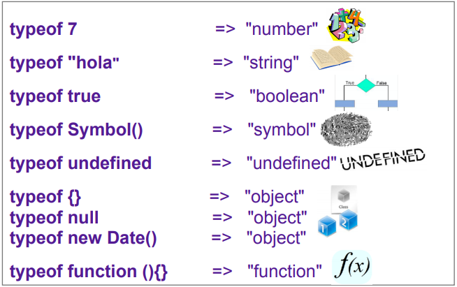
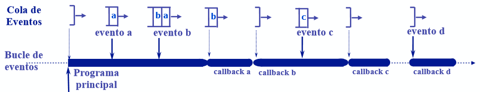
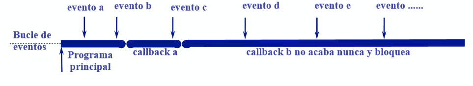

# Módulo 5. Tipos Y Clases, Herencia, Number, Multi-Asignación, Spread/Rest

## Tipos primitivos, clases predefinidas, typeof y belongsto y métodos propios y heredados
```Tipos primitivos```
- Number
- String
- Boolean
- Sýmbol (**nuevo en ES6**)
  - Claves de hash
  - Se crean con **Symbol()**
- Undefined

```Clase Object```
- Un objeto es una agregación de propiedades y métodos.
- Se agrupan en **clases**: Object, Array, Date, Function...
  - Objeto **null**: valor especial que representa objeto nulo

```Operador typeof```
- Determina a qué tipo pertenece un elemento de JavaScript.
- Todos los objetos (de cualquier clase) devuelven **object**, savo las funciones.



```Clases predefinidas```
- Object
- Array
- Date
- Function
- RegExp
- Error
- Number, String y Boolean
- **Nuevas**: Promise, Map, Set, Typed Arrays (introducidas en ES6+)

## Jerarquías de clases, constructores y literales
- La clase Object es la raíz de la que derivan todas las clases de Javascript.
  - Las demás clases predefinidas extienden la clase Object.
    - Una clase **hereda** los **métodos** y **propiedades** de la clase que extiende y añade otros nuevos.
  - JavaScript permite definir nuevas clases, además de las predefinidas existentes.

```Clase```
- Una clase es el conjunto de objetos del mismo tipo creados con su constructor.
  - El constructor tiene el mismo nombre de la clase y crea objetos con el operador **new**: new Object(), new Date(), new Array(), new Function()...
- Algunas clases predefinidas tienen **literales**:
 ```javascript
 // Literal de objetos
 {a:3, b:"hola"};     // { } Crea un objeto vacío igual que new Object()

 // Literal de arrays
 [1, 2, 3];           // [ ] Crea un array vacío igual que new Array()

 // Literal de función
 function (x) { ... } // (x) => { ... } el literal de funciones arrow de ES6

 // Literales de Regexp
 /(hola)+$/
 ```
 - Valores de los tipos primitivos **number, string y boolean** se traducen automáticamente a objetos de **Number, String** o **Boolean** al invocar métodos en dichos valores.

```Herencia y operador instanceof```
- Todas las clases de JavaScript **derivan de la clase Object** (la extienden).
  - Los objetos de una clase pertenecen también a la clase padre de la que derivan.
- **instanceof** determina si un valor pertenece a una clase.

```javascript
({}) instanceof Object;     // true - { } es un objeto aunque esté vacío.
({}) instanceof Array;      // false - { } no es un Array, pertenece solo a Object.

[] instanceof Array;        // true - [] es un array vacío
[] instanceof Object;       // true - [] Array deriva de object

(function(){}) instanceof Function;   // true - function(){} es una función vacía
(() => {})) instanceof Function;      // true - () => {} es una función vacía definida con "=>"

""  instanceof String;            // false - "" es un tipo primitivo (no son objetos)
new String("") instanceof String; // true - new String("") pertenece a la clase String.
```

```Métodos heredados```
- **Método**: es una función invocable sobre un objeto con el operador punto ".".
  - Ejemplo: **new Date().toString()**
- Un objeto **hereda** las propiedades y métodos de su clase.
  - Ejemplo. Los objetos de la **clase Date** heredan métodos como:
    - toString(), getDay(), getFullYear(), getHours(), getMinutes(), etc.


```Métodos propios```
- Una **función** asignada a una **propiedad** de un objeto, crea un **método**.
  - Este método, denominado **propio**, solo se puede invocar el **objeto** que lo contiene
    - Este método no existe en los demás objetos de la clase y da error al invocarlo en ellos.
  - **this** es una referencia al objeto sobre el que se invoca un método.
    - **this.count** referencia a la propiedad **count** del objeto sobre el que se invoca.
      - **this** puede omitirse si no hay ambigüedad y en el ejemplo se podría utilizar **count** en vez de **this.count**.


```Number: Literales de dec., hex., oct. y bin., NaN, Infinity, mod. Math y clase Number```


## Funciones, métodos y módulos de **number**

```javascript
// Number(a) - Función de conersción a number
Number('60');     // 60
Number('1e2');    // 100
Number('1.3e2');  // 130
Number('01xx');   // NaN
Number('5e500');  // Infinity
Number('5e-500'); // 0

// Métodos
toFixed(n);         // Devuelve string equivalente con n decimales
toPrecision(n);     // Devuelve string equivalente con n digitos
toString([base]);   // convierte a string equivalente en base

// Módulo Math
sin(x)
cos(x)
asin(x)
log(x)
pow(x,y)
sqrt(x)
abs(x)
ceil(x)
floor(x)
round(x)
min(x,y,z...)
man(x,y,z...)
random()
```

```Arrays: Asignación múltiple y spread/rest (...x)```
- La **asignación múltiple** permite **asignar un array** de valores a **distintas variables**.
  - Se puede utilizar en la definición de variable o en la asignación.
    - Las **variables deben agruparse entre corchetes** y se relacionan por omisión.
  - La asignación múltiple puede utilizar valores por defecto.
- La asignación múltiple se denomina también desestructurada (*destructuring*)


```Operador spred/rest(...x)```
- Tiene semántica **spread** (esparcir) o **rest** (resto) dependiendo del contexto.
- El operador **spread (...x)** esparce los elementos de un array en otro
  - Puede usarse en un constructor de array, al invocar una función, etc.

```javascript
function sum(x, y, z) {
  return x + y + z;
}

const numbers = [1, 2, 3];

console.log(sum(...numbers));
// expected output: 6

console.log(sum.apply(null, numbers));
// expected output: 6

// -------------------
// Copiar un arreglo
var arr = [1, 2, 3];
var arr2 = [...arr]; // like arr.slice()
arr2.push(4); 

// arr2 becomes [1, 2, 3, 4]
// arr remains unaffected

// -------------------
// Concatenar arreglos

// - Antes
var arr1 = [0, 1, 2];
var arr2 = [3, 4, 5];
// Append all items from arr2 onto arr1
arr1 = arr1.concat(arr2);

// - Ahora
var arr1 = [0, 1, 2];
var arr2 = [3, 4, 5];
arr1 = [...arr1, ...arr2];
```

- El operador **rest (...x)** agrupa el **resto** de valores en un array.
  - Agrupa en un array el resto de los elementos asignados de una lista
    - El operador **rest** debe ir al final y agrupa los últimos elementos de la lista.

```javascript
function sum(...theArgs) {
  return theArgs.reduce((previous, current) => {
    return previous + current;
  });
}

console.log(sum(1, 2, 3));
// expected output: 6

console.log(sum(1, 2, 3, 4));
// expected output: 10

/* 
A function's last parameter can be prefixed with ... which will cause all remaining (user supplied) arguments to be placed within a "standard" JavaScript array.

Only the last parameter can be a "rest parameter".
*/

function myFun(a,  b, ...manyMoreArgs) {
  console.log("a", a)
  console.log("b", b)
  console.log("manyMoreArgs", manyMoreArgs)
}

myFun("one", "two", "three", "four", "five", "six")

// Console Output:
// a, one
// b, two
// manyMoreArgs, [three, four, five, six]
```


```Objetos ES6+: Literal, multi-asignación y spread/rest (...x)```

**El literal de objetos de ES5 agrupa variables en propiedades.**
- Agrupa las variables **a, b y c** en un objeto con las propiedades de igual nombre (frecuente en algunas aplicaciones) 
  - **var obj = {a:a, b:b, c:c}**
- El literal de objetos de ES6+ permite una sintáxis simplificada
  - **var obj = {a, b, c}**

```javascript
let a=5, c=3, d=4;
let obj_ES5 = {a:a, c:c, d:d};

let obj_ES6 = {a, c, d};
```

**Asignación múltiple o desestructuradora (*destructuring*)**
- La multi-asignación de ES6 se puede aplicar también a objetos.
  - En este caso asigna varias propiedades a variables del mismo nombre.
- Variables y valores asignados se relacionan por **nombre**.
  - **Variables asignadas**: deben agruparse con llaves

```javascript
let {a, c=1, d, e} = {a:5, e:3, f:4};
/*
a = 5
c = 1
d = undefined
e = 3
*/

let a, c, d;
({a, c=1, d} = {a=5, e=3});
/*
a = 5
c = 1
d = undefined
*/
```

**Operador rest/spread (...x) para objetos**
- **rest(...x)** de ES6+ puede combinarse con la asignación múltiple
```javascript
let {a, ...x} = {a:5, b:1, c:2};
/*
a = 5
x = {b:1, c:2}
*/

let a, x;
({a, ...x} = {a:1, b:2});
/*
a = 1
x = {b:2}
*/
```

- El operador **spread(...x)** de ES6 esparce propiedades en un objeto
```javascript
let x = {a:5, b:1};
let y = {...x, c:6, d:7};
// y = {a:5, b:1, c:6, d:7}
```

```Referencias a objetos: comparación, compartición y clonación de objetos```

**Valores y referencias**
- Los tipos JavaScript se gestionan por valor o referencia
  - Los tipos **primitivos** (number, string, boolean, undefined) se gestionan por valor.
  - Los **objetos** se gestionan por referencia (Object, Array, Function, Date, etc.)
- La **asignación** copia el contenido de la variable
  - En los tipos **primitivos** se copia el **valor**.
  - En los **objetos** se copia la **referencia**.
    - Si se quiere copiar el objeto hay que **clonarlo**.
- La **identidad** y la **igualdad** también se ven afectadas.
  - En los tipos primitivos **se comparan los valores**.
  - En los objetos **se comparan las referencias**.

**Identidiad e igualdad de objetos**
- Las referencias a objetos afectan a la identidad: **identidad de objetos** es **identidad de referencias**.
- Los objetos **no se comparan**, solo las **referencias**.
- La **identidad de objetos** indica que son el mismo objeto.
  - Dos objetos distintos con el mismo contenido **no son idénticos**
- Se recomienda **no utilizar** la **igualdad débil (==, !=) con objetos.

```javascript
let x = {}; 
let y = x;
// x e y contienen la misma referencia

let z = {}; // la referencia a z es diferente de x e y.

x === y;  // true
x === {}; // false
x === z;  // false

let x = {}; // x e y tienen la
let y = x; // misma referencia
let z = {}; // la referencia a z

// es diferente de
// las de x e y
y.t = 1; // Añade la propiedad t a y
x.t => 1 // x accede al mismo
y.t => 1 // objeto que y
z.t => undefined
```


**Parámetros por referencia**
- Parámetros de una función
  - Los tipos primitivos se pasan por valor.
  - Los objetos se pasan por referencia.
- Si la función modifica el objeto
  - Esta modificación **se verá a través de todas la referencias** del objeto.
    - Los cambios realizados **dentro** de la función, se verán **fuera** de esta.


**Clonar objetos y arrays**
- Permite obtener copias **no relacionadas** (no habrá efectos laterales entre ambas).

Copia superficial (**shallow**)
- Copia **solo** los valores **primitivos**, pero en los **objetos** copia los **punteros**.
  - Se puede realizar con **Object.assign(obj)** o con el *spread* **...obj**.

- Copia profunda (**deep**)
  - Crea una copia totalmente **independiente** y es **costosa** en recursos.
  - Se recomienda utilizar librerías como **lodash**
  - **JSON.parse(JSON.stringify(obj))** solo clona el objeto si sus componentes se soportan en JSON.

```javascript
// x e y son objetos diferentes
// con el mismo contenido

let x = {a:1, b:2};
let y = ...x;

x === y;      // flase
x.a === y.a;  // true
x.b === y.b;  // true
```

```Clases ES6 y Prototipos```
- Una clase es un modelo que define un conjunto de variables (atributos) y métodos apropiados para operar con dichos datos.
- Cada instancia que se crea de la clase es un objeto.


**Explicación ampliada de prototipos** [StackOverflow](https://es.stackoverflow.com/questions/2012/qu%c3%a9-son-los-prototipos-en-javascript-y-para-qu%c3%a9-sirven/2022#2022)

> Todos los objetos en JavaScript tienen una propiedad especial llamada prototype que es una referencia a otro objeto.

- Ejemplo:

```javascript
var miObjeto = {
  foo: 5
}
console.log(miObjeto.foo); // 5
```

- Aquí creamos un objeto llamado miObjeto, definimos una propiedad foo con el valor de 5 e imprimimos el valor de esta variable. Claramente el resultado es 5, pero **¿qué pasa cuando el objeto no tiene una variable foo?**. **JavaScript tratará de encontrarla en el prototype de este objeto**, y así sucesivamente hasta que la encuentre o llegue al final de la cadena de prototipo.
- Esta cadena de prototipo nos permite simular herencia (recordemos que en JavaScript no existe la herencia basada en clases), si queremos agregar métodos o propiedades a un objeto podemos hacerlo mediante el prototype.

```javascript
// Consideremos la siguiente función Persona:

function Persona(nombre, edad) {
  this.nombre = nombre;
  this.edad = edad;
}
```

- El prototipo de esta función es **Persona.prototype** y podemos añadirle más métodos o propiedades de las que tiene originalmente:

```javascript
Persona.prototype.toString = function() {
  return "[Persona: " + this.nombre + "]";
}

Persona.prototype.saludar = function() {
  console.log("Hola mi nombre es: " + this.nombre);
}
```

- Ahora vamos a crear un objeto p de tipo Persona con new, es este punto el prototipo de p es igual Persona.prototype:

```javascript
var p = new Persona("John", 33);
console.log(p.nombre); // propiedad del objeto
console.log(p.toString()); // propiedad no encontrada directamente en el objeto
```

- Por esta razón al invocar el método toString a pesar de que no es un método directo de p, JavaScript busca en el prototipo de p y sí lo encuentra y todo funciona correctamente.

- En cualquier momento podemos consultar el prototipo de un objeto con **Object.getPrototypeOf**, para nuestro caso particular:

```javascript
Object.getPrototypeOf(p) === Persona.prototype; // true
```

```Herencia de Clases en ES6```

**Herencia**
- Cuando una clase **X** hereda de otra clase **Y** quiere decir que la clase hija **X** dispone de los mimos métodos y atributos que la clase padre **Y**, además de los atributos y métodos nuevos de la clase **X**.
- Para implementar la herencia se utiliza la palabra clave **extends**
  - *clase X extends Y {}*
- La palabra **super** se usa para llamar funciones de la clase padre.
  - Se suele emplear cuando queremos mantener la funcionalidad del método heredado y añadir lógica adicional en la clase hija.
- Se pueden **sobrescribir métodos** para añadir funcionalidades a los ya heredados.

```javascript
// Ejemplo de herencia
class Worker extends User {    
	constructor(name, age) {        
		super(name, age);    
	}    

	isRetired() {        
		return this.age >= 65;    
	} 
}

let alice = new Worker("Alice", 67); 	// Alice is 67 years old alice.isRetired();
alice.show();							// true

let bob = new User("Bob", 18); 		// Bob is 18 years old bob.isRetired();
bob.show();							// Uncaught TypeError: bob.isRetired is not a function

// Sobrescritura de métodos
class Employee extends Worker {    
	constructor(name, age, earlyRetirement) {        
		super(name, age);
    this.earlyRetirement = earlyRetirement;
	}    

	isRetired() {
    if(this.earlyRetirement){
      return true;
    }else{
		  return super.isRetired();
    }
	} 
}

let chris = new Employee("Chris", 43, true);
chris.show();         // Chris is 43 years old.
chris.isRetired();	  // true
```

```Ejecucion de programas: Eventos, bucle, cola, manejadores, timers```

- JavaScript se ejecuta en un solo hilo (*thread*) del proceso asignado al navegador.
  - Primero se ejecuta el programa principal (scripts de la página)
    - Después se atiende a los **eventos** ejecutando sus **manejadores** (*callbacks*).
- La **cola de eventos** guarda los eventos pendientes de ejecutar.
  - Al **finalizar** el programa en ejecución, se **atiende** al **primer evento** de la cola.
    - Los **nuevos eventos** se **guardan en la cola** si se está atendiendo otro.
- JavaScript se queda en **espera pasiva** si no hay eventos que atender.
  - Los recursos del procesador **solo** se consumen cuando se atiende a eventos.
- JavaScript garantiza la **exclusión mutua** en el acceso a variables y objetos.
  - No se necesitan mecanismos de exclusión mutua (zonas críticas, monitores, etc)
- Los eventos se introducen al final de la cola de eventos y se ejecutan en serie empezando por el más antiguo.




**Bloqueo**: problema importante de la programación concurrente.
- Un programa (o parte) deja de ejecutarse esperando que otro acabe.
- Programa principal y manejadores (*callbacks*)
  - Puede bloquear al resto solo por **inanición** (*starvation*)
    - Si un manejador **no finaliza**, no se atienden más eventos y el servidor se **bloquea**.
  - Un manejador **debe finalizar lo más rápido posible**. Así se garantia una pronta atención a los siguientes eventos.



**Eventos periódicos con setInterval(...)**
- JavaScript tiene funciones para programar eventos temporizados.
  - **setTimeOut(..)**: programa un evento interno temporizado.
  - **setInterval(..)**: programa eventos internos periódicos.
    - **setInterval(manejador, periodo_en_milisegundos)**
      - **Manejador o callback**: función ejecutada al ocurrir el evento.
      - **Periodo en milisegundos**: tiempo entre eventos periódicos.


