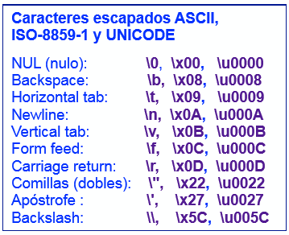
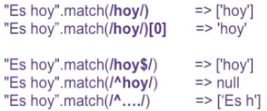
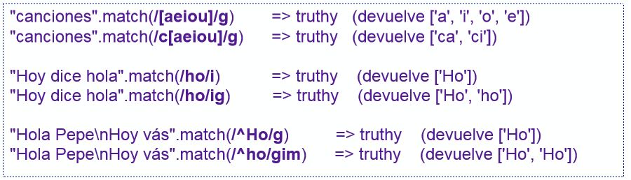

# Módulo 6. Strings, Iteradores Y Bucles, Programación Funcional Y Regexp

## Strings, códigos, UNICODE, literales, plantillas y códigos escapados.

**Código de caracteres**
- Conjunto de puntos de código dados a los símbolos de un alfabeto.
  - **ASCII**: alfabeto inglés codificado en 7 bits (128 caracteres, 95 imprimibles).
  - **ISO-8859-1,2, ... 15**: alfabeto de Europa occidental codificado en 8 bits.
  - **UNICODE**: código internalizado que contiene casi todos los alfabetos
- **Codificación**
  - Representación binaria de un código de caracteres.
  - ASCII e ISO Latin-x
  - UNICODE UTF-8: codificación binaria en 1, 2, 3 o 4 bytes, eficiente con leguas latinas.
  - UNICODE UTF-16: codificación del plano BMP (*Basic Multilingual Plane*) en 2 bytes y de otros planos en 4 bytes.
  - UNICODE UTF-32: codificación de todos los planos en 4 bytes.

**Códigos escapados**



```Iteradores y bucles: forEach, find-index, filter, map, reduce, for-in, for-of```
- Iteradores: mecanismo de programación funcional. Equivalente a los bucles.
- **Objetos iterables**: objeto compuesto cuyos componentes pueden procesarse, de uno en uno, con una función.
  - Ejemplo: un iterador puede extraer y procesar los elementos de un array, de uno en uno, desde **0** a **lenght-1**.
- **Método iterador forEach**
  - Ejecuta una función para cada elemento de un objeto iterable (ej. un array).
  - **forEach(<function>)** invoca **<function>** para cada elemento.
  - Los iterador equivalen a **bucles** en programación funcional.
    - Ejecutan la función (**parámetro**) en cada elemento de un array (u objeto iterable).


```javascript
// Elem => elemento del array accesible en la invocación en curso.
// i => índice al elemento del array.
// a => array/objeto completo sobre el que se invoca el método.
// _this => contexto.
forEach(function(elem, i, a, _this){ ... });
forEach((elem, i, a, _this) => { ... });

// For (funcional)
let n = [7, 4, 1, 23]; 
let add = 0; 
for (let i=0; i < n.length; ++i) {
  add += n[i];
} 
add;   // => 35   (7+4+2+23)

// forEach
let n = [7, 4, 1, 23]; 
let add = 0;
n.forEach(elem => add += elem);
n.forEach(elem, i => add += n[i]);
add;  // => 35   (7+4+2+23)
```

**Otros métodos iteradores de Array**
- **find((elem, i, a) => { ... } )**
  - Devuelve el primer elemento donde la función **retorna true**.
- **findIndex((elem, i, a) => { ... })**
  - Retorna el índice del primer elemento donde la función **retorna true**.
- **filter((elem, i, a) => { ... })**
  - Retorna un **nuevo array** sin los elementos para los que la función retorna false.
- **map((elem, i, a) => { ... })**
  - Retorn un nuevo array sustituyendo cada elemento por el que retorna la función.

```javascript
[7, 4, 1, 23].find(elem => elem < 3);      // => 1
[7, 4, 1, 23].findIndex(elem => elem < 3); // => 2
[7, 4, 1, 23].filter(elem => elem > 5);    // => [7, 23]
[7, 4, 1, 23].map(elem => -elem);          // => [-7, -4, -1, -23]
```

**Método reduce**
- El método reduce añade un parámetro acumulador: **acc**.
  - **acc**: variable con el valor retornado por la invocación anterior de la función.
    - Además están presentes los tres parámetros típicos de los iteradores (*element, index* y *array*).
- **reduce( (acc, element, index, array) => { ... }, acc_initialisation)**
  - Inicializa acumulador *acc* con *acc_initialisation* e itera de **0** a **array.length-1**.
    - *acc* recibe en cada iteración el valor retornado por la función en la iteración anterior.
  - Si *acc_initialisation* se omite, el valor inicial de acc es **array[0]** e itera de 1 a **array.length-1**.

```javascript
reduce( (acc, element, index, array) => { ... }, acc_initialisation);

// Example of addition of numbers with reduce 
// el acc lo usa como el acumulador de la suma (como puede pasar en un while/for cuando se suman los elementos de un array)
[7, 4, 1, 23].reduce((acc, elem) =>  acc += elem, 0);      // => 3
[1, 2, 3].reduce((acc, elem) =>  acc += elem, 1);          // => 7 (porque acc = 1)
[3, 0, 4, 0].reduce((ac, e) => ac+e, -4);                  // => 3 (porque acc = -4)

// Example which orders first the array and eliminates then duplicated numbers 
[4, 1, 4, 1, 4].sort().reduce((acc, elem, i, a)  =>  elem!==a[i-1] ? acc.concat(elem) : acc, []);   //  => [1, 4]

// sort(..) and reduce(..) are composed in series, where each one performs the following 
[4, 1, 4, 1, 4].sort();       //  => [1, 1, 4, 4, 4] 
// Comprueba si el elemento que se está procesando es el mismo que el elemento anterior (indice - 1)
[1, 1, 4, 4, 4].reduce((acumulador, elemento, indice, array)  =>  elemento !== array[indice-1] ? acumulador.concat(elemento) : acumulador, []);      //  => [1, 4]
```

**Bucles for-in y for-of**
- **for-in** permite recorrer cualquier objeto a través de los nombres del descriptor de acceso a cada elemento del objeto (índices).
  - Itera (se repite) en las propiedades de un objeto y en arrays.
    - Al iterar en **objetos**, la variable del bucle itera con el **nombre** de la propiedad (*string*).
    - Al iterar en **arrays**, la variable del bucle itera con el **índice del elemento** (*número*)
- **for-of** **solo** itera en objetos iterables, **no** en objetos.
  - La variable del bucle contiene en cada iteración **un elemento** del array (u objeto iterable).
    - En un array *for-of* comienza por el elemento de índice 0 y termina con el e length-1.

```javascript
// for-in => let i in n
let n = [7, 4, 1, 23];
let add = 0;
for (let i in n) {
  add += n[i];
}

add;      // => 35

// for-of => let elem of n
let n = [7, 4, 1, 23];
let add = 0;
for (let elem of n) {
  add += elem;
}

add;      // => 35
```

**Iterar en objetos: for-in, keys, values, entries**
- Sentencia **for-in**
  - Itera en las propiedades de un **objeto**, según el órden de creación de propiedades.
    - **p** contiene un string con el nombre de la propiedad para acceso con notación array: *obj[p]*.
  - La sentencia recorre las propiedades enumerables del objeto y de sus prototipos.
- Métodos estáticos **keys(..), values(..), entries(..)** de Object (*ES6*)
  - Devuelve un **array** con las **propiedades, valores** o **entradas** del objeto.
    - Devuelve **solo** las propiedades propias y no las de sus prototipos (conviene utilizarlas).

```javascript
Object.keys({a:3, b:2})    => ["a", "b"]           // Devuelve un array de nombres de propiedades
Object.values({a:3, b:2})  => [3, 2]               // Devuelve un array de valores
Object.entries({a:3, b:2}) => [["a",3], ["b", 2]]  // Devuelve array de pares nombre-valor

// For-in
// Se puede iterar en propiedades enumerables dentro de los prototipos (si las hubiera)
let obj = {a:7, b:4, c:1, d:23}; 
let add = 0; 
for (let p in obj) {
  add += obj[p];
} 

add    // => 35

// Object.keys
// NO itera sobre propiedads enumerables dentro de los prototipos (si las hubiera)
let obj = {a:7, b:4, c:1, d:23}; 
let add = 0; 
Object.keys(obj);     // => [ "a", "b", "c", "d"] 
Object.keys(obj).forEach(p => add += obj[p]); 
add                   // => 35
```

```RegExp I: Búsqueda de patrones```
- Mecanismo eficaz para procesar strings.
- Definen patrones que reconocen cadenas de caracteres específicas.
  - Match
- Utiliza la clase **RegExp**.
  - Constructor: RegExp("expresión-regular")
    - El string puede ser cualquier expresión regular.
  - RegExp literal: **/expresión-regular/** (utilizando la barra inclinada)

**Búsqueda de patrones**
- **"string".match(/patrón/)**: busca **/patrón/** en **"string"**.
  - Devuelve la primera ocurrencia del patrón en un array **([match])**, y si no casa, devuelve **null**.
- Algunos patrones básicos
  - **caracter**: /a/ => reconoce solo el caracter "a".
  - **secuencia**: /abc/ => reconoce la secuencia "abc".
  - **principio de string**: /^hoy/ => reconoce "hoy" al principio del string.
  - **final de string**: /hoy$/ => reconoce "hoy" al final del string.
  - **cualquier caracter**: /./ => reconoce cualquier caracter.



**Clases y rangos de caracteres**
- **Clases de caracteres**: patrón con varios caracteres alternativos entre corchetes.
  - **Ejemplo de clase de caracter**: /[aeiou]/ => cualquier vocal (minúscula)
  - **Clase negada**: /[^aeiou]/ => no debe ser vocal (minúscula)
  - **Patrón \s**: reconoce separadores => [\f\n\r\t\v\u00a0\u1680...]
- **Rango de caracteres**: patrón con un rango de caracteres ASCII alternativos.
  - **Rango de caracteres**: /[a-z]/ => rango "a-z" ASCII
  - **Patrón \w**: equivale a [a-zA-Z0-9_]
  - **Patrón \d (digit)**: equivale a [0-9]

**Controles y match()**
- **match()** admite controles:
-   **i**: insensible a mayúsculas y minúsculas.
-   **g**: devuelve array con **todos los match**.
-   **m**: multilínea, **^**, **$** representan principio y fin de línea.



```RegExp II: Repetición y alternativa```

**Operadores de repetición**
- **.** (cualquier cosa)
- **+** (una o más veces): /a+/ => casa con: "a", "aa", "aaa"
- **?** (cero o una vez): /a?/ => casa solo con: "", "a"
- **\*** (cero veces o más): /a*/ => casa con: "", "a", "aa", "aaa", "aaaa", etc.
- **{n}** (n veces): /a{2}/ => casa solo con: "aa"
- **{n,}** (n o más veces): /a{2,}/ => casa con: "aa", "aaa", "aaaa", etc.
- **{n,m}** (entre en y m veces): /a{2,3}/ => casa solo con: "aa" y "aaa"

```javascript
"tiene".match(/[aeiou]+/g);      // ["ie", "e"] Cadena no vacías de vocales.
"tiene".match(/[aeiou]?/g);      // ["", "i", "e", "", "e", ""] vocales o nada
"tiene".match(/[aeiou]*/g);      // ["", "ie", "", "e", ""] Cadena de vocales (incluyendo ""). Devuelve string vacío porque la "n" no es una vocal.
"Había un niño".match(/[a-zñáéíóú]+/ig);   // ["Había", "un", "niño] Casa con palabras en castellano: ascii extendido añadiendo ñ, á, é, í, ó, ú
```

**Repetición ansiosa o perezosa**
- Los operadores de repetición son *ansiosos* y reconocen la cadena más larga posible que casa con el patrón.
- Pueden volverse *perezosos* añadiendo "**?**" detrás.
  - Reconocerán cadenas más corta posible.

```javascript
"aaabb".match(/a+/);          // ["aaa"]
"aaabb".match(/a+?/);         // ["a"]
"ccaaccbccaa".match(/.+cc/);  // ["ccaaccbcc"]
"ccaaccbccaa".match(/.+?cc/); // ["ccaacc"]
```
**Patrones alternativas**
- Pipe ( **|** ) define dos patrones alternativos, por ejemplo:
  - **/[a-z]+/** casa con palabras escritas con caracteres ASCII.
  - **/[0-9]+/** casa con números decimales.
  - **/[a-z]+|[0-9]+/** casa con palabras o con números.

```javascript
"canciones".match(/ci|ca/);      // ["ca"]
"canciones".match(/ci|ca/g);      // ["ca", "ci"]
"1 + 2 --> tres".match(/[a-z]+|[0-9]+/g);   // ["1", "2", "tres"]
```

```RegExp III: Subpatrones y sustituciones```

**Subpatrón**
- Dentro de un patrón podemos delimitar subpatrones
  - Un subpatrón es una parte del patrón delimitada entre paréntesis.
- Por ejemplo **/(C)([aeiou])/** tiene dos subpatrones.
  - (C) es el primero
  - ([aeiou]) es el segundo
- "string".match(/patrón/) busca patrón y subpatrones en el string.
  - Devuelve array: **[match, match_subpatron_1, match_subpatron_2, ...]**

```javascript
"canciones".match(/(c)([aeiou])/);     // ["ca", "c", "a"] => C seguido de vocal, primer sub patrón "c" y segundo subpatrón "a"
"canciones".match(/(c)([aeiou])n/);    // ["can", "a"] => Patrón c + vocal + n, luego subpatrón
"canciones".match(/(..)..(..)/);       // ["cancio", "ca", "io"] => Patrón = subpatron 2 caracteres + 2 caracteres + subpatrón con 2 caracteres
```

**Sustitución de patrones**
- La clase String tiene el método **replace()** para sustituir patrones.
- La expresión: "string".replace(/patrón/, x) devuelve "string" sustituyendo el primer match de "patrón" por x.
- El patrón también puede tener controles **i, g** y **m**.
  - **i**: insensible a mayúsculay minúsculas.
  - **g**: devuelve el string con todos los "match" sustituídos.
  - **m**: multilínea, **^** y **$** representan principio y fin de línea.

```javascript
"Número: 142719".replace(/1/, "x");      // "Número: x42719"
"Número: 142719".replace(/1/g, "x");     // "Número: x427x9"
"Número: 142719".replace(/[0-9]+/, "<número>");      // "Número: <número>"
```

**Sustitución con subpatrones**
- Dentro de un patrón podemos delimitar subpatrones.
  - Un subpatrón se **delimina con paréntesis**.
- Por ejemplo **/([ae]+)([iou]\*)/** tiene dos subpatrones:
  - **$1** representa el match del primer subpatrón.
  - **$2** el match del segundo y así sucesivamente.

```javascript
"Número: 142,719".replace(/[0-9]+)(,[0-9]*)?/, "$1");      // "Numero: 142"
"Número: 142,719".replace(/[0-9]+)(,[0-9]*)?/, "0$2");     // "Numero: 0,719"
"Número: 142,719".replace(/[0-9]+)(,[0-9]*)?/, "$1.$2");   // "Numero: 142.719"
```