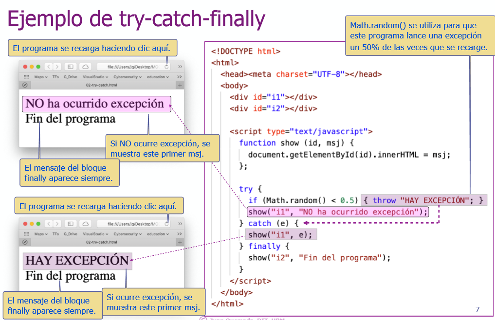
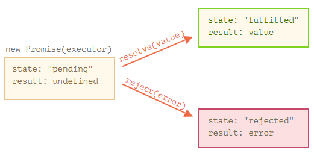
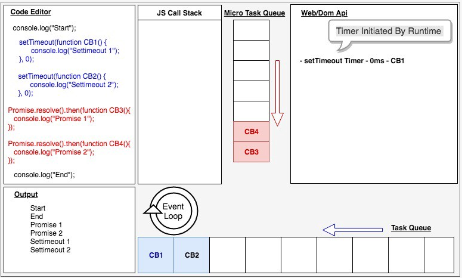
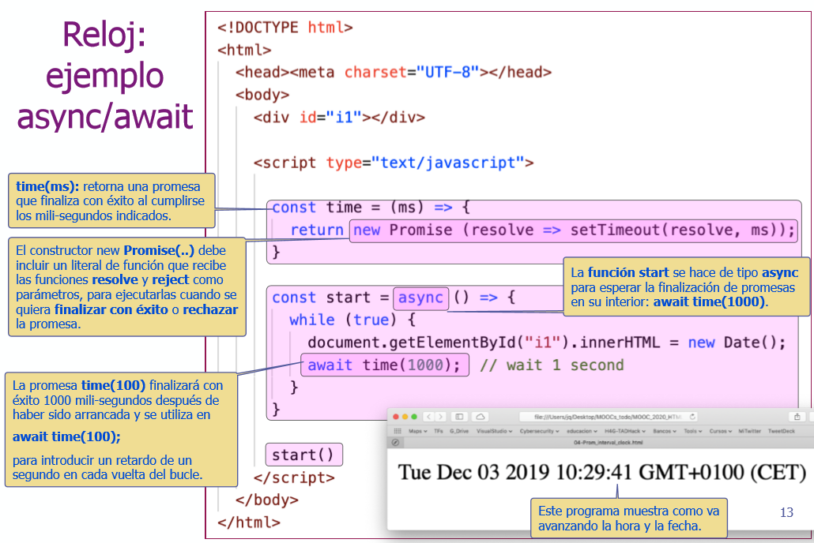
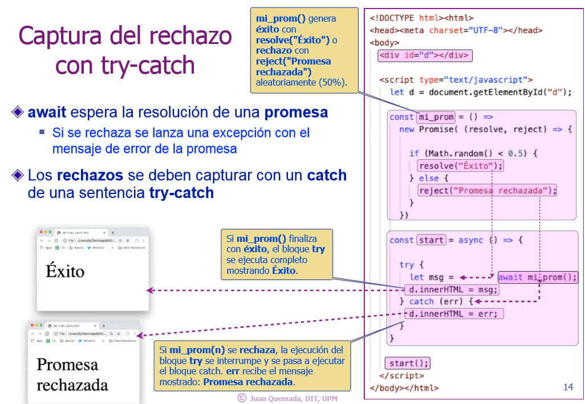
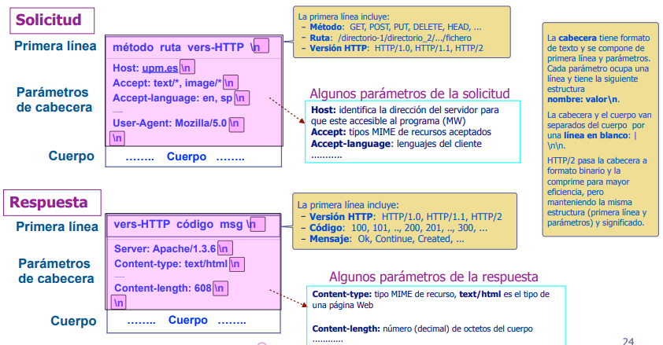
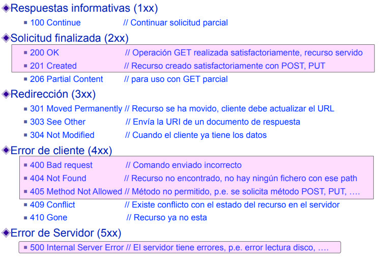
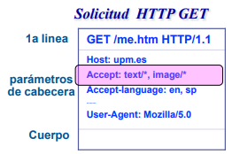
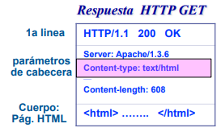

# Módulo 7. Excepciones, Promesas, Async/Await, HTTP, AJAX Y JQuery

## [Tema 1. Excepciones, errores y sentencias throw y try-catch-finally](https://www.youtube.com/watch?v=voTvXsB0JdY)

**Excepciones**
- Señal que interrumpe la ejecución de un programa.
- Se lanza con la sentencia **throw \<expr\>**
  - Ejemplo: **throw "Abort execution";**

**Errores** 
- Son **excepciones** donde **\<expr\>** pertenece a la clase predefinida **Error**.
- Un error se lanza también con la sentencia **throw \<expr\>**.
  - Ejemplo: **throw new Error("Execution error")**.

**Capturar excepciones: sentencia try-catch-finllay**
- Permite **capturar** excepciones o errores.
  - Captura solo las excepciones que ocurren **dentro del bloque *try***
- Cuando ocurre una excepción dentro del bloque ***try*** la ejecución **continúa en el bloque catch (exception)**. Se corta la ejecución.
  - *exception* contiene el parámetro de **throw \<param\>**
- El bloque **finally** se ejecuta siempre al final **ocurran o no excepciones**.
  - Se puede omitir.
- El intérprete JS también lanza errores.
  - Son excepciones con un objeto de la clase **Error**.
    - Hay muchas clases de **error** que extienden de **Error**.
    - Si ocurren dentro de ***try*** se pueden capturar con **catch**.

```javascript
try {
  ...
  -> throw "Exception"
  or throw new error("Error");
  ...
} catch (exception) {
  ...
}finally{
  ...
}
```



## [Tema 2. Promesas I: new Promise(..), resolve, reject, async, await](https://www.youtube.com/watch?v=uDG6lPJTA-8)

**Promesas de ES6**
- Se crean usando el constructor **Promise** y pasándole una función que recibe dos parámetros, **resolve** y **reject**, que nos permiten indicarle a esta que se resolvió o se rechazó.
  - Representa tareas que prometen retornar un valor en el futuro.
- Tiene tres estados para gestionar el proceso
  - **Pendiente**: antes de ejecutar la tarea asociada.
  - **Cumplida**: la tarea tiene éxito y retorna el valor prometido.
  - **Rechazada**: la tarea falla y retorna un código de rechazo.
  - Una promesa originalmente esta Pendiente. Cuando llamamos a resolve entonces la promesa pasa a estar Resuelta, si llamamos a reject pasa a estar Rechazada, usualmente cuando es rechazada obtenemos un error que nos va a indicar la razón del rechazo. Cuando una promesa se resuelve entonces se ejecuta la función que pasamos al método .then, si la promesa es rechazada entonces se ejecuta la función que pasamos a .catch, de esta forma podemos controlar el flujo de datos.
    - También es posible pasar una segunda función a .then la cual se ejecutaría en caso de un error en vez de ejecutar el .catch.
- **Ordenan** la ejecución de **funciones** (*callbacks*) en el tiempo.
  - Conservando la eficiencia de ejecución de los *callbacks* asíncronos.
    - Son sencillas de utilizar: separan el código normal del código de atención a errores.
- **Promesa**
  - Objeto de la clase **Promise** creado con **new Promise((resolve, reject) => <bloque>)**
    - El constructor debe recibir como **parámetro** una **función** (con los parámetros *resolve* y *reject*) que se ejecuta al crear el objeto.
  - **resolve(<data>)**
    - Función que finaliza la promesa **con éxito** al invocarse.
      - Devuelve la expresión ***<data>*** como valor de **éxito** de la promesa.
    - Si ***<data>*** es una promesa se espera a su resolución y se devuelve su valor de retorno.
  - **reject(<err>)**
    - Función que **rechaza** la promesa al invocarse.
      - Devuelve la expresión ***<err>*** como valor de **rechazo** (***<err>*** suele describir **causa del rechazo).

```javascript
// Ejemplo básico
const ticket = getFood();

ticket
	.then(food => eatFood(food))
	.catch(error => getRefund(error));

// A los 100ms invoca el callback resolve que le pasa el valor 5.
let mi_promesa = Promise ((resolve, reject) => {
  setTimeout( () => resolve(5), 100)
})

// Otro ejemplo
const promise = new Promise((resolve, reject) => {
	const number = Math.floor(Math.random() * 10);

	setTimeout(
		() => number > 5
			? resolve(number)
			: reject(new Error('Menor a 5')),
		1000
	);
});

promise
	.then(number => console.log(number))
	.catch(error => console.error(error));

// Antes de usar promesas
checkWeather('buenos aires', (error, weather) => {
	if (error) throw error;

	if (weather === 'well') {
		return checkFlights('buenos aires', (err, flights) => {
			if (err) throw err;

			buyTicket(flights[0], (e, ticket) => {
				if (e) throw e;
				console.log('ticket nº %d', ticket.number);
			});
		});
	}

	console.log('el clima es malo');
});

// Usando promesas
checkWatcher('buenos aires')
	.then(weather => {
		if (weather === 'well') {
			return checkFlights('buenos aires');
		}
		throw new Error('el clima es malo');
	})
	.then(flights => buyTicket(flights[0]))
	.then(ticket => {
		console.log('ticket nº %d', ticket.number);
	})
	.catch(error => console.error(error));
```

**Métodos útiles para crear promesas concisas**
- **Promise.resolve(<data>)**
  - Crea una promesa que finaliza con **éxito** y genera **<data>**.
    - La promesa finalizará con éxito normalmente salvo que **<data>** genere un rechazo
  - **Promise.reject(<data>)**
    - Crea una promesa que siempre se **rechaza** con **<err>**

```javascript
let p2 = Promise.resolve([7, 4, 1, 23]);  // Equivale a:
let p1 = new Promise((resolve, reject) => resolve([7, 4, 1, 23]));

let r2 = Promise.reject("Promesa rechazada"); // Equivale a:
let r1 = new Promise((resolve, reject) => reject("Promesa rechazada"));
```



**Promesas en paralelo**
- Hasta ahora solo vimos como ejecutar una función asíncrona a la vez (en serie), sin embargo es muy común que necesitemos realizar múltiples al tiempo, por ejemplo para obtener varios datos de un API. Para eso la clase Promise tiene un método estático llamado Promise.all el cual recibe un único parámetro, una lista de promesas las cuales se ejecutan simultáneamente, si alguna de estas es rechazadas entonces toda la lista lo es, pero si todas se resuelven entonces podemos obtener una lista de todas las respuestas.

```javascript
import { resolve } from 'path';

Promise.all([readFile('./archivo1.txt'), readFile('./archivo2.txt')])
	.then(data => data.map(resolve))
	.then(data => Promise.all(data.map(readFile)))
	.then(finalData => console.log(finalData))
  .catch(error => console.error(error));
```
- Lo que hacemos en el ejemplo de arriba es leer 2 archivos al tiempo, eso nos devuelve una lista (data) de contenidos, los cuales contienen la ruta para otro archivo, los convertimos entonces a una nueva lista de rutas absolutas (resolve) y usamos esas rutas para crear una nueva lista de promesas a partir de readFile. Si en algún momento ocurrió un error lo mostramos como tal en consola, si todo se resuelve bien entonces escribimos en consola la lista de contenidos de archivos.

**Carrera de promesas**
- Antes hablamos de ejecutar varias promesas en paralelo y obtener una respuesta cuando todas se completen, existe otro método que nos permite correr varias al tiempo, pero solo obtener el resultado de la primer promesa. Gracias a esto es posible mandar múltiples peticiones HTTP a un API y luego recibir una sola respuesta, la primera. Este método se llama **Promise.race**.

```javascript
import { resolve } from 'path';

Promise.race([readFile('./archivo1.txt'), readFile('./archivo2.txt'])
	.then(resolve)
	.then(readFile)
	.then(data => console.log(data)
  .catch(error => consol.error(error));
```
- Como vemos en el ejemplo otra vez leemos 2 archivos, pero esta vez solo obtenemos el contenido de 1, el que primero se termine de leer. O si alguno se completó con un error entonces entramos al catch y mostramos el error en consola.

**Info extra sobre promesas y callbacks**

¿Las promesas es solo sintaxis y funcionan igual que los callbacks?

No exactamente. Es cierto que las promesas manejan código que será ejecutado en algún futuro al igual que los callbacks. Nótese aquí la incertidumbre de cuándo será ejecutado este código. Sin embargo, la diferencia está en el mecanismo de las promesas. Pero antes, repasemos un poco para entender este mecanismo. El código síncrono inmediatamente se va a un lugar llamado el Call Stack, aquí la última función que entra al stack es el primero que se ejecuta y que sale del stack así hasta la primera que ingreso. Por otro lado, el asíncrono se va a una cola de tareas para su respectiva ejecución. Una vez que el Call Stack esté vacío, el Event Loop moverá las funciones que ya estén listas de la cola de tareas al Call Stack y luego pasarán a mostrar su resultado. Con esto en mente retomemos las promesas. Estas se dirigen a una cola de tareas diferente a las que van los callbacks. Los callbacks se van al Task Queue y las promesas al PromiseJobs o también llamado MicroTask Queue. Estos son manejadores de tareas, básicamente son los que deciden qué funciones son las que entran y las que salen. 



**Async/Await**
- Facilita el uso de promesas
  - Compratible con promesas de ES6 y puede mezclarse con ellas.
- **Async**
  - Define una función "especial" que retorna una **promesa**
    - **Async** se antepone a la definición de la funión: **async function suma(x, y) { ... }** o **async(x,y) => { ... }**
    - La promesa finaliza con éxito con **return <data>** o se rechaza con **throw <err>**.
    - **Async** no permite definir proesas que se resuelven en *callbacks*.
  - **Await <promesa>**: espera la resolución de la promesa y devuelve su resultado.
    - **let x = await promesa()** asigna a **x** el **valor de éxito** (en caso de éxito)
      - Pero si se **rechaza**, lanza una **excepción** que puede capturarse con una sentencia **try_catch**
    - **2*(await promesa())** o **await promesa()**.
  - **await <promesa>** solo se puede utilizar **dentro** de una **función async**.
    - No se puede utilizar en otros contextos.





**Info extra sobre Async/Await**
- La palabra “async” ante una función significa solamente una cosa: que la función siempre devolverá una promesa. Otros valores serán envueltos y resueltos en una promesa automáticamente.

```javascript
// Por ejemplo, esta función devuelve una promesa resuelta con el resultado de 1; 

async function f() {
  return 1;
}

f().then(alert); // 1
```

- **await**, solo trabaja dentro de funciones async y es muy interesante.
- **await** hace que JavaScript espere hasta que la promesa responda y devuelve su resultado.

```javascript
// funciona solamente dentro de funciones async
let value = await promise;

// Promesa que resuelve en 1 segundo:
async function f() {

  let promise = new Promise((resolve, reject) => {
    setTimeout(() => resolve("¡Hecho!"), 1000)
  });

  let result = await promise; // espera hasta que la promesa se resuelva (*)

  alert(result); // "¡Hecho!"
}

f();

// La ejecución de la función es pausada en la línea (*) y se reanuda cuando la promesa responde, con result volviéndose su resultado. Entonces el código arriba muestra “¡Hecho!” en un segundo.

// usando Promesas
callEndpoint('api/getidbyusername/davos')
  .then(results => callEndpoint('api/getfollowersbyid' + results.userId))
  .then(results => callEndpoint('api/someothercall'))
  .then(results => callEndpoint('api/someothercall'))
  .then(results => callEndpoint('api/someothercall'))
  .then(results => callEndpoint('api/someothercall'))

// usando Async Await
async function callEndpoints() {
  const userResults = await callEndpoint('api/getidbyusername/davos')
  const followersResults = await callEndpoint('api/getfollowersbyid' + userResults.userId)
  const someResults = await callEndpoint('api/someothercall')
  const moreResults = await callEndpoint('api/someothercall')
  const anotherResults = await callEndpoint('api/someothercall')
  const finalResults = await callEndpoint('api/someothercall')

  return finalResults
}

callEndpoints()
```

- **await** suspende la ejecución de la función hasta que se establezca la promesa, y luego la reanuda con el resultado de esta. Eso no cuesta ningún recurso de CPU, porque el motor de JavaScript puede hacer otros trabajos mientras tanto: ejecutar otros scripts, manejar eventos, etc.
  - Es simplemente una sintaxis más elegante para tener el resultado de una promesa que promise.then, es más facil de leer y de escribir.
  - Esto no detiene el engine del lenguaje, aún puede ejecutar otros scripts o eventos. Esto significa que está volviendo el código asíncrono en síncrono.
  - Async Await puede brillar en ciertos casos de uso donde necesitemos esperar y saber cuándo alguna función asíncrona se ejecute, por ejemplo en el caso de pedidos a una api, donde necesitemos que primero la página se llene de datos para que el usuario pueda interactuar.
- **No se puede** usar await en funciones regulares

```javascript
// Si tratamos de usar await en una función no async, habría un error de sintaxis:
function f() {
  let promise = Promise.resolve(1);
  let result = await promise; // Syntax error
}

// Ejemplo de función con async/await
async function showAvatar() {

  // leer nuestro JSON
  let response = await fetch('/article/promise-chaining/user.json');
  let user = await response.json();

  // leer usuario github
  let githubResponse = await fetch(`https://api.github.com/users/${user.name}`);
  let githubUser = await githubResponse.json();

  // muestra el avatar
  let img = document.createElement('img');
  img.src = githubUser.avatar_url;
  img.className = "promise-avatar-example";
  document.body.append(img);

  // espera 3 segundos
  await new Promise((resolve, reject) => setTimeout(resolve, 3000));

  img.remove();

  return githubUser;
}

showAvatar();

// No podemos usar await en el código de nivel superior. Por ejemplo, esto no funcionará:

// error de sintaxis en el nivel superior de código
let response = await fetch('/article/promise-chaining/user.json');
let user = await response.json();
Pero podemos envolverlo dentro de una función async anónima, como esto:

(async () => {
  let response = await fetch('/article/promise-chaining/user.json');
  let user = await response.json();
  ...
})();

async function f() {

  try {
    let response = await fetch('/no-user-here');
    let user = await response.json();
  } catch(err) {
    // atrapa errores tanto en fetch como en response.json
    alert(err);
  }
}

f();
```

**async/await y promise.then/catch**
- Cuando usamos **async/await**, raramente necesitamos **.then**, porque **await** maneja la espera por nosotros. Y podemos usar un **try..catch** normal en lugar de **.catch**. Esto usualmente (no siempre) es más conveniente.
- Pero en el nivel superior del código, cuando estamos fuera de cualquier función async, no estamos sintácticamente habilitados para usar await, entonces es práctica común agregar .then/catch para manejar el resultado final o errores que caigan a través, como en la línea (*) del ejemplo arriba.

**async/await funciona bien con Promise.all**
- Cuando necesitamos esperar por múltiples promesas, podemos envolverlas en un Promise.all y luego await.

```javascript
// espera por el array de resultados
let results = await Promise.all([
  fetch(url1),
  fetch(url2),
  ...
]);
```
- En caso de error, se propaga como es usual, desde la promesa que falla a Promise.all, y entonces se vuelve una excepción que podemos atrapar usando try..catch alrededor del llamado.


**Ejemplo**
- Vamos a suponer que estamos programando una carga inicial del perfil de usuario y que uno de los requerimientos sea que debamos mostrar la información básica del usuario, los cursos que ha tomado en la plataforma y la lista de sus amigos antes de que termine la carga. Estos recursos se consiguen por medio de una api, y cada recurso está en una diferente url. Y las url del api de los cursos y la de amigos vienen en la información del usuario en la propiedad links.

```
Información del usuario: api/user/1234
Cursos que ha tomado: api/user/1234/courses
Lista de sus amigos: api/user/1234/friends
Este es un ejemplo de la respuesta a un pedido a la url de la información del usuario
```

- Este es un ejemplo de la respuesta a un pedido a la url de la información del usuario

```
{
  user: {
    id: 1234,
    ...
    links: ['api/user/1234/courses', 'api/user/1234/friends']
  }
}
```

- Entonces tenemos que hacer 3 pedidos a la api y debemos tener acceso a su data antes de que termine la carga. Está claro lo que debemos usar, async await y promesas.
  - Vamos a crear una async function donde en primera instancia haremos un pedido a la url del usuario para obtener la información básica y los links que están como propiedad del usuario. 
  - Luego, usaremos una utilidad de las promesas, Promise.all. Esto hará que los pedidos se ejecuten paralelamente, por lo tanto el tiempo de espera se disminuye al no tener que ejectuar los pedidos de los links consecutivamente. Un detalle es que si alguno de estos pedidos falla en el Promise.all, todos fallarán. O todo o nada.
  - Dentro de Promise.all, iteraremos sobre los links con la función de los arreglos, **map**. Este recibe una función que tiene como argumento el elemento del arreglo en cada iteración, en este caso el link. 
  - Luego dentro de la función, aplicamos un arrow function que retorna un fetch al link en cada iteración. Esto hará que en cada iteración se retorne una promesa. 
  - Al final, tendremos un arreglo de estas promesas sin resolver. Para esto aplicamos await al Promise.all para que resuelva todas las promesas paralelamente. 
  - Una vez ya resueltos, obtendremos todas las respuestas de los pedidos si todo fue bien y lo guardamos en una variable **userResponse**. 
  - Por último aplicamos todo esto de nuevo para parsear las respuestas en data de tipo objeto para que Javascript pueda hacer operaciones sobre la data.
  - Por último obtenemos la data requerida para el usuario, y logramos hacer que la información se visualice por el usuario final.

```javascript
async function getAllUserInfo(id) {
  const user = await fetch('api/user/' + id)

  const userResponse = await Promise.all(user.links.map(link => fetch(link)))

  const userData = await Promise.all(userResponse.map(response => response.json()))

  return userData
}
```

**Resumen**: 
- Las promesas y async await resuelven la asincronía de distinta forma. Con las promesas no sabemos cuándo se va a resolver y con async await forzamos una espera en la función. No siempre se va a usar uno, el otro o ambos, por ello lo primero es entender el caso de uso y después empezamos a implementar todo lo que hemos aprendido aquí.
- El comando async antes de una función tiene dos efectos:
  - Hace que siempre devuelva una promesa.
  - Permite que sea usado await dentro de ella.
  - El comando await antes de una promesa hace que JavaScript espere hasta que la promesa responda, entonces:
    - Si es un error, la excepción es generada — lo mismo que si throw error fuera llamado en ese mismo lugar. De otro modo, devuelve el resultado.
    - Juntos proveen un excelente marco para escribir código asincrónico que es fácil de leer y escribir.
  - Con async/await raramente necesitamos escribir promise.then/catch, pero aún no deberíamos olvidar que están basados en promesas porque a veces (ej. como en el nivel superior de código) tenemos que usar esos métodos. También Promise.all es adecuado cuando esperamos por varias tareas simultáneas.

```javascript
// Ejercicio ejemplo
const insert = (msj) => document.getElementById("msj").innerHTML += msj;

const prom_A1 = () =>
    new Promise( (resolve, reject) => {
        insert('AA');
        resolve();
});

const prom_A2 = () =>
    new Promise( (resolve, reject) => {
        insert('AA');
        reject();
});

const prom_B1 = async () => {
    insert('BB');
    return;
};

const prom_B2 = async () => {
    insert('BB');
    throw "err";
};

const progr = async () => {..............};

progr ();

// Enunciado: Indicar el orden de los mensajes 'AA', 'BB', 'C', 'D' y 'E'

// Pregunta 1
const progr = async () => {
    try {
        insert("C");
        await prom_A2 ();
        insert("D");
    } catch (y) {
        insert("E");
    };
};
// Respuesta 1: C, AA, E

// Pregunta 2
const progr = async () => {
    try {
        await prom_A2 ();
        insert("D");
    } catch (y) {
        insert("E");
    };
    insert("C");
};
// Respuesta 2: AA, E, C

// Pregunta 3
const progr = async () => {
    try {
        await prom_A1 ();
        insert("D");
    } catch (y) {
        insert("E");
    };
    insert("C");
};
// Respuesta 3: AA, D, C

// Pregunta 4
const progr = async () => {
    try {
        insert("C");
        await prom_B1 ();
        insert("D");
    } catch (y) {
        insert("E");
    };
};
// Respuesta 4: C, BB, D

// Pregunta 5
const progr = async () => {
    try {
        await prom_B2 ();
        insert("D");
    } catch (y) {
        insert("E");
    };
    insert("C");
};
// Respuesta 5: BB, E, C
```

## [Tema 3. Promesas II: Orden de ejecución de instrucciones, then, catch](https://www.youtube.com/watch?v=H-XIr28X-Is)

- Recordar: las promesas **resolve(), reject()** o las funciones **async** son **funciones**.
  - Se ejecutan como cualquier functión y retornan al acabar.
- El ejecutar el código posterior a **await** o el bloque **catch** depende de la resolución de la problema.
  - Ambos se **encapsulan** como **callbacks**:
    - **resolve()** envía el **callback await** a la cola de eventos.
    - **reject()** envía el **callback catch** a la cola de eventos.

```javascript
/*
Órden de ejecución
- El programa principal se ejecuta primero.
  - Define primero las promesas prom y start.
  - A continuación invoca (ejecuta) start()
    - Muestra primero " E2"
    - Después invoca prom() que muestra " E1" y se rechaza.
      - El rechazo envía el callback catch a la cola.
  - Cuando start() retorna, se muestra " E5" y el programa principal finaliza.
- Se ejecuta el callback catch que muestra " E4"
*/

/*
3. prom() muestra el mensaje E1 y rechaza la promesa introduciendo el evento catch, que indica que se debe continuar por el bloque catch. A continuación retorna finalizando la ejecución de start()
*/
const prom = () => 
  new Promise((resolve, reject) => {
    document.write(" E1");
    reject();
  })

// 2. start() muestra el mensaje " E2" y ejecuta prom
const start = async() => {
  try {
    document.write(" E2");
    await prom();
    document.write(" E3");
  } catch (err) {
    /*
    5. Se ejecuta el callback catch asociado al evento catch del diagrama que el rechazo ha introducido en la cola (al llegarle el turno).
    El flujo de las funciones no se interrumpen, por eso catch se transforma en un callback.
    */
    document.write(" E4");
  }
}

// 1. start() es el primer código que se ejecuta
start();
// 4. Se ejecuta la sentencia uqe muestra " E5"
document.write(" E5");

// Resultado: E2 E1 E5 E4
```

**Métodos then y catch**
- **prom.then(<manejador>)**
  - **<manejador>** atiende el **éxito** de la promesa **prom**.
    - Propaga el **rechazo** al siguiente then(...) o catch(...)
- **prom.catch(<manejador>)**
  - **<manejador>** atiende el **rechazo** de la promesa **prom**
    - Propaga el éxito al siguiente then(...) o catch(...)
- then(...) y catch(...) devuelven promesas y pueden encadenarse.
- <manejador> de then(...) o catch(...)
  - **throw <msg>** rechaza la promesa
  - return <valor> resuelve la promesa con éxito
    - Si <valor> es una promesa, se espera a su resolución y se devuelve su éxito o rechazo.

```javascript
// Ejemplo equivalente al anterior
const prom = () => 
  new Promise((resolve, reject) => {
    document.write(" E1");
    reject();
  })

const start = () => {
  document.write(" E2");
  prom()
    .then( () => { 
      document.write(" E3");
      return;
    })
    .catch( () => {
      document.write(" E3");
      return;
    });
}

start();
document.write(" E5");

// Resultado: E2 E1 E5 E4

// Otro ejemplo
let display = document.getElementById("display");
const time = (ms) => new Promise (resolve => setTimeout(resolve, ms));

const response = (t0) => {
  new Promise((resolve, reject) => 
  display.addEventListener("click", () => {
    let t = new Date().getTime() - t0;
    if(t <= 1000) {
      resolve(t);
    }else{
      reject(`Too late: ${t}ms`);
    }
  })
  )
}

const start = async() => {
  await time(5000 * Math.random());
  display.innerHTML = "Click me in less than 1 second.";

  try {
    let t = await response(new Date().getTime());
    display.innerHTML = `Congratulations: ${t}ms`;
  } catch (msg) {
    display.innerHTML = msg;
  }
}

start();

// Mismo ejemplo con then y catch
let display = document.getElementById("display");

const time = ms => new Promise (resolve => setTimeout(resolve, ms));

const response = t0 => 
  new Promise((resolve, reject) => 
    display.addEventListener("click", () => {
      let t = new Date().getTime() - t0;

      if(t <= 1000) {
        resolve(t);
      }else{
        reject(`Too late: ${t}ms`);
      }
    })
  )

time(5000*Math.random());
  .then(() => display.innerHTML = "Click me in less thatn 1 second.").
  .then(() => 
    response(new Date().getTime())
    .then( (t) => 
      display.innerHTML = `Congratulations: ${t}ms`;
    )
    .catch( (msg) => display.innerHTML = msg );
  )
```

**Ejercicio opcional**
```javascript
onst prom_A = (x) =>
    new Promise( (resolve, reject) => {
        console.log('A1');
        (x===1) ? resolve(x) : reject(x);
        console.log('A2');
    });

const prom_B = async (y) => {
        console.log('B1');
        if (y===1) { return y;} else { throw y;};
        console.log('B2');
};

const progr = async () => {...};

progr ();

/*
Indicar el orden de los mensajes 'A1',
'A2', 'B1', 'B2', 'C', 'D' y 'E' por consola,
si progr()
*/

// Enunciado 01
const progr = async () => {
    try {
        console.log("C");
        let y = await prom_B (2);
        (y===1) ? console.log("D") : console.log("E");
    } catch (y) {
        (y===2) ? console.log("E") : console.log("D");
    };
};
// Respuesta: C, B1, E

// Encuando 02
const progr = () => {
       prom_A (2)
      .then(() => console.log("C"))
      .catch(() => console.log("D"));
      console.log("E");
};
// Respuesta: A1, A2, E, D

// Enunciado 03
const progr = async () => {
    try {
        console.log("C");
        await prom_A (2);
        console.log("D");
    } catch (y) {
        console.log("E");
    }
};
// Respuesta: C, A1, A2, E

// Enunciado 04
const progr = async () => {
    try {
        console.log("C");
        let y = await prom_B (1);
        (y===1) ? console.log("D") : console.log("E");
    } catch (y) {
        (y===2) ? console.log("E") : console.log("D");
    };
};
// Respuesta: C, B1, D

// Enunciado 05
const progr = async () => {
    try {
        await prom_B (1);
        console.log("C");
    } catch (y) {
        console.log("D");
    };
    console.log("E");
};
// Respuesta: B1, C, E
```

> APUNTE: Recordar que una promesa es una función, que
se ejecuta hasta el final. Resolve(x) o reject(x),
solo definen el resultado, pero no finalizan la
ejecución de la función, mientras que "return y"
o "throw y", si finalizan la ejecución de la
función. Recordar también que
console.log(<msg>) envía <msg> a la consola
del navegador.

## [Tema 4. HTTP: Protocolo, solicitudes, respuestas, métodos, MIME](https://www.youtube.com/embed/OgZfHsVjTCw)

### La web inicial
- Servidor web estático: programa que sirve ficheros solictados por el cliente.
- Cliente web: muestra páginas webs traídas de un servidor en internet a un usuario.
  - **http:** : protocolo.
  - **upm.es**: dirección de dominio del servidor.
  - **/dir/cal.html**: la ruta al fichero en el directorio de recursos del servidor.
- La transacción HTTP vista desde el cliente:
  - Establece una conexión TCP con el servidor.
  - Envía por la conexión una solicitud HTTP con la ruta al recurso web.
  - Recibe por la conexión la respuesta HTTP con el fichero (página web).
  - El servidor cierra la conexión TCP.

### HTTP hoy
- Soporta acceso hypermedia a páginas web y a otros servicios de internet.
  - Evolución: HTTP 0.9 -> HTTP 1.0 -> HTTP 1.1 -> HTTP/2
- Transacción HTTP
  - Una transacción HTTP se inicia siempre desde el lado del cliente.
    - El cliente establce la conexión HTTP con el servidor o reutiliza una existente.
    - El cliente envía solicitudes **HTTP** al servidor por la conexión **HTTP**.
      - Pueden enviar varias solicitudes en paralelo al servidor (conexión paralela).
    - El servidor contesta al cliente enviando **Respuesta HTTP** por la conexión.
  - Solicitud y despues son **envíos independientes**, aunque relacionados.
- Solicitud y respuesta tienen el mismo formato.
  - Formado por 3 partes: primera línea, parámetros y cuerpo.

### Tipos de transacciones HTTP: métodos o verbos
- Transacciones del **interfaz uniforme**
  - **POST**: crea un recuerdo en el servidor.
  - **GET**: trae un recuerdo al servidor.
  - **PUT**: modifica un recurso del servidor.
  - **DELETE**: borra un recurso del servidor.
- Existen otros métodos:
  - **HEAD**: pide solo la cabecera del servidor.
  - **OPTIONS**: determina qué metodos acepta el servidor.
  - **TRACE**: traza proxies, caches, etc. hasta el servidor.
  - **CONNECT**: conecta un servidor a través de un proxy.

### Cabecera y cuerpo de mensajes HTTP
- Los mensajes de solicitud o respuesta constan de **cabecera** y **cuerpo**.
- **Cabecera**: string formado por la **primera línea, parámetros y marca de final** (línea en blanco **\\n\\n**)
  - **Primera línea**: incluye método, ruta y versión HTTP.
  - **Parámetros**: cada uno coupa 1 línea y su formato es: **Nombre: valor\\n**
- **Cuerpo**: solo se incluye al enviar recursos. Puede tener cualquier formato: string, binario, imagen...



### Códigos de estado de un servidor web



### Tipos MIME

- Definen el tipo de un recurso.
- Un tipo MIME tiene **2 tipo / subtipo**
  - application, audio, font, example, image, message, model, multipart, text, video
- Ejemplos
  - image/gif, image/jpeg, image/png, image/svg...
  - text/plain, text/html, text/css...
  - application/javascript, application/msword
- HTTP utiliza el tipo Mime para tipar el contenido del cuerpo (*body*).
  - **Cabecera Request**: "Accept: text/html, image/png..."
  - **Cabecera Response**: "Content-type: text/html"




### Ejemplo de transacción HTTP GET

- Cuando el servidor recibe la solicitud GET
  - Responde con los siguientes parámetros:
    - **Devuelve** al cliente el **fichero solicitado** en el **cuerpo** de la respuesta junto con el código "**200 OK**"
    - El parámetro "**Content-Type: text/html**" indica el **tipo MIME** del recurso enviado.
    - El parámetro "**Content-length: 608** indica el **número de octetos** del cuerpo.
  - Si el fichero solicitado no existe, envía solo el mensaje de error: **304 Not found**.
- La etensión del fichero genera su tipo MIME
  - *xx*.html => text/html
  - *xx*.gif => image/gif
  - *xx*.xss => text/css
- El tipo MIME indica al navegador el formato del recurso recibido
  - El navegador muestra el cógido HTML si una **página HTML** lleva el tipo "**text/plain**".

### Interfaces REST

- Interfaz Rest
  - Cliente y servidor **interaccionan con HTTP**.
    - Cada operación identifica el recurso con una **ruta (*path*) diferente**
      - Ejemplo: /nota/5, /user/10, /notas/user/5, /grupo?n=23, etc.
  - Solo utilizan métodos o comandos del **interfaz uniforme**
    - **GET**: trae al cliente (**lee**) un recuerdo identificado por una ruta.
    - **POST**: **crea** un recurso identificado por una ruta.
    - **PUT**: **actualiza** un recurso identificado por una ruta.
    - **DELETE**: **borra** un recurso identificado por una ruta.

## [Tema 5. AJAX - Asynchronous JavaScript & XML](https://www.youtube.com/watch?v=1BQgVPYMPaw)

**AJAX: Asynchronous Javascript & XML | JSON | text**
- Permite realizar transacciones HTTP desde JavaScript en el cliente
  - El soporte inicial de AJAX era el objeto XMLHttpRequest (cuando no existías fetch)
- ES6 añade el método **fetch** para realizar transacciones HTTP.
  - **fetch** permite el uso de **promesas** y es muy simmple y eficaz.
- Una aplicación AJAX debe economizar proceso y ancho de banda.
  - También se denominan RIA (Rich Internet Application) o SPA (Single Page Applications)

**Same-origin Security Policy**
- **Origen**
  - Protocolo, dominio y puerto del servidor de donde vino la página o script.
- La política de **same-origin** es el mecanimos básico de seguridad Web.
  - Restringe transacciones HTTP-AJAX a otros servidores diferentes de **origin**.
- Las transacciones HTTP tradicionales de HTML no están afectadas por la *Same-origin Security Policy*.
  - **Transacciones GET** generadas con: href, link rel, script, img, audio, video, iframe, object, form metdho="GET"...
  - **Transacciones POST** generadas con: form method="POST"

**CORS: Cross-Origin Resource Sharing**
- La política de seguridad basada en *same-origin* es restrictiva.
  - CORS permite flexibilidad esta política manteniendo controles de seguridad.
    - Utiliza el navegador como un intermediario confiable.
- CORS necesita extensiones de HTTP para garantizar la seguridad
  - Son extensiones complejas definidas como parte del objeto **fetch** de **ES6**.
- Las solicitudes HTTP CORS deben declarar su servidor *origin*.
  - El servidor accedido solo acepta solicitudes cuando tiene confianza en *origin*.
- CORS incluye transacciones **simples** y **complejas**.
  - Las simples son similares a las ya existentes en HTML.
  - Las complejas permiten cualquier transacción.
    - El **servidor** accedido tiene que dar su **consentimiento** con **antelación**.

**FETCH API**
- Permite realizar transacciones AJAX.
- *fetch(url)*
  - Realiza una transacción **GET** (trae el recurso identificado por **url**).
- *fetch(resource, init)*
  - Realiza cualquier transacción AJAX (HTTP).
    - Devuelve una **promesa** con un objeto **Response**.
  - **resource**: puede ser el **url** (dirección) de un recurso o un objeto **Request**.
  - **init**: objeto opcional que permite configurar parámetros de la solicitud HTTP.
- **Headers**: objeto genérico para gestionar cabeceras (**Request** y **Response**)
- Objetos **Request** y **Response** de la transacción HTTP.
  - [Request](https://developer.mozilla.org/en-US/docs/Web/API/Request)
  - [Response](https://developer.mozilla.org/en-US/docs/Web/API/Response)

```javascript
// <div id="res"></div>

/* 
Esta app está publicado en neocities junto con el
fichero JSON (neocities no tiene CORS activado):
https://juan-quemada.neocities.org/ex/pelis.htm
AJAX accede al fichero JSON sin problemas, porque
la página Web el mismo origen (neocities) que el
fichero JSON. (hacer clic en URL).
*/

const get = async(url) => {
  try {
    // fetch está configurado por defecto para hacer transacciones GET
    // Cuando se pasa un URL como parámetro, trae del servidor el recurso asociado a la URL
    // con una transacción GET.
    let response = await fetch(url); 
    // fetch devuelve un objeto de tipo "response" (respuesta HTTP) con métodos
    // como json(), text() o blob() para obtener el contenido de body en esos formatos.
    let myJson = await response.json();
    show("res", `Respuesta: <br> ${JSON.strinify(myJson)}`);
  } catch(e) {
    /*
    Si cargamos este fichero HTML de otro origen, p.e.
    un fichero local (file:///Users/jq/ej/20-pelis.htm)
    dará error, salvo que cambiemos el URL del fichero
    JSON por https://api.myjson.com/bins//a7k7a, que
    tiene CORS activado.
    */
    show("res", `Error: ${e}`);
  }
}

const show = (id, msj) => document.getElementById(id).innerHTML = msj;

get("https://juan-quemada.neocities.org/ex/pelis.json");
// get("https://api.myjson.com/bins//a7k7a"); // Servidor que acepta CORS
```

## [Tema 6. MyJSON - AJAX - REST](https://www.youtube.com/watch?v=SpkJsJJmdTM)