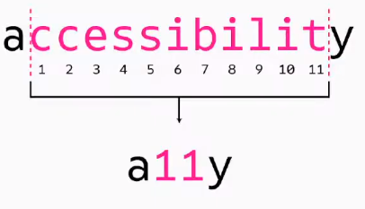

# Módulo 8. Arq. Información, UX, Wireframes, Iconos, SEO, SASS. @Media

## [Tema 1. UX - a11y - Herramientas para a11y](https://www.youtube.com/watch?v=cD-WujTzdkU)

**IxD. Diseño de interacción**
- El diseño de interacción es una disciplina que trata de armonizar la relación interactiva entre el comportamiento de las personasal utilizar productos y el comportamiento de dichos productosal ser utilizados.

**Usabilidad**
- Atributo objetivo, porque es medible y se basa en lo eficaz, eficiente y satisfactoria que sea la interfaz que estemos evaluando.

**Experiencia de usuario**
- Es un concepto importado del área del marketing, y se trata de una disciplina que intenta describir la relación entre las personas y la tecnología desde una perpestiva más global e inclusiva.

**Interfaz de usuario**
- Medio con el que el usuario se puede comunicar o intercambia información con el producto o servicio.

**Accesibilidad**
- Debe ser entendida como parte de y al mismo tiempo requisito para la usabilidad.
- Grado en el que todas las personas pueden utilizar un objeto, visitar un lugar o accededer a un servicio independientemente de sus capacidades personales.
- W3C
  - Web Accessibility Initiative
  - WCAG 2.1 - Web content Accessibility Guidelines
    - Perceptible
    - Operable
    - Comprensible
    - Robusto
  - Niveles de conformidad: A, AA, AAA
- Se puede evaluar con ACHecker.

