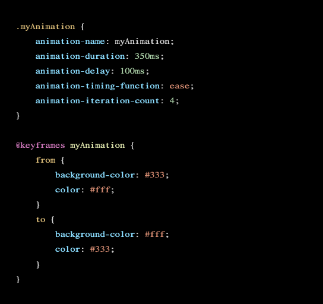

# Módulo 9. Transiciones, Animaciones CSS, SVG, Interacción Gestual...

## [Tema 1. Transiciones y animaciones en CSS](https://www.youtube.com/watch?v=lXnxZYQX-lo)

### Transición

- Se pueden entender como animaciones con un inicio y un fotograma clave.
- Propiedades
  - **Transition-duration**: La duración de la transición.
    - Hace referencia al tiempo que tarda en completarse la transición.
    - Se puede expresar en milisegundos (ms) o segundos (s).
  - **Transition-property**: La propiedad o propiedades
que queramos transicionar.
    - Para que exista una transición tiene que haber algún cambio en alguna propiedad del elemento HTML en cuestión. Suele suceder en tres casos:
      - Cambio de CSS desde Javascript con la propiedad *style*.
      - Cambio de una clase.
      - Cambio por un pseudoselector como *:focus* o *:hover*.
  - **Transition-delay**: El tiempo de retardo que pasa hasta que se dispara la transición.
    - Hace referencia al tiempo que tarda en comenzar la transición desde que se detecta el cambio de estado, ya sea hover, cambio de clase, o cambio de estilo por JS.
    - Se puede expresar en milisegundos (ms) o segundos (s).
  - **Transition-timing-function**: La curva de interpolación de la transición.
    - Hace referencia a la curva de interpolación entre dos fotogramas.
    - Las curvas de interpolación describen las aceleraciones, deceleraciones, etc.. que se pueden dar en el proceso de interpolación entre dos puntos.
    - Valores
      - **ease**: Es el valor por defecto
      - **linear**: Hace una transición totalmente linear.
      - **ease-in**
      - **ease-out**
      - **ease-in-out**
      - **step(a)**. Hace la transición por pasos. A es el número de pasos
      - **cubic-bezier(a, b, c, d)**. Definen la curva bezier de transición. Mejor hacerlo visualmente. Para ello hay un par de herramientas interesantes: Una es la curva que aparece en el Chrome DevTools cuando declaramos la propiedad transition- timing-function, otra es en la página http://easings.net/es.
- No todas las propiedades son animables.
  - **Animables**: tienen contenido numérico de cualquier tipo (relativo, absoluto, calc) => medidas, márgenes, paddings, bordes, contenido de color, opacidad, backgrounds, etc.
  - **No animables**: display none a block, por ej.
- Por ejemplo, si se aplica a un *hover* se debe poner que afecte al *background-color* tanto para cuando se pone el mouse encima como para cuando se quita, es decir, habría que modificar dos clases.

**Cheatsheet de transición para esconder**

### Animaciones
- Las animaciones pueden tener dos fotogramas clave o más.
- En lugar de definir qué propiedades animamos en la etiqueta, declaramos qué animación se hace y en la animación se declaran los fotogramas clave y las propiedades que se animan.
- En animation tenemos una doble sintaxis, la de la declaración en la regla CSS y la de la regla **@keyframes**.

**@keyframes**

- La propiedad animation tiene una sintaxis parecida a transition con algunas opciones más, en lugar de definir qué propiedades animamos en la etiqueta, declaramos qué animación se hace y en la animación se declaran los fotogramas clave y las propiedades que se animan.
- En animation tenemos una doble sintaxis, la de la declaración en la regla CSS y la de la regla @keyframes.
- En los valores se puede poner las palabras from, to, donde tendríamos dos fotogramas clave. Si no, se puede poner por porcentajes (0%, 99%, 100%)
From y to son dos atajos para decir 0% y 100%. Ambas maneras son posibles.
- En la declaración entre llaves cambiamos el CSS necesario, siempre teniendo en cuenta que estén las mismas propiedades en todos los fotogramas.

**Animation-duration, animation delay y animation-timing-function**

- Es el mismo fenómeno que en el caso de transition.
- Habla de la duración o del retardo de la animación en segundos o milisegundos, igual que en la transición.
- Y timing-function es igual también.
- 

**Animation-iteration-count**

- Define cuantas veces se va a repetir la animación.
- Acepta un número entero, o acepta la palabra clave infinite, que hace que se repita la animación una y otra vez.
- 

**Animation-direction**

- Permite ejecutar la animación en diferentes direcciones, es decir colocando los valores from, to, o numéricos de manera simétrica. Se hace con palabras clave.
  - **Normal**: Ejecuta la animación como está definida en el @keyframes.
  - **Reverse**: Ejecuta la animación al contrario de como está definida en el @keyframes.
  - **Alternate**: Ejecuta la animación en las veces impares de modo normal y las pares como reverse. Este valor tiene sentido en el momento en el que la animación tenga varias iteraciones.
  - **Alternate-reverse**: Ejecuta la animación en las veces pares de modo normal y las impares como reverse.

**Animation-fill-mode y Animation-play-state**

- Animation fill mode tiene varias opciones, pero se usan dos: forwards o backwards.
  - Forwards hace que cuando termine la animación, las propiedades modificadas se queden aplicadas.
  - Backwards hace que una vez terminada la animación se vuelva a los datos anteriores.
- Animation play state permite parar o reanudar una animación que está en ejecución.

**Animation**

- Es la propiedad resumen de todas las propiedades anteriores. Si alguna de las propiedades la dejamos en su valor por defecto se puede omitir. El orden sería:
  - name
  - duration
  - timing-function 
  - delay
  - iteration-count 
  - direction
  - fill-mode
  - play-state;

### Transform

- Transform es una propiedad de CSS3 que nos permite meter cambios en cualquier elemento como si se tratara de un elemento individual y modificarlo.
- Para usar transiciones y animaciones que tengan que ver con posicionamiento conviene usar transform en lugar de otras opciones.
- La sintaxis es un poco especial, y consta de 3 partes: **translate, rotate, scale**. Tiene más propiedades más complejas, tridimensionales, etc..

## [Tema 2. Gráficos Vectoriales en HTML y CSS](https://www.youtube.com/watch?v=1dtZtPUgFJ4)

### Recursos

- [Transition](https://www.w3schools.com/css/css3_transitions.asp)
- [Animation](https://www.w3schools.com/css/css3_animations.asp)
- [Transitio-timing-function](https://easings.net/)
- Animaciones complejas
  - GSAP
  - AnimeJS