# Desarrollo Frontend con HTML, CSS y Javascript (10.ª edición) - MiriadaX

## CSS

### :arrow_forward: Propiedades grid-column y grid-row

A veces necesitamos definir la posición y la extensión de un elemento ( ítem ) dentro del contenedor grid. 
Por ejemplo para decir que el elemento se sitúa entre la **segunda y la tercera línea vertical** y **entre la segunda y la tercera línea horizontal** tenemos que escribir estas reglas:

```css
.item{
  grid-column-start:    2;
  grid-column-end:      3;
  grid-row-start:       2;
  grid-row-end:         3;
}
```

Podemos escribir lo mismo utilizando solo dos líneas de código:
```css
.item{
    grid-column: 2 / 3;
  grid-row: 2 / 3;
}
```
En estos ejemplos los números utilizados son los nombres de las [líneas](http://w3.unpocodetodo.info/css3/grid-palabras-clave.php#lineasycarriles) verticales y horizontales definidas con grid-template-columns y/o grid-template-rows.

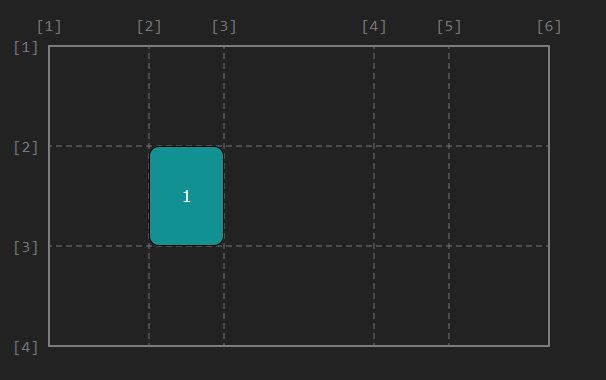

También podemos utilizar la palabra clave span ( se extiende ). Por ejemplo span 1 quiere decir que el ítem se extiende exactamente una celda, fuera el que fuera el tamaño de esta.
```css
.item{
  grid-column: 2 / span 1;
  grid-row: 2 / span 1;
}
```

### :arrow_forward: Propiedad grid-area
a propiedad grid-area es una manera abreviada para definir la posición y la extensión de un ítem dentro del contenedor grid. La sintaxis es la siguiente:
```css
.item{
	grid-area: <grid-row-start> / <grid-column-start> / < grid-row-end> / < grid-column-end>
}
```
O sea: podemos tomar esto:

```css
.item{
  grid-row-start: 2;
  grid-column-start: 2;
  grid-row-end: 3;
  grid-column-end: span 3;
  }
```

Y transformarlo en esto:
```css
.item{
  grid-area: 2 / 2 / 3 / span 3;
}
```

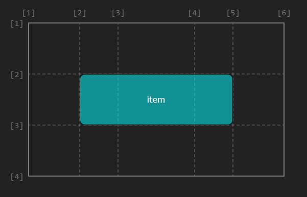

Pero la propiedad grid-area puede tener una sintaxis alternativa:
```css
.item{
  grid-area: el-nombre-de-una-area;
}
```

## Javascript

**Arguments**: el array de parámetros.
- Una función tiene un array de nombres **arguments**.
  - El array **arguments** permitiría saber su número total y acceder a todos.
```javascript
function greet(){
  return `${arguments[0]} ${arguments[1]}, how are you?`;
};

greet("Good mornin", "Peter"); // "Good morning Peter, how are you?"
greet("Hello", "Peter"); // "Hello peter, how are you?"
```

### Funciones como objetos
- Pueden asignarse a variables, propiedades, pasarse como parámetros, etc.
- Literal de función: **function(<argumentos>){<sentencias>}
  - Construye un objeto de tipo función que no tiene nombre.
    - Puede guardarse en variables o parámetros como cualquier otro valor
    - Se invoca aplicando el operador paréntesis **()**.
- El **operador paréntesis()** ejecuta el código de un objeto **function**
```javascript
const greet = function(greeting, person){
  return `${greeting} ${person}, how are you?`;
};

greet("Good mornin", "Peter");  // "Good morning Peter, how are you?"
greet("Hello", "Peter");        // "Hello peter, how are you?"
```

### Parámetros por defecto
- El valor por defecto se utiliza en la invocación, cuando ese parámetro sea **undefined**.
```javascript
const greet = function(greeting="Hi", person="my friend"){
  return `${greeting} ${person}, how are you?`;
};

greet("Hello");  // "Hello my friend, how are you?"
greet();        // "Hi my friend, how are you?"
```

### Fat arrow function (notación fleca) (ES6)
- Function se sustituye por los paréntesis y la fecha **=>**.
- **Nunca** puede modificar el contexto. El objeto **this** tiene visibilidad sintáctica siempre que se utiliza.
- **Solo** se pueden utilizan para **programación funcional**. **NO** pueden utilizarse como constructores de objeto (usar en ese caso funciones tradicionales).
```javascript
// Función tradicional
const greet = function(greeting, person){
  return `${greeting} ${person}, how are you?`;
}

// Función arrow
const greet = (greeting, person) => {
  return `${greeting} ${person}, how are you?`;
}

// Cuando solo hay un parámetro de entrada NO SON NECESARIOS los paréntesis
// Si la función SOLO retorna UNA expressión, NO ES NECESARIO la sentencia return
const square = x => x*x;
// No hay parámetro, se ponen los paréntesis.
const say_hi = () => "Hi, how are you?";
```

### Declaraciones locales de una función y ámbito
Las variables y funciones tienen visibilidad sintáctica en Javascript.
- Son visibles dentro del ámbito donde se declaran.
- Las funciones son **visibles** antes de su declaración (igual que las variables *var*).

Una función puede tener declaraciones locales de variables y funciones.
- Las declaraciones son visibiles solo dentro de la función.

Variables y funciones externas son visibles en el bloque de la función.
- Siempre que no sean tapadas con otras declaraciones locales **del mismo nombre**.
  - Una declaración **local** tapa a una **global** del mismo nombre.

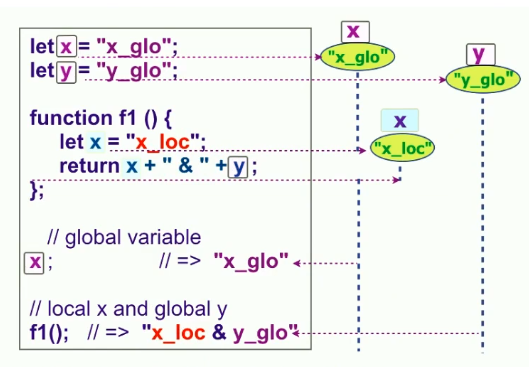

### Objetos, propiedades, métodos, DOM, eventos e interacción

**Objetos**
- Agrupación de:
  - **Variables** "especiales" denominadas **propiedades**.
  - **Funciones** "especiales" denominadas **métodos**.
- Las propiedades de los objetos forman un árbol y **pueden crear** árboles **multinivel anidados** unos objetos de otros.
- Los nombres de las propiedades y métodos **tienen la misma sintáxis que las variables**: a, _method, $1, etc.
  - Conviene que sean diferentes si pertenecen al mismo objeto (no es obligatorio).
- El **operador "." (punto)** se utiliza como propiedades y métodos 
  - Para acceder a una propuedad de un objeto
    - Consulta del valor de la propiedad **y** del objeto **obj**: obj.y
    - Asignar el valor de la propiedad **y** del objeto **obj**: obj.y = 5
  - Para incovcar un **método** de un **objeto**: document.write("Hola");
    - Invocar a un método que **NO** pertenece a un objeto causa **error**.

**Entorno global: windo, document y Web APIs**
- El objeto **windows** es el entorno global de ejecución de Javascript en el navegador.
  - Sus propiedades dan acceso a los elementos de página web, del navegador y de Javascript.
    - **This** es una referencia al **entorno de ejecución** y referencia **window** cuando el programa está en el entorno global.
- El entorno global da acceso a **APIs** del navegador:
  - DOM, Canvas, Fetch, Storage, Full Screen, Touch Events, Service Workers, WebRTC, etc.
- **Document** da acceso a la página HTML con la **API DOM**.
  - Document se referencia como **window.document, this.document o document**.

**Acceso DOM y cajas visuales**
- **Objeto DOM** 
  - Permite manipular elementos HTML desde un programa.
  - Tiene una caja visual asociada
  - **document.getElementByID("id_x")**: método que obtiene el objeto DOM del elemento HTML con atributo **id="id_x"**.

### Eventos y manejadores
- **Evento**: indica la ocurrencia de un hecho que es atendido por un *manejador* (*handler*).
- **Manejador de un evento**: bloque de código o función asociada al evento (se ejecuta al ocurrer este).
- Un programa Javascript se guía por eventos (*event driven*).
  - El script inicial debe configurar los primeros manejadores.
- Los manejadores de eventos **no hay que asociarlos** a los elementos HTML a través de atributos.
  - Hay otra forma de no usar eventos en el HTML y es utilizar **addEventListener(tipo_evento, manejador)**.
- **onload** indica cuando se ha cargado la página HTML completamente.
  - Se hace esto porque el código funciona correctamente cuando se carga todo el DOM.
- La mejor forma de no mezclar código HTML y Javascript es utilizar el evento **DOMContentLoaded** que indica cuándo finaliza la carga de la página. 
  - Es **más eficiente** que **onload**.
  - Ocurre cuando se carga la página principal pero **NO** todos los recursos, cosa que **onloda** espera a cargar dichos recursos.
- **Bubbling** (eventos delegados)
  - Permite programar los eventos de manera delegada.
  - Cuando se hace click sobre un botón, se "mida" si hay un manejador asociado al elemento HTML. Si hay, se atiende, si no, se pasa al siguiente nivel.
    - Utiliza el método **matches(..)** para filtrar el evento.

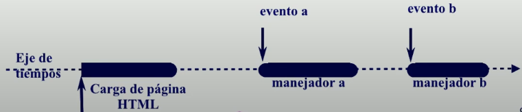
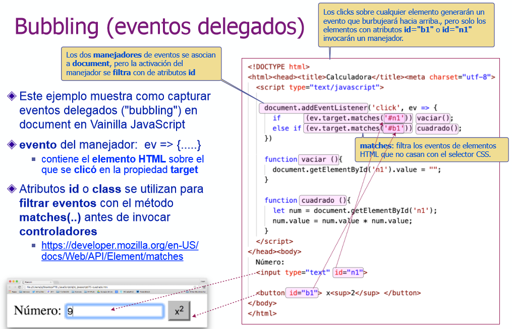

### Literal de objetos
- Siempre se tienen que inicializar.
- Recomendable asignar nombres diferentes.
- Operador punto: **objeto.propiedad**
```javascript
let pelicula = {
  titulo: "Tiburón",
  director: "Steven Spielberg",
  estreno: 1975
}

let movie = {
  "El título": "E.T.",
  director: "Steven Spielberg",
  estreno: 1982
}
movie["El título"]; // "E.T". NO SE PUEDE acceder con operador punto.
movie["director"]; // "Steven Spielberg" 

let t = "titulo";
pelicula[t]; // "Tiburón". 
pelita.t; // NO SE PUEDE HACER con la notación punto.

// Asignar o crear propiedades
pelicula.estreno = 1975; // Actualiza/asigna el valor 1975 a estreno.
pelicula.pais = "EEUU"; // Crear la propiedad ya que no existe.
delete pelicula.estreno; // Elimina la propiedad estreno
"estreno" in pelicula; // Devuelve true o fase según exista o no la propiedad.
```
### MVC (Modelo-Vista-Controlador)
- Patrón de diseño que se puede aplicar en el cliente o en el servidor.
- **Evento**: mueve la aplicación ejecutando controladores (manejadores de eventos).
  - Clicks, texto, temporizadores, etc.
    - **Router de eventos**: HTML permite definir atributos de datos **data-\***. Por ejemplo **data-my-id="2"**.
      - Los valores asignados a estos atributos estarán en propiedades (en **camel-case**) de **ev.target.dataset**. **data-id="2"** y **data-my-id="2"** generan las propiedades **id:2** y **myid:2** en **ev.target.dataset**.
- **Modelo**: conjunto de datos de la aplicación, por ejemplo, el título, director y año de estreno de una película.
- **Vista**: generador de la representación visual. Función que genera el código HTML que muetra los datos del modelo.
- **Controlador**: orquesta la respuesta a una petición del usuario.
  - Normalmente, busca los datos, los formatea con la Vista y los muestra.

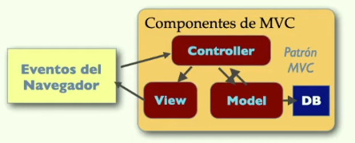

**Plantilla (o interpolación) de strings**
- Plantilla de string: delimita el texto con comillas invertidas
- Permite definir strings multi-línea.
- Permite incluir parámetros como **${<expr>}**.
- Simplifica la generación de MVC.
```javascript  
`Hola, qué tal?`
`Esto es una
multi-línea.`
`Esto es una variable ${var}`
```

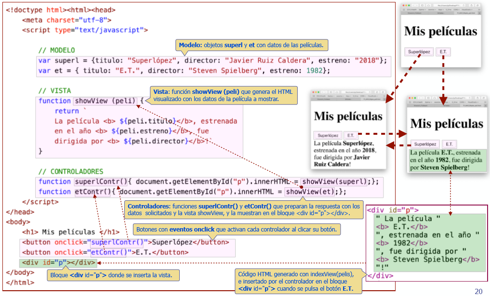
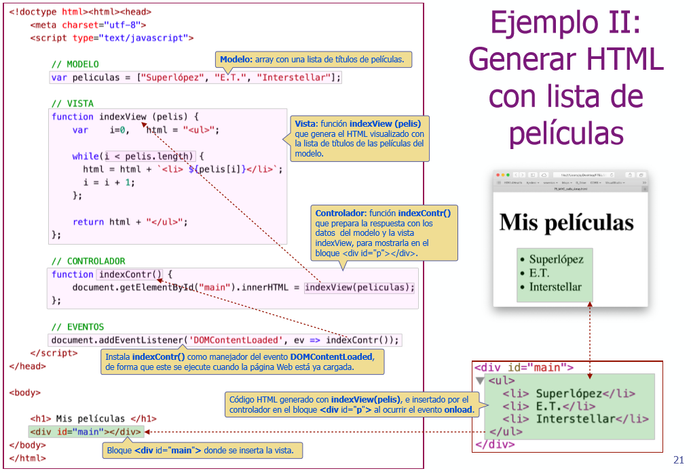
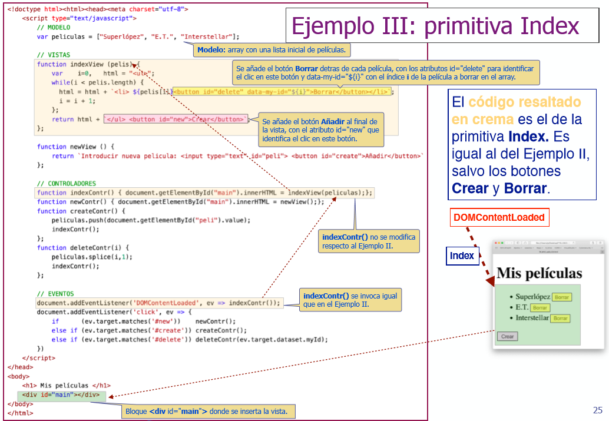

### JSON (JavaScript Object Notation)

- Serialización de datos
  - Transformación reversible de valores en un string equivalente.
  - Facilita el almacenamiento y envío de datos:
    - Almacenar datos de un fichero.
    - Enviar datos a través de una línea de comunicación.
    - Paso de parámetros de interfaces *REST*.
- JSON puede serializar: objetos, arrays, strings, números finitos, true, false y null.
  - NaN, Infinity y -Infinity se serealizan por defecto a **null**.
  - Los objetos **Date** se serializan como un string en formato ISO 8601.
    - La reconstrucción devuelve un string y **no el objeto** original.
- JSON **NO** puede serializar: funciones, RegExp, errores y undefined.
- Parse y Stringify admiten filtros para los elementos no soportados.
  - Ver doc de APIs de Javascript.
- Permite insertar espacios en blanco y retorno de línea entre los símbolos.

```javascript
// Transforma un objeto en un string JSON equivalente.
JSON.stringify(object); 

// Transforma un <string> JSON en el valor/objeto equivalente
JSON.parse(string); 

JSON.stringify(null); // 'null'
JSON.stringify("null"); // null
JSON.stringify(127); // '127'
JSON.stringify("hola"); // '"hola"'
JSON.stringify([1, 2, 3]); // '[1,2,3]'
JSON.stringify({a:27, b:"hola"}); // '{"a":27,"b":"hola"}'
```
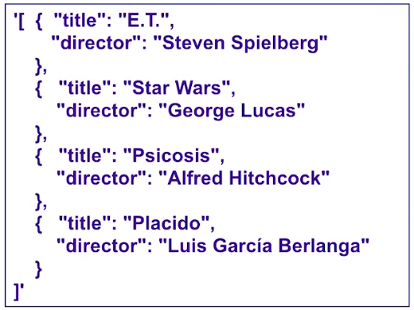

### Boolean y operadores relacionados: !, && y ||, ===, !==, etc.
- **Bolean**: true o false
- **Boolean(a)** es una función que convierte otros valores a boolean.
  - **0, -0, NaN, null, undefined, "", '', ``** se convierte a **false** y el resto a **true**.
- **!x** (operación de negación)
  - Convierte **x** a booleano y lo invierte
> A double NOT !! is sometimes used for converting a value to boolean type:
```javascript
!!"";   // false
!!4;    // true
!4;     // false
!"4";   // false
!null;  // true
!0;     // true

alert( !!"non-empty string" ); // true
alert( !!null ); // fals
// There’s a little more verbose way to do the same thing – a built-in Boolean function:
alert( Boolean("non-empty string") ); // true
alert( Boolean(null) ); // false
```
- **x && y** (operador *y* / *and*)
  - No convierte a booleano.
> In other words, AND returns the first falsy value or the last value if none were found.
```javascript
true && true;   // true
true && false;  // false
undefined && x; // undefined
o && true;      // 0
1 && "5";       // "5"

// if the first operand is truthy,
// AND returns the second operand:
alert( 1 && 0 ); // 0
alert( 1 && 5 ); // 5

// if the first operand is falsy,
// AND returns it. The second operand is ignored
alert( null && 5 ); // null
alert( 0 && "no matter what" ); // 0
```

- **x || y** (operador *o* / *or*)
  - No convierte a booleano
```javascript
true || false;    // true
false || false;   // false
undefined || 1;   // 1
13 || 1;          // 13
```

- **z ? x : y** (operador ternario condicional)
  - No convierte a booleano
```javascript
true ? 1 : 7;   // 1
3 ? 1 : 7;      // 1
false ? 1 : 7;  // 7
"" ? 1 : 7;     // 7      
```

- **Comparación e identidiad de valores**
  - <, <=, > >=
    - Se utiliza **solo** con números.

- **Identidad y no identidad**
  - Determina *true* si los dos valores son iguales y del mismo tipo.
    - Indica igualdad cuando se comparan elementos **number, boolean, strings, symbol y undefined**.

- Igualdad débidl **==, !=**. Se recomienda **no utilizarlas**.

### Almacenamiento en cliente: localStorage, sessionStorage
- Almacenar datos de forma persistente en el navegador cliente.
- Objetos Windows: **localStorage** y **sessionStorage**.
  - Solo permiten crear propiedades que guarden **string**.
- **localStorage**: permite crear contenedores de datos **permanentes**. 
  - Solo se eliminarán si se borra desde Javascript.
- **sessionStorage**: permite crear contenedores de datos asociados a la **sesión**.
  - Comienzo de sesión: apertura de navegador/pestaña.
  - Final de la sesión: cierre del navegador/pestaña.
- Se recomienda utilizar **Web Storage API**
```javascript
localStorage.setItem('s', 'hola');    // Crea un contenedor 's' y le asigna 'hola'.
localStorage.getItem('s');            // Obtiene el string guardado en 's': 'hola'.
localStorage.removeItem('s');         // Elimina el contenedor 's'.
localStorage.clear();                 // Elimina todos los contenedores.
```

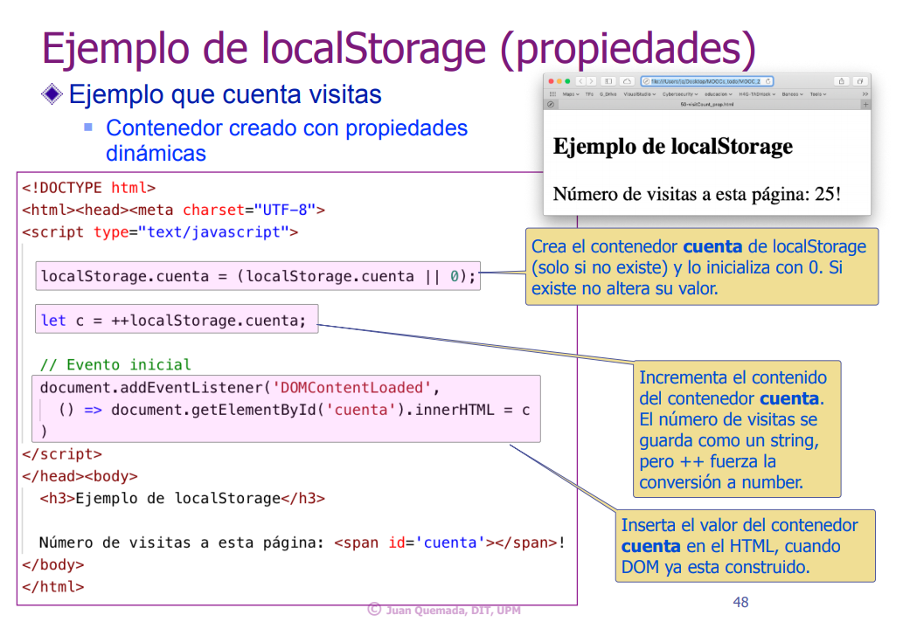
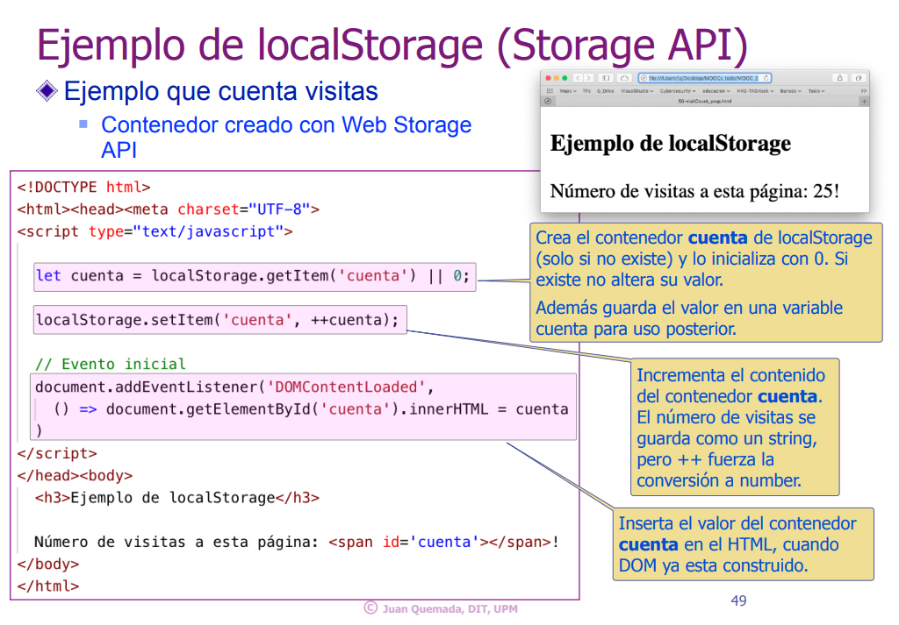

**Same Origin Policy**
- Los contenedores de localStorage y sessionStorage siguen políticas de seguridad: **same-origin-policy**.
- El origen de un script son el protocolo, dominio y puerto del servidor.
  - Un programa solo puede acceder a contenedores creados por otros programas que vinieron del **mismo origen** (mismo servidor).
    - Un programa solo puede acceder a los contenedores creados por otros programas descargados de un servidor origen.
  - Razones para usarlo:
    - Seguridad: un programa solo confía en programas del mismo servidor.
    - Modularidad: cada servidor tiene espacios de nombres diferentes.

## Bibliografía

### CSS
- [Unpocodetodo](http://w3.unpocodetodo.info/css3/grid-items.php)
  - [CSS - Líneas y carriles](http://w3.unpocodetodo.info/css3/grid-palabras-clave.php#lineasycarriles)
- [Learncssgrid](https://learncssgrid.com/)
- [Grid Cheatsheet](https://yoksel.github.io/grid-cheatsheet/)

### Javascript
- [Fundamientos Javascript ES6](https://bluuweb.github.io/javascript/fundamentos/#var-vs-let-vs-const)
- [10 Cosas de JAVASCRIPT que debes conocer para React/Vue/Angular](https://www.youtube.com/watch?v=Z4TuS0HEJP8)
- [Arrow Functions](https://deployando.net/2019/06/11/javascript-arrow-functions/)
- [Objetos](http://javascript.info/object-basics)
- [Matches](https://developer.mozilla.org/en-US/docs/Web/API/Element/matches)
- [JSON Español](http://json.org/json-es.html)
- [Mozilla JSON](https://developer.mozilla.org/es/docs/Web/JavaScript/Referencia/Objetos_globales/JSON)
- [Logical Operators](https://javascript.info/logical-operators)
- [Comparadores de igualdad e identidad](https://developer.mozilla.org/es/docs/Web/JavaScript/Equality_comparisons_and_sameness)
- [Local Storage](https://developer.mozilla.org/es/docs/Web/API/Window/localStorage)
- [Same Origin Policy](https://developer.mozilla.org/es/docs/Web/Security/Same-origin_politica)
