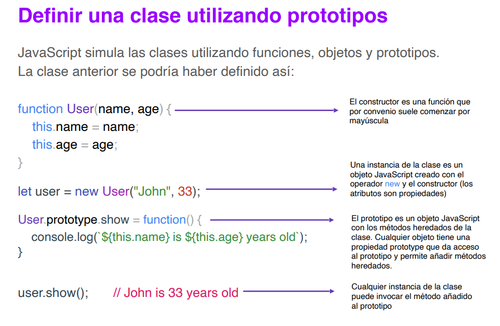
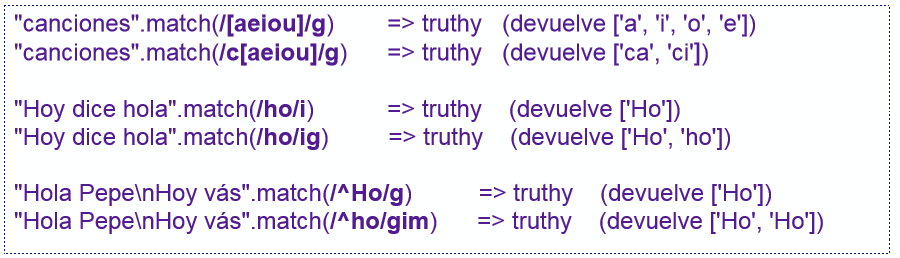
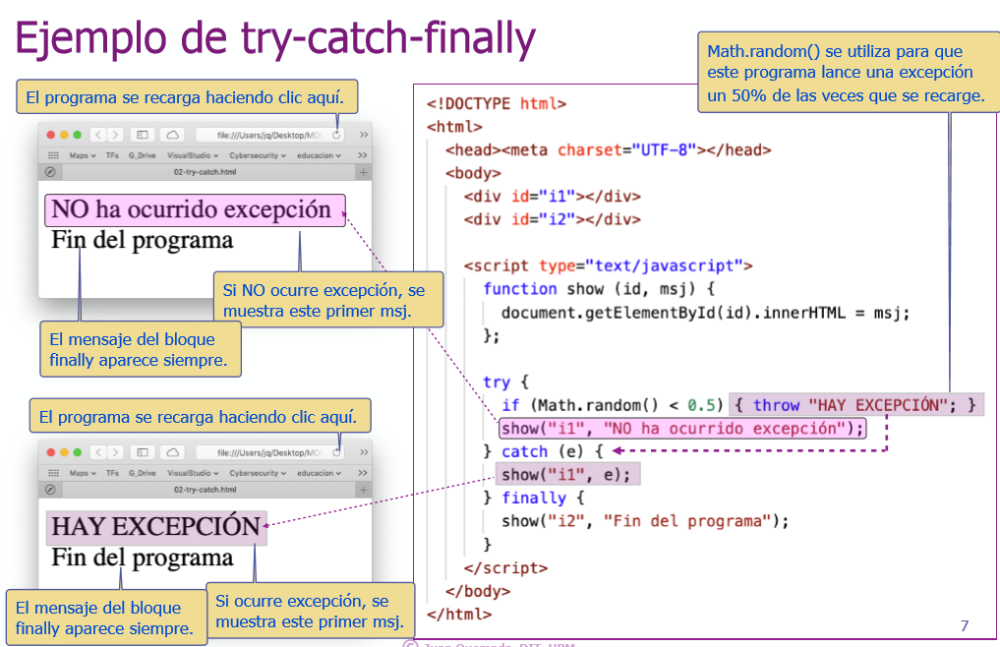
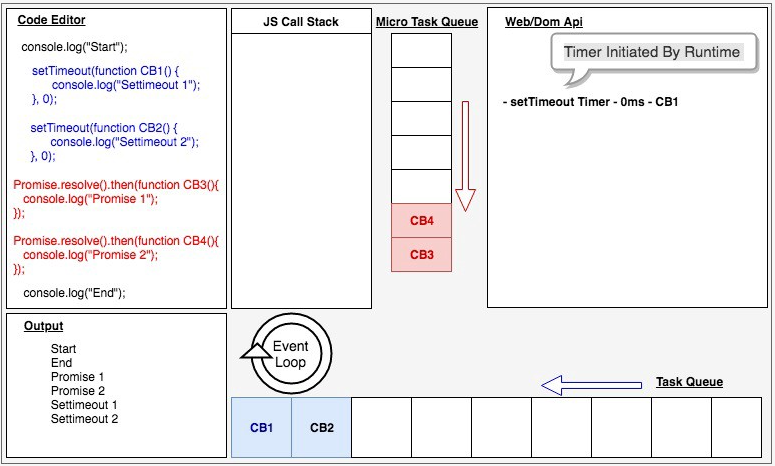
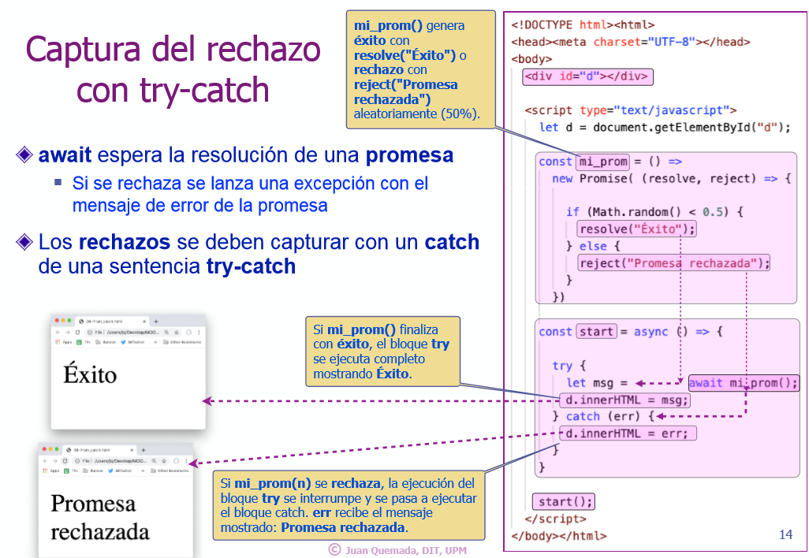

Desarrollo Frontend con HTML, CSS y Javascript (10.ª edición) - MiriadaX
===

## Módulo 1. Introducción A HTML Y CSS, Estructura, Herencia, ..

### Tema 1. HTML/CSS - Mi primera página
### Tema 2. Mi primera página con Visual Studio Code
### Tema 3. HTML/CSS - Estructura HTML
### Tema 4. HTML/CSS - Herencia CSS
### Tema 5. Publicación de ejercicios en Neocities.org

## Módulo 2. Menús, Estructura CSS, Texto, Fuentes, Imágenes Y Multimedia

### Propiedades grid-column y grid-row

- A veces necesitamos definir la posición y la extensión de un elemento ( ítem ) dentro del contenedor grid. 
- Por ejemplo para decir que el elemento se sitúa entre la **segunda y la tercera línea vertical** y **entre la segunda y la tercera línea horizontal** tenemos que escribir estas reglas:

```css
.item{
  grid-column-start:    2;
  grid-column-end:      3;
  grid-row-start:       2;
  grid-row-end:         3;
}
```

- Podemos escribir lo mismo utilizando solo dos líneas de código:
```css
.item{
    grid-column: 2 / 3;
  grid-row: 2 / 3;
}
```
- En estos ejemplos los números utilizados son los nombres de las [líneas](http://w3.unpocodetodo.info/css3/grid-palabras-clave.php#lineasycarriles) verticales y horizontales definidas con grid-template-columns y/o grid-template-rows.


- También podemos utilizar la palabra clave span ( se extiende ). Por ejemplo span 1 quiere decir que el ítem se extiende exactamente una celda, fuera el que fuera el tamaño de esta.
```css
.item{
  grid-column: 2 / span 1;
  grid-row: 2 / span 1;
}
```

### Propiedad grid-area
- La propiedad grid-area es una manera abreviada para definir la posición y la extensión de un ítem dentro del contenedor grid. La sintaxis es la siguiente:
```css
.item{
	grid-area: <grid-row-start> / <grid-column-start> / < grid-row-end> / < grid-column-end>
}
```
O sea: podemos tomar esto:

```css
.item{
  grid-row-start: 2;
  grid-column-start: 2;
  grid-row-end: 3;
  grid-column-end: span 3;
  }
```

Y transformarlo en esto:
```css
.item{
  grid-area: 2 / 2 / 3 / span 3;
}
```


Pero la propiedad grid-area puede tener una sintaxis alternativa:
```css
.item{
  grid-area: el-nombre-de-una-area;
}
```

## Módulo 3. Introducción A ES6+, Let, VS Code, DOM, Boolean, If, Bucles, ..

### Arguments: el array de parámetros.
- Una función tiene un array de nombres **arguments**.
  - El array **arguments** permitiría saber su número total y acceder a todos.
```javascript
function greet(){
  return `${arguments[0]} ${arguments[1]}, how are you?`;
};

greet("Good mornin", "Peter"); // "Good morning Peter, how are you?"
greet("Hello", "Peter"); // "Hello peter, how are you?"
```

### Funciones como objetos
- Pueden asignarse a variables, propiedades, pasarse como parámetros, etc.
- Literal de función: **function(<argumentos>){<sentencias>}
  - Construye un objeto de tipo función que no tiene nombre.
    - Puede guardarse en variables o parámetros como cualquier otro valor
    - Se invoca aplicando el operador paréntesis **()**.
- El **operador paréntesis()** ejecuta el código de un objeto **function**
```javascript
const greet = function(greeting, person){
  return `${greeting} ${person}, how are you?`;
};

greet("Good mornin", "Peter");  // "Good morning Peter, how are you?"
greet("Hello", "Peter");        // "Hello peter, how are you?"
```

### Parámetros por defecto
- El valor por defecto se utiliza en la invocación, cuando ese parámetro sea **undefined**.
```javascript
const greet = function(greeting="Hi", person="my friend"){
  return `${greeting} ${person}, how are you?`;
};

greet("Hello");  // "Hello my friend, how are you?"
greet();        // "Hi my friend, how are you?"
```

### Fat arrow function (notación fleca) (ES6)
- Function se sustituye por los paréntesis y la fecha **=>**.
- **Nunca** puede modificar el contexto. El objeto **this** tiene visibilidad sintáctica siempre que se utiliza.
- **Solo** se pueden utilizan para **programación funcional**. **NO** pueden utilizarse como constructores de objeto (usar en ese caso funciones tradicionales).
```javascript
// Función tradicional
const greet = function(greeting, person){
  return `${greeting} ${person}, how are you?`;
}

// Función arrow
const greet = (greeting, person) => {
  return `${greeting} ${person}, how are you?`;
}

// Cuando solo hay un parámetro de entrada NO SON NECESARIOS los paréntesis
// Si la función SOLO retorna UNA expressión, NO ES NECESARIO la sentencia return
const square = x => x*x;
// No hay parámetro, se ponen los paréntesis.
const say_hi = () => "Hi, how are you?";
```

### Declaraciones locales de una función y ámbito
Las variables y funciones tienen visibilidad sintáctica en Javascript.
- Son visibles dentro del ámbito donde se declaran.
- Las funciones son **visibles** antes de su declaración (igual que las variables *var*).

Una función puede tener declaraciones locales de variables y funciones.
- Las declaraciones son visibiles solo dentro de la función.

Variables y funciones externas son visibles en el bloque de la función.
- Siempre que no sean tapadas con otras declaraciones locales **del mismo nombre**.
  - Una declaración **local** tapa a una **global** del mismo nombre.


## Módulo 4. Eventos, Objetos, Arrays, MVC, JSON, Boolean Y Storage API

### Objetos, propiedades, métodos, DOM, eventos e interacción

**Objetos**
- Agrupación de:
  - **Variables** "especiales" denominadas **propiedades**.
  - **Funciones** "especiales" denominadas **métodos**.
- Las propiedades de los objetos forman un árbol y **pueden crear** árboles **multinivel anidados** unos objetos de otros.
- Los nombres de las propiedades y métodos **tienen la misma sintáxis que las variables**: a, _method, $1, etc.
  - Conviene que sean diferentes si pertenecen al mismo objeto (no es obligatorio).
- El **operador "." (punto)** se utiliza como propiedades y métodos 
  - Para acceder a una propuedad de un objeto
    - Consulta del valor de la propiedad **y** del objeto **obj**: obj.y
    - Asignar el valor de la propiedad **y** del objeto **obj**: obj.y = 5
  - Para incovcar un **método** de un **objeto**: document.write("Hola");
    - Invocar a un método que **NO** pertenece a un objeto causa **error**.

**Entorno global: windo, document y Web APIs**
- El objeto **windows** es el entorno global de ejecución de Javascript en el navegador.
  - Sus propiedades dan acceso a los elementos de página web, del navegador y de Javascript.
    - **This** es una referencia al **entorno de ejecución** y referencia **window** cuando el programa está en el entorno global.
- El entorno global da acceso a **APIs** del navegador:
  - DOM, Canvas, Fetch, Storage, Full Screen, Touch Events, Service Workers, WebRTC, etc.
- **Document** da acceso a la página HTML con la **API DOM**.
  - Document se referencia como **window.document, this.document o document**.

**Acceso DOM y cajas visuales**
- **Objeto DOM** 
  - Permite manipular elementos HTML desde un programa.
  - Tiene una caja visual asociada
  - **document.getElementByID("id_x")**: método que obtiene el objeto DOM del elemento HTML con atributo **id="id_x"**.

### Eventos y manejadores
- **Evento**: indica la ocurrencia de un hecho que es atendido por un *manejador* (*handler*).
- **Manejador de un evento**: bloque de código o función asociada al evento (se ejecuta al ocurrer este).
- Un programa Javascript se guía por eventos (*event driven*).
  - El script inicial debe configurar los primeros manejadores.
- Los manejadores de eventos **no hay que asociarlos** a los elementos HTML a través de atributos.
  - Hay otra forma de no usar eventos en el HTML y es utilizar **addEventListener(tipo_evento, manejador)**.
- **onload** indica cuando se ha cargado la página HTML completamente.
  - Se hace esto porque el código funciona correctamente cuando se carga todo el DOM.
- La mejor forma de no mezclar código HTML y Javascript es utilizar el evento **DOMContentLoaded** que indica cuándo finaliza la carga de la página. 
  - Es **más eficiente** que **onload**.
  - Ocurre cuando se carga la página principal pero **NO** todos los recursos, cosa que **onloda** espera a cargar dichos recursos.
- **Bubbling** (eventos delegados)
  - Permite programar los eventos de manera delegada.
  - Cuando se hace click sobre un botón, se "mida" si hay un manejador asociado al elemento HTML. Si hay, se atiende, si no, se pasa al siguiente nivel.
    - Utiliza el método **matches(..)** para filtrar el evento.


### Literal de objetos
- Siempre se tienen que inicializar.
- Recomendable asignar nombres diferentes.
- Operador punto: **objeto.propiedad**
```javascript
let pelicula = {
  titulo: "Tiburón",
  director: "Steven Spielberg",
  estreno: 1975
}

let movie = {
  "El título": "E.T.",
  director: "Steven Spielberg",
  estreno: 1982
}
movie["El título"]; // "E.T". NO SE PUEDE acceder con operador punto.
movie["director"]; // "Steven Spielberg" 

let t = "titulo";
pelicula[t]; // "Tiburón". 
pelita.t; // NO SE PUEDE HACER con la notación punto.

// Asignar o crear propiedades
pelicula.estreno = 1975; // Actualiza/asigna el valor 1975 a estreno.
pelicula.pais = "EEUU"; // Crear la propiedad ya que no existe.
delete pelicula.estreno; // Elimina la propiedad estreno
"estreno" in pelicula; // Devuelve true o fase según exista o no la propiedad.
```
### MVC (Modelo-Vista-Controlador)
- Patrón de diseño que se puede aplicar en el cliente o en el servidor.
- **Evento**: mueve la aplicación ejecutando controladores (manejadores de eventos).
  - Clicks, texto, temporizadores, etc.
    - **Router de eventos**: HTML permite definir atributos de datos **data-\***. Por ejemplo **data-my-id="2"**.
      - Los valores asignados a estos atributos estarán en propiedades (en **camel-case**) de **ev.target.dataset**. **data-id="2"** y **data-my-id="2"** generan las propiedades **id:2** y **myid:2** en **ev.target.dataset**.
- **Modelo**: conjunto de datos de la aplicación, por ejemplo, el título, director y año de estreno de una película.
- **Vista**: generador de la representación visual. Función que genera el código HTML que muetra los datos del modelo.
- **Controlador**: orquesta la respuesta a una petición del usuario.
  - Normalmente, busca los datos, los formatea con la Vista y los muestra.


**Plantilla (o interpolación) de strings**
- Plantilla de string: delimita el texto con comillas invertidas
- Permite definir strings multi-línea.
- Permite incluir parámetros como **${<expr>}**.
- Simplifica la generación de MVC.
```javascript  
`Hola, qué tal?`
`Esto es una
multi-línea.`
`Esto es una variable ${var}`
```


### JSON (JavaScript Object Notation)

- Serialización de datos
  - Transformación reversible de valores en un string equivalente.
  - Facilita el almacenamiento y envío de datos:
    - Almacenar datos de un fichero.
    - Enviar datos a través de una línea de comunicación.
    - Paso de parámetros de interfaces *REST*.
- JSON puede serializar: objetos, arrays, strings, números finitos, true, false y null.
  - NaN, Infinity y -Infinity se serealizan por defecto a **null**.
  - Los objetos **Date** se serializan como un string en formato ISO 8601.
    - La reconstrucción devuelve un string y **no el objeto** original.
- JSON **NO** puede serializar: funciones, RegExp, errores y undefined.
- Parse y Stringify admiten filtros para los elementos no soportados.
  - Ver doc de APIs de Javascript.
- Permite insertar espacios en blanco y retorno de línea entre los símbolos.

```javascript
// Transforma un objeto en un string JSON equivalente.
JSON.stringify(object); 

// Transforma un <string> JSON en el valor/objeto equivalente
JSON.parse(string); 

JSON.stringify(null); // 'null'
JSON.stringify("null"); // null
JSON.stringify(127); // '127'
JSON.stringify("hola"); // '"hola"'
JSON.stringify([1, 2, 3]); // '[1,2,3]'
JSON.stringify({a:27, b:"hola"}); // '{"a":27,"b":"hola"}'
```


### Boolean y operadores relacionados: !, && y ||, ===, !==, etc.
- **Bolean**: true o false
- **Boolean(a)** es una función que convierte otros valores a boolean.
  - **0, -0, NaN, null, undefined, "", '', ``** se convierte a **false** y el resto a **true**.
- **!x** (operación de negación)
  - Convierte **x** a booleano y lo invierte
> A double NOT !! is sometimes used for converting a value to boolean type:
```javascript
!!"";   // false
!!4;    // true
!4;     // false
!"4";   // false
!null;  // true
!0;     // true

alert( !!"non-empty string" ); // true
alert( !!null ); // fals
// There’s a little more verbose way to do the same thing – a built-in Boolean function:
alert( Boolean("non-empty string") ); // true
alert( Boolean(null) ); // false
```
- **x && y** (operador *y* / *and*)
  - No convierte a booleano.
> In other words, AND returns the first falsy value or the last value if none were found.
```javascript
true && true;   // true
true && false;  // false
undefined && x; // undefined
o && true;      // 0
1 && "5";       // "5"

// if the first operand is truthy,
// AND returns the second operand:
alert( 1 && 0 ); // 0
alert( 1 && 5 ); // 5

// if the first operand is falsy,
// AND returns it. The second operand is ignored
alert( null && 5 ); // null
alert( 0 && "no matter what" ); // 0
```

- **x || y** (operador *o* / *or*)
  - No convierte a booleano
```javascript
true || false;    // true
false || false;   // false
undefined || 1;   // 1
13 || 1;          // 13
```

- **z ? x : y** (operador ternario condicional)
  - No convierte a booleano
```javascript
true ? 1 : 7;   // 1
3 ? 1 : 7;      // 1
false ? 1 : 7;  // 7
"" ? 1 : 7;     // 7      
```

- **Comparación e identidiad de valores**
  - <, <=, > >=
    - Se utiliza **solo** con números.

- **Identidad y no identidad**
  - Determina *true* si los dos valores son iguales y del mismo tipo.
    - Indica igualdad cuando se comparan elementos **number, boolean, strings, symbol y undefined**.

- Igualdad débidl **==, !=**. Se recomienda **no utilizarlas**.

## Almacenamiento en cliente: localStorage, sessionStorage
- Almacenar datos de forma persistente en el navegador cliente.
- Objetos Windows: **localStorage** y **sessionStorage**.
  - Solo permiten crear propiedades que guarden **string**.
- **localStorage**: permite crear contenedores de datos **permanentes**. 
  - Solo se eliminarán si se borra desde Javascript.
- **sessionStorage**: permite crear contenedores de datos asociados a la **sesión**.
  - Comienzo de sesión: apertura de navegador/pestaña.
  - Final de la sesión: cierre del navegador/pestaña.
- Se recomienda utilizar **Web Storage API**
```javascript
localStorage.setItem('s', 'hola');    // Crea un contenedor 's' y le asigna 'hola'.
localStorage.getItem('s');            // Obtiene el string guardado en 's': 'hola'.
localStorage.removeItem('s');         // Elimina el contenedor 's'.
localStorage.clear();                 // Elimina todos los contenedores.
```


**Same Origin Policy**
- Los contenedores de localStorage y sessionStorage siguen políticas de seguridad: **same-origin-policy**.
- El origen de un script son el protocolo, dominio y puerto del servidor.
  - Un programa solo puede acceder a contenedores creados por otros programas que vinieron del **mismo origen** (mismo servidor).
    - Un programa solo puede acceder a los contenedores creados por otros programas descargados de un servidor origen.
  - Razones para usarlo:
    - Seguridad: un programa solo confía en programas del mismo servidor.
    - Modularidad: cada servidor tiene espacios de nombres diferentes.

## Módulo 5. Tipos Y Clases, Herencia, Number, Multi-Asignación, Spread/Rest

### Tipos primitivos, clases predefinidas, typeof y belongsto y métodos propios y heredados
```Tipos primitivos```
- Number
- String
- Boolean
- Sýmbol (**nuevo en ES6**)
  - Claves de hash
  - Se crean con **Symbol()**
- Undefined

```Clase Object```
- Un objeto es una agregación de propiedades y métodos.
- Se agrupan en **clases**: Object, Array, Date, Function...
  - Objeto **null**: valor especial que representa objeto nulo

```Operador typeof```
- Determina a qué tipo pertenece un elemento de JavaScript.
- Todos los objetos (de cualquier clase) devuelven **object**, savo las funciones.


```Clases predefinidas```
- Object
- Array
- Date
- Function
- RegExp
- Error
- Number, String y Boolean
- **Nuevas**: Promise, Map, Set, Typed Arrays (introducidas en ES6+)

### Jerarquías de clases, constructores y literales
- La clase Object es la raíz de la que derivan todas las clases de Javascript.
  - Las demás clases predefinidas extienden la clase Object.
    - Una clase **hereda** los **métodos** y **propiedades** de la clase que extiende y añade otros nuevos.
  - JavaScript permite definir nuevas clases, además de las predefinidas existentes.

```Clase```
- Una clase es el conjunto de objetos del mismo tipo creados con su constructor.
  - El constructor tiene el mismo nombre de la clase y crea objetos con el operador **new**: new Object(), new Date(), new Array(), new Function()...
- Algunas clases predefinidas tienen **literales**:
 ```javascript
 // Literal de objetos
 {a:3, b:"hola"};     // { } Crea un objeto vacío igual que new Object()

 // Literal de arrays
 [1, 2, 3];           // [ ] Crea un array vacío igual que new Array()

 // Literal de función
 function (x) { ... } // (x) => { ... } el literal de funciones arrow de ES6

 // Literales de Regexp
 /(hola)+$/
 ```
 - Valores de los tipos primitivos **number, string y boolean** se traducen automáticamente a objetos de **Number, String** o **Boolean** al invocar métodos en dichos valores.

```Herencia y operador instanceof```
- Todas las clases de JavaScript **derivan de la clase Object** (la extienden).
  - Los objetos de una clase pertenecen también a la clase padre de la que derivan.
- **instanceof** determina si un valor pertenece a una clase.

```javascript
({}) instanceof Object;     // true - { } es un objeto aunque esté vacío.
({}) instanceof Array;      // false - { } no es un Array, pertenece solo a Object.

[] instanceof Array;        // true - [] es un array vacío
[] instanceof Object;       // true - [] Array deriva de object

(function(){}) instanceof Function;   // true - function(){} es una función vacía
(() => {})) instanceof Function;      // true - () => {} es una función vacía definida con "=>"

""  instanceof String;            // false - "" es un tipo primitivo (no son objetos)
new String("") instanceof String; // true - new String("") pertenece a la clase String.
```

```Métodos heredados```
- **Método**: es una función invocable sobre un objeto con el operador punto ".".
  - Ejemplo: **new Date().toString()**
- Un objeto **hereda** las propiedades y métodos de su clase.
  - Ejemplo. Los objetos de la **clase Date** heredan métodos como:
    - toString(), getDay(), getFullYear(), getHours(), getMinutes(), etc.


```Métodos propios```
- Una **función** asignada a una **propiedad** de un objeto, crea un **método**.
  - Este método, denominado **propio**, solo se puede invocar el **objeto** que lo contiene
    - Este método no existe en los demás objetos de la clase y da error al invocarlo en ellos.
  - **this** es una referencia al objeto sobre el que se invoca un método.
    - **this.count** referencia a la propiedad **count** del objeto sobre el que se invoca.
      - **this** puede omitirse si no hay ambigüedad y en el ejemplo se podría utilizar **count** en vez de **this.count**.


```Number: Literales de dec., hex., oct. y bin., NaN, Infinity, mod. Math y clase Number```


### Funciones, métodos y módulos de **number**

```javascript
// Number(a) - Función de conersción a number
Number('60');     // 60
Number('1e2');    // 100
Number('1.3e2');  // 130
Number('01xx');   // NaN
Number('5e500');  // Infinity
Number('5e-500'); // 0

// Métodos
toFixed(n);         // Devuelve string equivalente con n decimales
toPrecision(n);     // Devuelve string equivalente con n digitos
toString([base]);   // convierte a string equivalente en base

// Módulo Math
sin(x)
cos(x)
asin(x)
log(x)
pow(x,y)
sqrt(x)
abs(x)
ceil(x)
floor(x)
round(x)
min(x,y,z...)
man(x,y,z...)
random()
```

```Arrays: Asignación múltiple y spread/rest (...x)```
- La **asignación múltiple** permite **asignar un array** de valores a **distintas variables**.
  - Se puede utilizar en la definición de variable o en la asignación.
    - Las **variables deben agruparse entre corchetes** y se relacionan por omisión.
  - La asignación múltiple puede utilizar valores por defecto.
- La asignación múltiple se denomina también desestructurada (*destructuring*)


```Operador spred/rest(...x)```
- Tiene semántica **spread** (esparcir) o **rest** (resto) dependiendo del contexto.
- El operador **spread (...x)** esparce los elementos de un array en otro
  - Puede usarse en un constructor de array, al invocar una función, etc.

```javascript
function sum(x, y, z) {
  return x + y + z;
}

const numbers = [1, 2, 3];

console.log(sum(...numbers));
// expected output: 6

console.log(sum.apply(null, numbers));
// expected output: 6

// -------------------
// Copiar un arreglo
var arr = [1, 2, 3];
var arr2 = [...arr]; // like arr.slice()
arr2.push(4); 

// arr2 becomes [1, 2, 3, 4]
// arr remains unaffected

// -------------------
// Concatenar arreglos

// - Antes
var arr1 = [0, 1, 2];
var arr2 = [3, 4, 5];
// Append all items from arr2 onto arr1
arr1 = arr1.concat(arr2);

// - Ahora
var arr1 = [0, 1, 2];
var arr2 = [3, 4, 5];
arr1 = [...arr1, ...arr2];
```

- El operador **rest (...x)** agrupa el **resto** de valores en un arrya.
  - Agrupa en un array el resto de los elementos asignados de una lista
    - El operador **rest** debe ir al final y agrupa los últimos elementos de la lista.

```javascript
function sum(...theArgs) {
  return theArgs.reduce((previous, current) => {
    return previous + current;
  });
}

console.log(sum(1, 2, 3));
// expected output: 6

console.log(sum(1, 2, 3, 4));
// expected output: 10

/* 
A function's last parameter can be prefixed with ... which will cause all remaining (user supplied) arguments to be placed within a "standard" JavaScript array.

Only the last parameter can be a "rest parameter".
*/

function myFun(a,  b, ...manyMoreArgs) {
  console.log("a", a)
  console.log("b", b)
  console.log("manyMoreArgs", manyMoreArgs)
}

myFun("one", "two", "three", "four", "five", "six")

// Console Output:
// a, one
// b, two
// manyMoreArgs, [three, four, five, six]
```


```Objetos ES6+: Literal, multi-asignación y spread/rest (...x)```

**El literal de objetos de ES5 agrupa variables en propiedades.**
- Agrupa las variables **a, b y c** en un objeto con las propiedades de igual nombre (frecuente en algunas aplicaciones) 
  - **var obj = {a:a, b:b, c:c}**
- El literal de objetos de ES6+ permite una sintáxis simplificada
  - **var obj = {a, b, c}**

```javascript
let a=5, c=3, d=4;
let obj_ES5 = {a:a, c:c, d:d};

let obj_ES6 = {a, c, d};
```

**Asignación múltiple o desestructuradora (*destructuring*)**
- La multi-asignación de ES6 se puede aplicar también a objetos.
  - En este caso asigna varias propiedades a variables del mismo nombre.
- Variables y valores asignados se relacionan por **nombre**.
  - **Variables asignadas**: deben agruparse con llaves

```javascript
let {a, c=1, d, e} = {a:5, e:3, f:4};
/*
a = 5
c = 1
d = undefined
e = 3
*/

let a, c, d;
({a, c=1, d} = {a=5, e=3});
/*
a = 5
c = 1
d = undefined
*/
```

**Operador rest/spread (...x) para objetos**
- **rest(...x)** de ES6+ puede combinarse con la asignación múltiple
```javascript
let {a, ...x} = {a:5, b:1, c:2};
/*
a = 5
x = {b:1, c:2}
*/

let a, x;
({a, ...x} = {a:1, b:2});
/*
a = 1
x = {b:2}
*/
```

- El operador **spread(...x)** de ES6 esparce propiedades en un objeto
```javascript
let x = {a:5, b:1};
let y = {...x, c:6, d:7};
// y = {a:5, b:1, c:6, d:7}
```

```Referencias a objetos: comparación, compartición y clonación de objetos```

**Valores y referencias**
- Los tipos JavaScript se gestionan por valor o referencia
  - Los tipos **primitivos** (number, string, boolean, undefined) se gestionan por valor.
  - Los **objetos** se gestionan por referencia (Object, Array, Function, Date, etc.)
- La **asignación** copia el contenido de la variable
  - En los tipos **primitivos** se copia el **valor**.
  - En los **objetos** se copia la **referencia**.
    - Si se quiere copiar el objeto hay que **clonarlo**.
- La **identidad** y la **igualdad** también se ven afectadas.
  - En los tipos primitivos **se comparan los valores**.
  - En los objetos **se comparan las referencias**.

**Identidiad e igualdad de objetos**
- Las referencias a objetos afectan a la identidad: **identidad de objetos** es **identidad de referencias**.
- Los objetos **no se comparan**, solo las **referencias**.
- La **identidad de objetos** indica que son el mismo objeto.
  - Dos objetos distintos con el mismo contenido **no son idénticos**
- Se recomienda **no utilizar** la **igualdad débil (==, !=) con objetos.

```javascript
let x = {}; 
let y = x;
// x e y contienen la misma referencia

let z = {}; // la referencia a z es diferente de x e y.

x === y;  // true
x === {}; // false
x === z;  // false

let x = {}; // x e y tienen la
let y = x; // misma referencia
let z = {}; // la referencia a z

// es diferente de
// las de x e y
y.t = 1; // Añade la propiedad t a y
x.t => 1 // x accede al mismo
y.t => 1 // objeto que y
z.t => undefined
```


**Parámetros por referencia**
- Parámetros de una función
  - Los tipos primitivos se pasan por valor.
  - Los objetos se pasan por referencia.
- Si la función modifica el objeto
  - Esta modificación **se verá a través de todas la referencias** del objeto.
    - Los cambios realizados **dentro** de la función, se verán **fuera** de esta.


**Clonar objetos y arrays**
- Permite obtener copias **no relacionadas** (no habrá efectos laterales entre ambas).

Copia superficial (**shallow**)
- Copia **solo** los valores **primitivos**, pero en los **objetos** copia los **punteros**.
  - Se puede realizar con **Object.assign(obj)** o con el *spread* **...obj**.

- Copia profunda (**deep**)
  - Crea una copia totalmente **independiente** y es **costosa** en recursos.
  - Se recomienda utilizar librerías como **lodash**
  - **JSON.parse(JSON.stringify(obj))** solo clona el objeto si sus componentes se soportan en JSON.

```javascript
// x e y son objetos diferentes
// con el mismo contenido

let x = {a:1, b:2};
let y = ...x;

x === y;      // flase
x.a === y.a;  // true
x.b === y.b;  // true
```

```Clases ES6 y Prototipos```
- Una clase es un modelo que define un conjunto de variables (atributos) y métodos apropiados para operar con dichos datos.
- Cada instancia que se crea de la clase es un objeto.





**Explicación ampliada de prototipos** [StackOverflow](https://es.stackoverflow.com/questions/2012/qu%c3%a9-son-los-prototipos-en-javascript-y-para-qu%c3%a9-sirven/2022#2022)

> Todos los objetos en JavaScript tienen una propiedad especial llamada prototype que es una referencia a otro objeto.

- Ejemplo:

```javascript
var miObjeto = {
  foo: 5
}
console.log(miObjeto.foo); // 5
```

- Aquí creamos un objeto llamado miObjeto, definimos una propiedad foo con el valor de 5 e imprimimos el valor de esta variable. Claramente el resultado es 5, pero **¿qué pasa cuando el objeto no tiene una variable foo?**. **JavaScript tratará de encontrarla en el prototype de este objeto**, y así sucesivamente hasta que la encuentre o llegue al final de la cadena de prototipo.
- Esta cadena de prototipo nos permite simular herencia (recordemos que en JavaScript no existe la herencia basada en clases), si queremos agregar métodos o propiedades a un objeto podemos hacerlo mediante el prototype.

```javascript
// Consideremos la siguiente función Persona:

function Persona(nombre, edad) {
  this.nombre = nombre;
  this.edad = edad;
}
```

- El prototipo de esta función es **Persona.prototype** y podemos añadirle más métodos o propiedades de las que tiene originalmente:

```javascript
Persona.prototype.toString = function() {
  return "[Persona: " + this.nombre + "]";
}

Persona.prototype.saludar = function() {
  console.log("Hola mi nombre es: " + this.nombre);
}
```

- Ahora vamos a crear un objeto p de tipo Persona con new, es este punto el prototipo de p es igual Persona.prototype:

```javascript
var p = new Persona("John", 33);
console.log(p.nombre); // propiedad del objeto
console.log(p.toString()); // propiedad no encontrada directamente en el objeto
```

- Por esta razón al invocar el método toString a pesar de que no es un método directo de p, JavaScript busca en el prototipo de p y sí lo encuentra y todo funciona correctamente.

- En cualquier momento podemos consultar el prototipo de un objeto con **Object.getPrototypeOf**, para nuestro caso particular:

```javascript
Object.getPrototypeOf(p) === Persona.prototype; // true
```

```Herencia de Clases en ES6```

**Herencia**
- Cuando una clase **X** hereda de otra clase **Y** quiere decir que la clase hija **X** dispone de los mimos métodos y atributos que la clase padre **Y**, además de los atributos y métodos nuevos de la clase **X**.
- Para implementar la herencia se utiliza la palabra clave **extends**
  - *clase X extends Y {}*
- La palabra **super** se usa para llamar funciones de la clase padre.
  - Se suele emplear cuando queremos mantener la funcionalidad del método heredado y añadir lógica adicional en la clase hija.
- Se pueden **sobrescribir métodos** para añadir funcionalidades a los ya heredados.

```javascript
// Ejemplo de herencia
class Worker extends User {    
	constructor(name, age) {        
		super(name, age);    
	}    

	isRetired() {        
		return this.age >= 65;    
	} 
}

let alice = new Worker("Alice", 67); 	// Alice is 67 years old alice.isRetired();
alice.show();							// true

let bob = new User("Bob", 18); 		// Bob is 18 years old bob.isRetired();
bob.show();							// Uncaught TypeError: bob.isRetired is not a function

// Sobrescritura de métodos
class Employee extends Worker {    
	constructor(name, age, earlyRetirement) {        
		super(name, age);
    this.earlyRetirement = earlyRetirement;
	}    

	isRetired() {
    if(this.earlyRetirement){
      return true;
    }else{
		  return super.isRetired();
    }
	} 
}

let chris = new Employee("Chris", 43, true);
chris.show();         // Chris is 43 years old.
chris.isRetired();	  // true
```

```Ejecucion de programas: Eventos, bucle, cola, manejadores, timers```

- JavaScript se ejecuta en un solo hilo (*thread*) del proceso asignado al navegador.
  - Primero se ejecuta el programa principal (scripts de la página)
    - Después se atiende a los **eventos** ejecutando sus **manejadores** (*callbacks*).
- La **cola de eventos** guarda los eventos pendientes de ejecutar.
  - Al **finalizar** el programa en ejecución, se **atiende** al **primer evento** de la cola.
    - Los **nuevos eventos** se **guardan en la cola** si se está atendiendo otro.
- JavaScript se queda en **espera pasiva** si no hay eventos que atender.
  - Los recursos del procesador **solo** se consumen cuando se atiende a eventos.
- JavaScript garantiza la **exclusión mutua** en el acceso a variables y objetos.
  - No se necesitan mecanismos de exclusión mutua (zonas críticas, monitores, etc)
- Los eventos se introducen al final de la cola de eventos y se ejecutan en serie empezando por el más antiguo.


**Bloqueo**: problema importante de la programación concurrente.
- Un programa (o parte) deja de ejecutarse esperando que otro acabe.
- Programa principal y manejadores (*callbacks*)
  - Puede bloquear al resto solo por **inanición** (*starvation*)
    - Si un manejador **no finaliza**, no se atienden más eventos y el servidor se **bloquea**.
  - Un manejador **debe finalizar lo más rápido posible**. Así se garantia una pronta atención a los siguientes eventos.


**Eventos periódicos con setInterval(...)**
- JavaScript tiene funciones para programar eventos temporizados.
  - **setTimeOut(..)**: programa un evento interno temporizado.
  - **setInterval(..)**: programa eventos internos periódicos.
    - **setInterval(manejador, periodo_en_milisegundos)**
      - **Manejador o callback**: función ejecutada al ocurrir el evento.
      - **Periodo en milisegundos**: tiempo entre eventos periódicos.


## Módulo 6. Strings, Iteradores Y Bucles, Programación Funcional Y Regexp

### Strings, códigos, UNICODE, literales, plantillas y códigos escapados.

**Código de caracteres**
- Conjunto de puntos de código dados a los símbolos de un alfabeto.
  - **ASCII**: alfabeto inglés codificado en 7 bits (128 caracteres, 95 imprimibles).
  - **ISO-8859-1,2, ... 15**: alfabeto de Europa occidental codificado en 8 bits.
  - **UNICODE**: código internalizado que contiene casi todos los alfabetos
- **Codificación**
  - Representación binaria de un código de caracteres.
  - ASCII e ISO Latin-x
  - UNICODE UTF-8: codificación binaria en 1, 2, 3 o 4 bytes, eficiente con leguas latinas.
  - UNICODE UTF-16: codificación del plano BMP (*Basic Multilingual Plane*) en 2 bytes y de otros planos en 4 bytes.
  - UNICODE UTF-32: codificación de todos los planos en 4 bytes.

**Códigos escapados**


```Iteradores y bucles: forEach, find-index, filter, map, reduce, for-in, for-of```
- Iteradores: mecanismo de programación funcional. Equivalente a los bucles.
- **Objetos iterables**: objeto compuesto cuyos componentes pueden procesarse, de uno en uno, con una función.
  - Ejemplo: un iterador puede extraer y procesar los elementos de un array, de uno en uno, desde **0** a **lenght-1**.
- **Método iterador forEach**
  - Ejecuta una función para cada elemento de un objeto iterable (ej. un array).
  - **forEach(<function>)** invoca **<function>** para cada elemento.
  - Los iterador equivalen a **bucles** en programación funcional.
    - Ejecutan la función (**parámetro**) en cada elemento de un array (u objeto iterable).


```javascript
// Elem => elemento del array accesible en la invocación en curso.
// i => índice al elemento del array.
// a => array/objeto completo sobre el que se invoca el método.
// _this => contexto.
forEach(function(elem, i, a, _this){ ... });
forEach((elem, i, a, _this) => { ... });

// For (funcional)
let n = [7, 4, 1, 23]; 
let add = 0; 
for (let i=0; i < n.length; ++i) {
  add += n[i];
} 
add;   // => 35   (7+4+2+23)

// forEach
let n = [7, 4, 1, 23]; 
let add = 0;
n.forEach(elem => add += elem);
n.forEach(elem, i => add += n[i]);
add;  // => 35   (7+4+2+23)
```

**Otros métodos iteradores de Array**
- **find((elem, i, a) => { ... } )**
  - Devuelve el primer elemento donde la función **retorna true**.
- **findIndex((elem, i, a) => { ... })**
  - Retorna el índice del primer elemento donde la función **retorna true**.
- **filter((elem, i, a) => { ... })**
  - Retorna un **nuevo array** sin los elementos para los que la función retorna false.
- **map((elem, i, a) => { ... })**
  - Retorn un nuevo array sustituyendo cada elemento por el que retorna la función.

```javascript
[7, 4, 1, 23].find(elem => elem < 3);      // => 1
[7, 4, 1, 23].findIndex(elem => elem < 3); // => 2
[7, 4, 1, 23].filter(elem => elem > 5);    // => [7, 23]
[7, 4, 1, 23].map(elem => -elem);          // => [-7, -4, -1, -23]
```

**Método reduce**
- El método reduce añade un parámetro acumulador: **acc**.
  - **acc**: variable con el valor retornado por la invocación anterior de la función.
    - Además están presentes los tres parámetros típicos de los iteradores (*element, index* y *array*).
- **reduce( (acc, element, index, array) => { ... }, acc_initialisation)**
  - Inicializa acumulador *acc* con *acc_initialisation* e itera de **0** a **array.length-1**.
    - *acc* recibe en cada iteración el valor retornado por la función en la iteración anterior.
  - Si *acc_initialisation* se omite, el valor inicial de acc es **array[0]** e itera de 1 a **array.length-1**.

```javascript
reduce( (acc, element, index, array) => { ... }, acc_initialisation);

// Example of addition of numbers with reduce 
// el acc lo usa como el acumulador de la suma (como puede pasar en un while/for cuando se suman los elementos de un array)
[7, 4, 1, 23].reduce((acc, elem) =>  acc += elem, 0);      // => 3
[1, 2, 3].reduce((acc, elem) =>  acc += elem, 1);          // => 7 (porque acc = 1)
[3, 0, 4, 0].reduce((ac, e) => ac+e, -4);                  // => 3 (porque acc = -4)

// Example which orders first the array and eliminates then duplicated numbers 
[4, 1, 4, 1, 4].sort().reduce((acc, elem, i, a)  =>  elem!==a[i-1] ? acc.concat(elem) : acc, []);   //  => [1, 4]

// sort(..) and reduce(..) are composed in series, where each one performs the following 
[4, 1, 4, 1, 4].sort();       //  => [1, 1, 4, 4, 4] 
// Comprueba si el elemento que se está procesando es el mismo que el elemento anterior (indice - 1)
[1, 1, 4, 4, 4].reduce((acumulador, elemento, indice, array)  =>  elemento !== array[indice-1] ? acumulador.concat(elemento) : acumulador, []);      //  => [1, 4]
```

**Bucles for-in y for-of**
- **for-in** permite recorrer cualquier objeto a través de los nombres del descriptor de acceso a cada elemento del objeto (índices).
  - Itera (se repite) en las propiedades de un objeto y en arrays.
    - Al iterar en **objetos**, la variable del bucle itera con el **nombre** de la propiedad (*string*).
    - Al iterar en **arrays**, la variable del bucle itera con el **índice del elemento** (*número*)
- **for-of** **solo** itera en objetos iterables, **no** en objetos.
  - La variable del bucle contiene en cada iteración **un elemento** del array (u objeto iterable).
    - En un array *for-of* comienza por el elemento de índice 0 y termina con el e length-1.

```javascript
// for-in => let i in n
let n = [7, 4, 1, 23];
let add = 0;
for (let i in n) {
  add += n[i];
}

add;      // => 35

// for-of => let elem of n
let n = [7, 4, 1, 23];
let add = 0;
for (let elem of n) {
  add += elem;
}

add;      // => 35
```

**Iterar en objetos: for-in, keys, values, entries**
- Sentencia **for-in**
  - Itera en las propiedades de un **objeto**, según el órden de creación de propiedades.
    - **p** contiene un string con el nombre de la propiedad para acceso con notación array: *obj[p]*.
  - La sentencia recorre las propiedades enumerables del objeto y de sus prototipos.
- Métodos estáticos **keys(..), values(..), entries(..)** de Object (*ES6*)
  - Devuelve un **array** con las **propiedades, valores** o **entradas** del objeto.
    - Devuelve **solo** las propiedades propias y no las de sus prototipos (conviene utilizarlas).

```javascript
Object.keys({a:3, b:2})    => ["a", "b"]           // Devuelve un array de nombres de propiedades
Object.values({a:3, b:2})  => [3, 2]               // Devuelve un array de valores
Object.entries({a:3, b:2}) => [["a",3], ["b", 2]]  // Devuelve array de pares nombre-valor

// For-in
// Se puede iterar en propiedades enumerables dentro de los prototipos (si las hubiera)
let obj = {a:7, b:4, c:1, d:23}; 
let add = 0; 
for (let p in obj) {
  add += obj[p];
} 

add    // => 35

// Object.keys
// NO itera sobre propiedads enumerables dentro de los prototipos (si las hubiera)
let obj = {a:7, b:4, c:1, d:23}; 
let add = 0; 
Object.keys(obj);     // => [ "a", "b", "c", "d"] 
Object.keys(obj).forEach(p => add += obj[p]); 
add                   // => 35
```

```RegExp I: Búsqueda de patrones```
- Mecanismo eficaz para procesar strings.
- Definen patrones que reconocen cadenas de caracteres específicas.
  - Match
- Utiliza la clase **RegExp**.
  - Constructor: RegExp("expresión-regular")
    - El string puede ser cualquier expresión regular.
  - RegExp literal: **/expresión-regular/** (utilizando la barra inclinada)

**Búsqueda de patrones**
- **"string".match(/patrón/)**: busca **/patrón/** en **"string"**.
  - Devuelve la primera ocurrencia del patrón en un array **([match])**, y si no casa, devuelve **null**.
- Algunos patrones básicos
  - **caracter**: /a/ => reconoce solo el caracter "a".
  - **secuencia**: /abc/ => reconoce la secuencia "abc".
  - **principio de string**: /^hoy/ => reconoce "hoy" al principio del string.
  - **final de string**: /hoy$/ => reconoce "hoy" al final del string.
  - **cualquier caracter**: /./ => reconoce cualquier caracter.


**Clases y rangos de caracteres**
- **Clases de caracteres**: patrón con varios caracteres alternativos entre corchetes.
  - **Ejemplo de clase de caracter**: /[aeiou]/ => cualquier vocal (minúscula)
  - **Clase negada**: /[^aeiou]/ => no debe ser vocal (minúscula)
  - **Patrón \s**: reconoce separadores => [\f\n\r\t\v\u00a0\u1680...]
- **Rango de caracteres**: patrón con un rango de caracteres ASCII alternativos.
  - **Rango de caracteres**: /[a-z]/ => rango "a-z" ASCII
  - **Patrón \w**: equivale a [a-zA-Z0-9_]
  - **Patrón \d (digit)**: equivale a [0-9]

**Controles y match()**
- **match()** admite controles:
-   **i**: insensible a mayúsculas y minúsculas.
-   **g**: devuelve array con **todos los match**.
-   **m**: multilínea, **^**, **$** representan principio y fin de línea.



```RegExp II: Repetición y alternativa```

**Operadores de repetición**
- **.** (cualquier cosa)
- **+** (una o más veces): /a+/ => casa con: "a", "aa", "aaa"
- **?** (cero o una vez): /a?/ => casa solo con: "", "a"
- **\*** (cero veces o más): /a*/ => casa con: "", "a", "aa", "aaa", "aaaa", etc.
- **{n}** (n veces): /a{2}/ => casa solo con: "aa"
- **{n,}** (n o más veces): /a{2,}/ => casa con: "aa", "aaa", "aaaa", etc.
- **{n,m}** (entre en y m veces): /a{2,3}/ => casa solo con: "aa" y "aaa"

```javascript
"tiene".match(/[aeiou]+/g);      // ["ie", "e"] Cadena no vacías de vocales.
"tiene".match(/[aeiou]?/g);      // ["", "i", "e", "", "e", ""] vocales o nada
"tiene".match(/[aeiou]*/g);      // ["", "ie", "", "e", ""] Cadena de vocales (incluyendo ""). Devuelve string vacío porque la "n" no es una vocal.
"Había un niño".match(/[a-zñáéíóú]+/ig);   // ["Había", "un", "niño] Casa con palabras en castellano: ascii extendido añadiendo ñ, á, é, í, ó, ú
```

**Repetición ansiosa o perezosa**
- Los operadores de repetición son *ansiosos* y reconocen la cadena más larga posible que casa con el patrón.
- Pueden volverse *perezosos* añadiendo "**?**" detrás.
  - Reconocerán cadenas más corta posible.

```javascript
"aaabb".match(/a+/);          // ["aaa"]
"aaabb".match(/a+?/);         // ["a"]
"ccaaccbccaa".match(/.+cc/);  // ["ccaaccbcc"]
"ccaaccbccaa".match(/.+?cc/); // ["ccaacc"]
```
**Patrones alternativas**
- Pipe ( **|** ) define dos patrones alternativos, por ejemplo:
  - **/[a-z]+/** casa con palabras escritas con caracteres ASCII.
  - **/[0-9]+/** casa con números decimales.
  - **/[a-z]+|[0-9]+/** casa con palabras o con números.

```javascript
"canciones".match(/ci|ca/);      // ["ca"]
"canciones".match(/ci|ca/g);      // ["ca", "ci"]
"1 + 2 --> tres".match(/[a-z]+|[0-9]+/g);   // ["1", "2", "tres"]
```

```RegExp III: Subpatrones y sustituciones```

**Subpatrón**
- Dentro de un patrón podemos delimitar subpatrones
  - Un subpatrón es una parte del patrón delimitada entre paréntesis.
- Por ejemplo **/(C)([aeiou])/** tiene dos subpatrones.
  - (C) es el primero
  - ([aeiou]) es el segundo
- "string".match(/patrón/) busca patrón y subpatrones en el string.
  - Devuelve array: **[match, match_subpatron_1, match_subpatron_2, ...]**

```javascript
"canciones".match(/(c)([aeiou])/);     // ["ca", "c", "a"] => C seguido de vocal, primer sub patrón "c" y segundo subpatrón "a"
"canciones".match(/(c)([aeiou])n/);    // ["can", "a"] => Patrón c + vocal + n, luego subpatrón
"canciones".match(/(..)..(..)/);       // ["cancio", "ca", "io"] => Patrón = subpatron 2 caracteres + 2 caracteres + subpatrón con 2 caracteres
```

**Sustitución de patrones**
- La clase String tiene el método **replace()** para sustituir patrones.
- La expresión: "string".replace(/patrón/, x) devuelve "string" sustituyendo el primer match de "patrón" por x.
- El patrón también puede tener controles **i, g** y **m**.
  - **i**: insensible a mayúsculay minúsculas.
  - **g**: devuelve el string con todos los "match" sustituídos.
  - **m**: multilínea, **^** y **$** representan principio y fin de línea.

```javascript
"Número: 142719".replace(/1/, "x");      // "Número: x42719"
"Número: 142719".replace(/1/g, "x");     // "Número: x427x9"
"Número: 142719".replace(/[0-9]+/, "<número>");      // "Número: <número>"
```

**Sustitución con subpatrones**
- Dentro de un patrón podemos delimitar subpatrones.
  - Un subpatrón se **delimina con paréntesis**.
- Por ejemplo **/([ae]+)([iou]\*)/** tiene dos subpatrones:
  - **$1** representa el match del primer subpatrón.
  - **$2** el match del segundo y así sucesivamente.

```javascript
"Número: 142,719".replace(/[0-9]+)(,[0-9]*)?/, "$1");      // "Numero: 142"
"Número: 142,719".replace(/[0-9]+)(,[0-9]*)?/, "0$2");     // "Numero: 0,719"
"Número: 142,719".replace(/[0-9]+)(,[0-9]*)?/, "$1.$2");   // "Numero: 142.719"
```

## Módulo 7. Excepciones, Promesas, Async/Await, HTTP, AJAX Y JQuery

### [Tema 1. Excepciones, errores y sentencias throw y try-catch-finally](https://www.youtube.com/watch?v=voTvXsB0JdY)

**Excepciones**
- Señal que interrumpe la ejecución de un programa.
- Se lanza con la sentencia **throw \<expr\>**
  - Ejemplo: **throw "Abort execution";**

**Errores** 
- Son **excepciones** donde **\<expr\>** pertenece a la clase predefinida **Error**.
- Un error se lanza también con la sentencia **throw \<expr\>**.
  - Ejemplo: **throw new Error("Execution error")**.

**Capturar excepciones: sentencia try-catch-finllay**
- Permite **capturar** excepciones o errores.
  - Captura solo las excepciones que ocurren **dentro del bloque *try***
- Cuando ocurre una excepción dentro del bloque ***try*** la ejecución **continúa en el bloque catch (exception)**. Se corta la ejecución.
  - *exception* contiene el parámetro de **throw \<param\>**
- El bloque **finally** se ejecuta siempre al final **ocurran o no excepciones**.
  - Se puede omitir.
- El intérprete JS también lanza errores.
  - Son excepciones con un objeto de la clase **Error**.
    - Hay muchas clases de **error** que extienden de **Error**.
    - Si ocurren dentro de ***try*** se pueden capturar con **catch**.

```javascript
try {
  ...
  -> throw "Exception"
  or throw new error("Error");
  ...
} catch (exception) {
  ...
}finally{
  ...
}
```



### [Tema 2. Promesas I: new Promise(..), resolve, reject, async, await](https://www.youtube.com/watch?v=uDG6lPJTA-8)

**Promesas de ES6**
- Se crean usando el constructor **Promise** y pasándole una función que recibe dos parámetros, **resolve** y **reject**, que nos permiten indicarle a esta que se resolvió o se rechazó.
  - Representa tareas que prometen retornar un valor en el futuro.
- Tiene tres estados para gestionar el proceso
  - **Pendiente**: antes de ejecutar la tarea asociada.
  - **Cumplida**: la tarea tiene éxito y retorna el valor prometido.
  - **Rechazada**: la tarea falla y retorna un código de rechazo.
  - Una promesa originalmente esta Pendiente. Cuando llamamos a resolve entonces la promesa pasa a estar Resuelta, si llamamos a reject pasa a estar Rechazada, usualmente cuando es rechazada obtenemos un error que nos va a indicar la razón del rechazo. Cuando una promesa se resuelve entonces se ejecuta la función que pasamos al método .then, si la promesa es rechazada entonces se ejecuta la función que pasamos a .catch, de esta forma podemos controlar el flujo de datos.
    - También es posible pasar una segunda función a .then la cual se ejecutaría en caso de un error en vez de ejecutar el .catch.
- **Ordenan** la ejecución de **funciones** (*callbacks*) en el tiempo.
  - Conservando la eficiencia de ejecución de los *callbacks* asíncronos.
    - Son sencillas de utilizar: separan el código normal del código de atención a errores.
- **Promesa**
  - Objeto de la clase **Promise** creado con **new Promise((resolve, reject) => <bloque>)**
    - El constructor debe recibir como **parámetro** una **función** (con los parámetros *resolve* y *reject*) que se ejecuta al crear el objeto.
  - **resolve(<data>)**
    - Función que finaliza la promesa **con éxito** al invocarse.
      - Devuelve la expresión ***<data>*** como valor de **éxito** de la promesa.
    - Si ***<data>*** es una promesa se espera a su resolución y se devuelve su valor de retorno.
  - **reject(<err>)**
    - Función que **rechaza** la promesa al invocarse.
      - Devuelve la expresión ***<err>*** como valor de **rechazo** (***<err>*** suele describir **causa del rechazo).

```javascript
// Ejemplo básico
const ticket = getFood();

ticket
	.then(food => eatFood(food))
	.catch(error => getRefund(error));

// A los 100ms invoca el callback resolve que le pasa el valor 5.
let mi_promesa = Promise ((resolve, reject) => {
  setTimeout( () => resolve(5), 100)
})

// Otro ejemplo
const promise = new Promise((resolve, reject) => {
	const number = Math.floor(Math.random() * 10);

	setTimeout(
		() => number > 5
			? resolve(number)
			: reject(new Error('Menor a 5')),
		1000
	);
});

promise
	.then(number => console.log(number))
	.catch(error => console.error(error));

// Antes de usar promesas
checkWeather('buenos aires', (error, weather) => {
	if (error) throw error;

	if (weather === 'well') {
		return checkFlights('buenos aires', (err, flights) => {
			if (err) throw err;

			buyTicket(flights[0], (e, ticket) => {
				if (e) throw e;
				console.log('ticket nº %d', ticket.number);
			});
		});
	}

	console.log('el clima es malo');
});

// Usando promesas
checkWatcher('buenos aires')
	.then(weather => {
		if (weather === 'well') {
			return checkFlights('buenos aires');
		}
		throw new Error('el clima es malo');
	})
	.then(flights => buyTicket(flights[0]))
	.then(ticket => {
		console.log('ticket nº %d', ticket.number);
	})
	.catch(error => console.error(error));
```

**Métodos útiles para crear promesas concisas**
- **Promise.resolve(<data>)**
  - Crea una promesa que finaliza con **éxito** y genera **<data>**.
    - La promesa finalizará con éxito normalmente salvo que **<data>** genere un rechazo
  - **Promise.reject(<data>)**
    - Crea una promesa que siempre se **rechaza** con **<err>**

```javascript
let p2 = Promise.resolve([7, 4, 1, 23]);  // Equivale a:
let p1 = new Promise((resolve, reject) => resolve([7, 4, 1, 23]));

let r2 = Promise.reject("Promesa rechazada"); // Equivale a:
let r1 = new Promise((resolve, reject) => reject("Promesa rechazada"));
```


**Promesas en paralelo**
- Hasta ahora solo vimos como ejecutar una función asíncrona a la vez (en serie), sin embargo es muy común que necesitemos realizar múltiples al tiempo, por ejemplo para obtener varios datos de un API. Para eso la clase Promise tiene un método estático llamado Promise.all el cual recibe un único parámetro, una lista de promesas las cuales se ejecutan simultáneamente, si alguna de estas es rechazadas entonces toda la lista lo es, pero si todas se resuelven entonces podemos obtener una lista de todas las respuestas.

```javascript
import { resolve } from 'path';

Promise.all([readFile('./archivo1.txt'), readFile('./archivo2.txt')])
	.then(data => data.map(resolve))
	.then(data => Promise.all(data.map(readFile)))
	.then(finalData => console.log(finalData))
  .catch(error => console.error(error));
```
- Lo que hacemos en el ejemplo de arriba es leer 2 archivos al tiempo, eso nos devuelve una lista (data) de contenidos, los cuales contienen la ruta para otro archivo, los convertimos entonces a una nueva lista de rutas absolutas (resolve) y usamos esas rutas para crear una nueva lista de promesas a partir de readFile. Si en algún momento ocurrió un error lo mostramos como tal en consola, si todo se resuelve bien entonces escribimos en consola la lista de contenidos de archivos.

**Carrera de promesas**
- Antes hablamos de ejecutar varias promesas en paralelo y obtener una respuesta cuando todas se completen, existe otro método que nos permite correr varias al tiempo, pero solo obtener el resultado de la primer promesa. Gracias a esto es posible mandar múltiples peticiones HTTP a un API y luego recibir una sola respuesta, la primera. Este método se llama **Promise.race**.

```javascript
import { resolve } from 'path';

Promise.race([readFile('./archivo1.txt'), readFile('./archivo2.txt'])
	.then(resolve)
	.then(readFile)
	.then(data => console.log(data)
  .catch(error => consol.error(error));
```
- Como vemos en el ejemplo otra vez leemos 2 archivos, pero esta vez solo obtenemos el contenido de 1, el que primero se termine de leer. O si alguno se completó con un error entonces entramos al catch y mostramos el error en consola.

**Info extra sobre promesas y callbacks**

¿Las promesas es solo sintaxis y funcionan igual que los callbacks?

No exactamente. Es cierto que las promesas manejan código que será ejecutado en algún futuro al igual que los callbacks. Nótese aquí la incertidumbre de cuándo será ejecutado este código. Sin embargo, la diferencia está en el mecanismo de las promesas. Pero antes, repasemos un poco para entender este mecanismo. El código síncrono inmediatamente se va a un lugar llamado el Call Stack, aquí la última función que entra al stack es el primero que se ejecuta y que sale del stack así hasta la primera que ingreso. Por otro lado, el asíncrono se va a una cola de tareas para su respectiva ejecución. Una vez que el Call Stack esté vacío, el Event Loop moverá las funciones que ya estén listas de la cola de tareas al Call Stack y luego pasarán a mostrar su resultado. Con esto en mente retomemos las promesas. Estas se dirigen a una cola de tareas diferente a las que van los callbacks. Los callbacks se van al Task Queue y las promesas al PromiseJobs o también llamado MicroTask Queue. Estos son manejadores de tareas, básicamente son los que deciden qué funciones son las que entran y las que salen. 



**Async/Await**
- Facilita el uso de promesas
  - Compratible con promesas de ES6 y puede mezclarse con ellas.
- **Async**
  - Define una función "especial" que retorna una **promesa**
    - **Async** se antepone a la definición de la funión: **async function suma(x, y) { ... }** o **async(x,y) => { ... }**
    - La promesa finaliza con éxito con **return <data>** o se rechaza con **throw <err>**.
    - **Async** no permite definir proesas que se resuelven en *callbacks*.
  - **Await <promesa>**: espera la resolución de la promesa y devuelve su resultado.
    - **let x = await promesa()** asigna a **x** el **valor de éxito** (en caso de éxito)
      - Pero si se **rechaza**, lanza una **excepción** que puede capturarse con una sentencia **try_catch**
    - **2*(await promesa())** o **await promesa()**.
  - **await <promesa>** solo se puede utilizar **dentro** de una **función async**.
    - No se puede utilizar en otros contextos.





**Info extra sobre Async/Await**
- La palabra “async” ante una función significa solamente una cosa: que la función siempre devolverá una promesa. Otros valores serán envueltos y resueltos en una promesa automáticamente.

```javascript
// Por ejemplo, esta función devuelve una promesa resuelta con el resultado de 1; 

async function f() {
  return 1;
}

f().then(alert); // 1
```

- **await**, solo trabaja dentro de funciones async y es muy interesante.
- **await** hace que JavaScript espere hasta que la promesa responda y devuelve su resultado.

```javascript
// funciona solamente dentro de funciones async
let value = await promise;

// Promesa que resuelve en 1 segundo:
async function f() {

  let promise = new Promise((resolve, reject) => {
    setTimeout(() => resolve("¡Hecho!"), 1000)
  });

  let result = await promise; // espera hasta que la promesa se resuelva (*)

  alert(result); // "¡Hecho!"
}

f();

// La ejecución de la función es pausada en la línea (*) y se reanuda cuando la promesa responde, con result volviéndose su resultado. Entonces el código arriba muestra “¡Hecho!” en un segundo.

// usando Promesas
callEndpoint('api/getidbyusername/davos')
  .then(results => callEndpoint('api/getfollowersbyid' + results.userId))
  .then(results => callEndpoint('api/someothercall'))
  .then(results => callEndpoint('api/someothercall'))
  .then(results => callEndpoint('api/someothercall'))
  .then(results => callEndpoint('api/someothercall'))

// usando Async Await
async function callEndpoints() {
  const userResults = await callEndpoint('api/getidbyusername/davos')
  const followersResults = await callEndpoint('api/getfollowersbyid' + userResults.userId)
  const someResults = await callEndpoint('api/someothercall')
  const moreResults = await callEndpoint('api/someothercall')
  const anotherResults = await callEndpoint('api/someothercall')
  const finalResults = await callEndpoint('api/someothercall')

  return finalResults
}

callEndpoints()
```

- **await** suspende la ejecución de la función hasta que se establezca la promesa, y luego la reanuda con el resultado de esta. Eso no cuesta ningún recurso de CPU, porque el motor de JavaScript puede hacer otros trabajos mientras tanto: ejecutar otros scripts, manejar eventos, etc.
  - Es simplemente una sintaxis más elegante para tener el resultado de una promesa que promise.then, es más facil de leer y de escribir.
  - Esto no detiene el engine del lenguaje, aún puede ejecutar otros scripts o eventos. Esto significa que está volviendo el código asíncrono en síncrono.
  - Async Await puede brillar en ciertos casos de uso donde necesitemos esperar y saber cuándo alguna función asíncrona se ejecute, por ejemplo en el caso de pedidos a una api, donde necesitemos que primero la página se llene de datos para que el usuario pueda interactuar.
- **No se puede** usar await en funciones regulares

```javascript
// Si tratamos de usar await en una función no async, habría un error de sintaxis:
function f() {
  let promise = Promise.resolve(1);
  let result = await promise; // Syntax error
}

// Ejemplo de función con async/await
async function showAvatar() {

  // leer nuestro JSON
  let response = await fetch('/article/promise-chaining/user.json');
  let user = await response.json();

  // leer usuario github
  let githubResponse = await fetch(`https://api.github.com/users/${user.name}`);
  let githubUser = await githubResponse.json();

  // muestra el avatar
  let img = document.createElement('img');
  img.src = githubUser.avatar_url;
  img.className = "promise-avatar-example";
  document.body.append(img);

  // espera 3 segundos
  await new Promise((resolve, reject) => setTimeout(resolve, 3000));

  img.remove();

  return githubUser;
}

showAvatar();

// No podemos usar await en el código de nivel superior. Por ejemplo, esto no funcionará:

// error de sintaxis en el nivel superior de código
let response = await fetch('/article/promise-chaining/user.json');
let user = await response.json();
Pero podemos envolverlo dentro de una función async anónima, como esto:

(async () => {
  let response = await fetch('/article/promise-chaining/user.json');
  let user = await response.json();
  ...
})();

async function f() {

  try {
    let response = await fetch('/no-user-here');
    let user = await response.json();
  } catch(err) {
    // atrapa errores tanto en fetch como en response.json
    alert(err);
  }
}

f();
```

**async/await y promise.then/catch**
- Cuando usamos **async/await**, raramente necesitamos **.then**, porque **await** maneja la espera por nosotros. Y podemos usar un **try..catch** normal en lugar de **.catch**. Esto usualmente (no siempre) es más conveniente.
- Pero en el nivel superior del código, cuando estamos fuera de cualquier función async, no estamos sintácticamente habilitados para usar await, entonces es práctica común agregar .then/catch para manejar el resultado final o errores que caigan a través, como en la línea (*) del ejemplo arriba.

**async/await funciona bien con Promise.all**
- Cuando necesitamos esperar por múltiples promesas, podemos envolverlas en un Promise.all y luego await.

```javascript
// espera por el array de resultados
let results = await Promise.all([
  fetch(url1),
  fetch(url2),
  ...
]);
```
- En caso de error, se propaga como es usual, desde la promesa que falla a Promise.all, y entonces se vuelve una excepción que podemos atrapar usando try..catch alrededor del llamado.


**Ejemplo**
- Vamos a suponer que estamos programando una carga inicial del perfil de usuario y que uno de los requerimientos sea que debamos mostrar la información básica del usuario, los cursos que ha tomado en la plataforma y la lista de sus amigos antes de que termine la carga. Estos recursos se consiguen por medio de una api, y cada recurso está en una diferente url. Y las url del api de los cursos y la de amigos vienen en la información del usuario en la propiedad links.

```
Información del usuario: api/user/1234
Cursos que ha tomado: api/user/1234/courses
Lista de sus amigos: api/user/1234/friends
Este es un ejemplo de la respuesta a un pedido a la url de la información del usuario
```

- Este es un ejemplo de la respuesta a un pedido a la url de la información del usuario

```
{
  user: {
    id: 1234,
    ...
    links: ['api/user/1234/courses', 'api/user/1234/friends']
  }
}
```

- Entonces tenemos que hacer 3 pedidos a la api y debemos tener acceso a su data antes de que termine la carga. Está claro lo que debemos usar, async await y promesas.
  - Vamos a crear una async function donde en primera instancia haremos un pedido a la url del usuario para obtener la información básica y los links que están como propiedad del usuario. 
  - Luego, usaremos una utilidad de las promesas, Promise.all. Esto hará que los pedidos se ejecuten paralelamente, por lo tanto el tiempo de espera se disminuye al no tener que ejectuar los pedidos de los links consecutivamente. Un detalle es que si alguno de estos pedidos falla en el Promise.all, todos fallarán. O todo o nada.
  - Dentro de Promise.all, iteraremos sobre los links con la función de los arreglos, **map**. Este recibe una función que tiene como argumento el elemento del arreglo en cada iteración, en este caso el link. 
  - Luego dentro de la función, aplicamos un arrow function que retorna un fetch al link en cada iteración. Esto hará que en cada iteración se retorne una promesa. 
  - Al final, tendremos un arreglo de estas promesas sin resolver. Para esto aplicamos await al Promise.all para que resuelva todas las promesas paralelamente. 
  - Una vez ya resueltos, obtendremos todas las respuestas de los pedidos si todo fue bien y lo guardamos en una variable **userResponse**. 
  - Por último aplicamos todo esto de nuevo para parsear las respuestas en data de tipo objeto para que Javascript pueda hacer operaciones sobre la data.
  - Por último obtenemos la data requerida para el usuario, y logramos hacer que la información se visualice por el usuario final.

```javascript
async function getAllUserInfo(id) {
  const user = await fetch('api/user/' + id)

  const userResponse = await Promise.all(user.links.map(link => fetch(link)))

  const userData = await Promise.all(userResponse.map(response => response.json()))

  return userData
}
```

**Resumen**: 
- Las promesas y async await resuelven la asincronía de distinta forma. Con las promesas no sabemos cuándo se va a resolver y con async await forzamos una espera en la función. No siempre se va a usar uno, el otro o ambos, por ello lo primero es entender el caso de uso y después empezamos a implementar todo lo que hemos aprendido aquí.
- El comando async antes de una función tiene dos efectos:
  - Hace que siempre devuelva una promesa.
  - Permite que sea usado await dentro de ella.
  - El comando await antes de una promesa hace que JavaScript espere hasta que la promesa responda, entonces:
    - Si es un error, la excepción es generada — lo mismo que si throw error fuera llamado en ese mismo lugar. De otro modo, devuelve el resultado.
    - Juntos proveen un excelente marco para escribir código asincrónico que es fácil de leer y escribir.
  - Con async/await raramente necesitamos escribir promise.then/catch, pero aún no deberíamos olvidar que están basados en promesas porque a veces (ej. como en el nivel superior de código) tenemos que usar esos métodos. También Promise.all es adecuado cuando esperamos por varias tareas simultáneas.

```javascript
// Ejercicio ejemplo
const insert = (msj) => document.getElementById("msj").innerHTML += msj;

const prom_A1 = () =>
    new Promise( (resolve, reject) => {
        insert('AA');
        resolve();
});

const prom_A2 = () =>
    new Promise( (resolve, reject) => {
        insert('AA');
        reject();
});

const prom_B1 = async () => {
    insert('BB');
    return;
};

const prom_B2 = async () => {
    insert('BB');
    throw "err";
};

const progr = async () => {..............};

progr ();

// Enunciado: Indicar el orden de los mensajes 'AA', 'BB', 'C', 'D' y 'E'

// Pregunta 1
const progr = async () => {
    try {
        insert("C");
        await prom_A2 ();
        insert("D");
    } catch (y) {
        insert("E");
    };
};
// Respuesta 1: C, AA, E

// Pregunta 2
const progr = async () => {
    try {
        await prom_A2 ();
        insert("D");
    } catch (y) {
        insert("E");
    };
    insert("C");
};
// Respuesta 2: AA, E, C

// Pregunta 3
const progr = async () => {
    try {
        await prom_A1 ();
        insert("D");
    } catch (y) {
        insert("E");
    };
    insert("C");
};
// Respuesta 3: AA, D, C

// Pregunta 4
const progr = async () => {
    try {
        insert("C");
        await prom_B1 ();
        insert("D");
    } catch (y) {
        insert("E");
    };
};
// Respuesta 4: C, BB, D

// Pregunta 5
const progr = async () => {
    try {
        await prom_B2 ();
        insert("D");
    } catch (y) {
        insert("E");
    };
    insert("C");
};
// Respuesta 5: BB, E, C
```

### [Tema 3. Promesas II: Orden de ejecución de instrucciones, then, catch](https://www.youtube.com/watch?v=H-XIr28X-Is)

- Recordar: las promesas **resolve(), reject()** o las funciones **async** son **funciones**.
  - Se ejecutan como cualquier functión y retornan al acabar.
- El ejecutar el código posterior a **await** o el bloque **catch** depende de la resolución de la problema.
  - Ambos se **encapsulan** como **callbacks**:
    - **resolve()** envía el **callback await** a la cola de eventos.
    - **reject()** envía el **callback catch** a la cola de eventos.

```javascript
/*
Órden de ejecución
- El programa principal se ejecuta primero.
  - Define primero las promesas prom y start.
  - A continuación invoca (ejecuta) start()
    - Muestra primero " E2"
    - Después invoca prom() que muestra " E1" y se rechaza.
      - El rechazo envía el callback catch a la cola.
  - Cuando start() retorna, se muestra " E5" y el programa principal finaliza.
- Se ejecuta el callback catch que muestra " E4"
*/

/*
3. prom() muestra el mensaje E1 y rechaza la promesa introduciendo el evento catch, que indica que se debe continuar por el bloque catch. A continuación retorna finalizando la ejecución de start()
*/
const prom = () => 
  new Promise((resolve, reject) => {
    document.write(" E1");
    reject();
  })

// 2. start() muestra el mensaje " E2" y ejecuta prom
const start = async() => {
  try {
    document.write(" E2");
    await prom();
    document.write(" E3");
  } catch (err) {
    /*
    5. Se ejecuta el callback catch asociado al evento catch del diagrama que el rechazo ha introducido en la cola (al llegarle el turno).
    El flujo de las funciones no se interrumpen, por eso catch se transforma en un callback.
    */
    document.write(" E4");
  }
}

// 1. start() es el primer código que se ejecuta
start();
// 4. Se ejecuta la sentencia uqe muestra " E5"
document.write(" E5");

// Resultado: E2 E1 E5 E4
```

**Métodos then y catch**
- **prom.then(<manejador>)**
  - **<manejador>** atiende el **éxito** de la promesa **prom**.
    - Propaga el **rechazo** al siguiente then(...) o catch(...)
- **prom.catch(<manejador>)**
  - **<manejador>** atiende el **rechazo** de la promesa **prom**
    - Propaga el éxito al siguiente then(...) o catch(...)
- then(...) y catch(...) devuelven promesas y pueden encadenarse.
- <manejador> de then(...) o catch(...)
  - **throw <msg>** rechaza la promesa
  - return <valor> resuelve la promesa con éxito
    - Si <valor> es una promesa, se espera a su resolución y se devuelve su éxito o rechazo.

```javascript
// Ejemplo equivalente al anterior
const prom = () => 
  new Promise((resolve, reject) => {
    document.write(" E1");
    reject();
  })

const start = () => {
  document.write(" E2");
  prom()
    .then( () => { 
      document.write(" E3");
      return;
    })
    .catch( () => {
      document.write(" E3");
      return;
    });
}

start();
document.write(" E5");

// Resultado: E2 E1 E5 E4

// Otro ejemplo
let display = document.getElementById("display");
const time = (ms) => new Promise (resolve => setTimeout(resolve, ms));

const response = (t0) => {
  new Promise((resolve, reject) => 
  display.addEventListener("click", () => {
    let t = new Date().getTime() - t0;
    if(t <= 1000) {
      resolve(t);
    }else{
      reject(`Too late: ${t}ms`);
    }
  })
  )
}

const start = async() => {
  await time(5000 * Math.random());
  display.innerHTML = "Click me in less than 1 second.";

  try {
    let t = await response(new Date().getTime());
    display.innerHTML = `Congratulations: ${t}ms`;
  } catch (msg) {
    display.innerHTML = msg;
  }
}

start();

// Mismo ejemplo con then y catch
let display = document.getElementById("display");

const time = ms => new Promise (resolve => setTimeout(resolve, ms));

const response = t0 => 
  new Promise((resolve, reject) => 
    display.addEventListener("click", () => {
      let t = new Date().getTime() - t0;

      if(t <= 1000) {
        resolve(t);
      }else{
        reject(`Too late: ${t}ms`);
      }
    })
  )

time(5000*Math.random());
  .then(() => display.innerHTML = "Click me in less thatn 1 second.").
  .then(() => 
    response(new Date().getTime())
    .then( (t) => 
      display.innerHTML = `Congratulations: ${t}ms`;
    )
    .catch( (msg) => display.innerHTML = msg );
  )
```


Bibliografía
===

## CSS
- [Unpocodetodo](http://w3.unpocodetodo.info/css3/grid-items.php)
  - [CSS - Líneas y carriles](http://w3.unpocodetodo.info/css3/grid-palabras-clave.php#lineasycarriles)
- [Learncssgrid](https://learncssgrid.com/)
- [Grid Cheatsheet](https://yoksel.github.io/grid-cheatsheet/)

## Javascript
- [Fundamientos Javascript ES6](https://bluuweb.github.io/javascript/fundamentos/#var-vs-let-vs-const)
- [10 Cosas de JAVASCRIPT que debes conocer para React/Vue/Angular](https://www.youtube.com/watch?v=Z4TuS0HEJP8)
- [Arrow Functions](https://deployando.net/2019/06/11/javascript-arrow-functions/)
- [Objetos](http://javascript.info/object-basics)
- [Matches](https://developer.mozilla.org/en-US/docs/Web/API/Element/matches)
- [JSON Español](http://json.org/json-es.html)
- [Mozilla JSON](https://developer.mozilla.org/es/docs/Web/JavaScript/Referencia/Objetos_globales/JSON)
- [Logical Operators](https://javascript.info/logical-operators)
- [Comparadores de igualdad e identidad](https://developer.mozilla.org/es/docs/Web/JavaScript/Equality_comparisons_and_sameness)
- [Local Storage](https://developer.mozilla.org/es/docs/Web/API/Window/localStorage)
- [Same Origin Policy](https://developer.mozilla.org/es/docs/Web/Security/Same-origin_politica)
- [Una reintroducción a JavaScript](https://developer.mozilla.org/es/docs/Web/JavaScript/Una_re-introducci%C3%B3n_a_JavaScript)
- [Grammar and types](https://developer.mozilla.org/en-US/docs/Web/JavaScript/Guide/Grammar_and_types)
- [Clases predefinidas de JavaScript](https://developer.mozilla.org/en-US/docs/Web/JavaScript/Reference/Global_Objects)
- [Destructuring assignment](https://javascript.info/destructuring-assignment)
- [Destructuring assignment 2](https://developer.mozilla.org/en-US/docs/Web/JavaScript/Reference/Operators/Destructuring_assignment)
- [Sintáxis Spread](https://developer.mozilla.org/es/docs/Web/JavaScript/Referencia/Operadores/Sintaxis_Spread)
- [Sintáxis Rest](https://developer.mozilla.org/en-US/docs/Web/JavaScript/Reference/Functions/rest_parameters)
- [setTimeOut y setInterval](https://javascript.info/settimeout-setinterval)
- [Clases ES6](https://lenguajejs.com/javascript/caracteristicas/clases-es6/)
- [Super and extends](https://medium.com/beginners-guide-to-mobile-web-development/super-and-extends-in-javascript-es6-understanding-the-tough-parts-6120372d3420)
- [Herencia de clases](https://lenguajejs.com/javascript/caracteristicas/herencia-de-clases/)
- [Inheritance in Javascript](https://medium.com/@happymishra66/inheritance-in-javascript-21d2b82ffa6f)
- [Introducción a la POO en Javascript moderno: las nuevas clases en ES6](https://www.etnassoft.com/2016/12/02/introduccion-a-la-poo-en-javascript-moderno-las-nuevas-clases-en-es6/)
- [Usando clases en Javascript](https://medium.com/@jmz12/usando-clases-en-javascript-e07f0e25c67d)
- [Super - Javascript](https://developer.mozilla.org/es/docs/Web/JavaScript/Referencia/Operadores/super)
- [forEach](https://developer.mozilla.org/en-US/docs/Web/JavaScript/Reference/Global_Objects/Array/forEach)
- [find](https://developer.mozilla.org/en-US/docs/Web/JavaScript/Reference/Global_Objects/Array/find)
- [filter](https://developer.mozilla.org/en-US/docs/Web/JavaScript/Reference/Global_Objects/Array/filter)
- [map](https://developer.mozilla.org/en-US/docs/Web/JavaScript/Reference/Global_Objects/Array/map)
- [reduce](https://developer.mozilla.org/es/docs/Web/JavaScript/Referencia/Objetos_globales/Array/reduce)
- [for-of](https://developer.mozilla.org/en-US/docs/Web/JavaScript/Reference/Statements/for...of)
- [for-in](https://developer.mozilla.org/en-US/docs/Web/JavaScript/Reference/Statements/for...in)
- [Excepción - Throw](https://developer.mozilla.org/en-US/docs/Web/JavaScript/Reference/Statements/throw)
- [TypeError](https://developer.mozilla.org/en-US/docs/Web/JavaScript/Reference/Global_Objects/TypeError)
- [Try...catch](https://developer.mozilla.org/en-US/docs/Web/JavaScript/Reference/Statements/try...catch)
- [Async](https://javascript.info/async)
- [Promise](https://developer.mozilla.org/en-US/docs/Web/JavaScript/Reference/Global_Objects/Promise)
- [Resolve](https://developer.mozilla.org/en-US/docs/Web/JavaScript/Reference/Global_Objects/Promise/resolve)
- [Reject](https://developer.mozilla.org/en-US/docs/Web/JavaScript/Reference/Global_Objects/Promise/reject)
- [Async_function](https://developer.mozilla.org/en-US/docs/Web/JavaScript/Reference/Operators/async_function)
- [Await](https://developer.mozilla.org/en-US/docs/Web/JavaScript/Reference/Operators/await)
- [Async-await](https://javascript.info/async-await)
- [*** Javascript.info => Callbacks](https://es.javascript.info/callbacks)
- [*** Javascript.info => Promesas](https://es.javascript.info/promise-basics)
- [*** Javascript.info => Async/Await](https://es.javascript.info/async-await)
- [*** Las promesas y async await lógicamente no son iguales. Y te explico el porqué.](https://platzi.com/tutoriales/1789-asincronismo-js/5063-las-promesas-y-async-await-logicamente-no-son-iguales-y-te-explico-el-porque/)
- [*** Qué son y cómo funcionan las promesas en JavaScript](https://platzi.com/blog/que-es-y-como-funcionan-las-promesas-en-javascript/)
- [*** Mezclando flujos síncronos y asíncronos usando promesas en JavaScript](https://platzi.com/blog/mezclando-flujos-sincronos-y-asincronos/)
- [JavaScript: How is callback execution strategy for promises different than DOM events callback?](https://medium.com/@jitubutwal144/javascript-how-is-callback-execution-strategy-for-promises-different-than-dom-events-callback-73c0e9e203b1)
- [Tasks, microtasks, queues and schedules](https://jakearchibald.com/2015/tasks-microtasks-queues-and-schedules/)