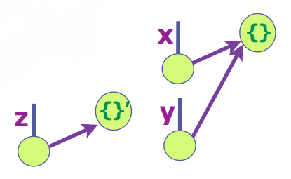
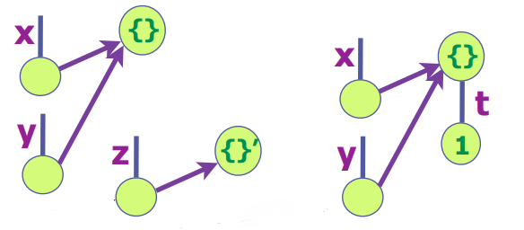

Desarrollo Frontend con HTML, CSS y Javascript (10.ª edición) - MiriadaX
===

# CSS

## :arrow_forward: Propiedades grid-column y grid-row

A veces necesitamos definir la posición y la extensión de un elemento ( ítem ) dentro del contenedor grid. 
Por ejemplo para decir que el elemento se sitúa entre la **segunda y la tercera línea vertical** y **entre la segunda y la tercera línea horizontal** tenemos que escribir estas reglas:

```css
.item{
  grid-column-start:    2;
  grid-column-end:      3;
  grid-row-start:       2;
  grid-row-end:         3;
}
```

Podemos escribir lo mismo utilizando solo dos líneas de código:
```css
.item{
    grid-column: 2 / 3;
  grid-row: 2 / 3;
}
```
En estos ejemplos los números utilizados son los nombres de las [líneas](http://w3.unpocodetodo.info/css3/grid-palabras-clave.php#lineasycarriles) verticales y horizontales definidas con grid-template-columns y/o grid-template-rows.


También podemos utilizar la palabra clave span ( se extiende ). Por ejemplo span 1 quiere decir que el ítem se extiende exactamente una celda, fuera el que fuera el tamaño de esta.
```css
.item{
  grid-column: 2 / span 1;
  grid-row: 2 / span 1;
}
```

## :arrow_forward: Propiedad grid-area
a propiedad grid-area es una manera abreviada para definir la posición y la extensión de un ítem dentro del contenedor grid. La sintaxis es la siguiente:
```css
.item{
	grid-area: <grid-row-start> / <grid-column-start> / < grid-row-end> / < grid-column-end>
}
```
O sea: podemos tomar esto:

```css
.item{
  grid-row-start: 2;
  grid-column-start: 2;
  grid-row-end: 3;
  grid-column-end: span 3;
  }
```

Y transformarlo en esto:
```css
.item{
  grid-area: 2 / 2 / 3 / span 3;
}
```


Pero la propiedad grid-area puede tener una sintaxis alternativa:
```css
.item{
  grid-area: el-nombre-de-una-area;
}
```

# Javascript

**Arguments**: el array de parámetros.
- Una función tiene un array de nombres **arguments**.
  - El array **arguments** permitiría saber su número total y acceder a todos.
```javascript
function greet(){
  return `${arguments[0]} ${arguments[1]}, how are you?`;
};

greet("Good mornin", "Peter"); // "Good morning Peter, how are you?"
greet("Hello", "Peter"); // "Hello peter, how are you?"
```

## Funciones como objetos
- Pueden asignarse a variables, propiedades, pasarse como parámetros, etc.
- Literal de función: **function(<argumentos>){<sentencias>}
  - Construye un objeto de tipo función que no tiene nombre.
    - Puede guardarse en variables o parámetros como cualquier otro valor
    - Se invoca aplicando el operador paréntesis **()**.
- El **operador paréntesis()** ejecuta el código de un objeto **function**
```javascript
const greet = function(greeting, person){
  return `${greeting} ${person}, how are you?`;
};

greet("Good mornin", "Peter");  // "Good morning Peter, how are you?"
greet("Hello", "Peter");        // "Hello peter, how are you?"
```

## Parámetros por defecto
- El valor por defecto se utiliza en la invocación, cuando ese parámetro sea **undefined**.
```javascript
const greet = function(greeting="Hi", person="my friend"){
  return `${greeting} ${person}, how are you?`;
};

greet("Hello");  // "Hello my friend, how are you?"
greet();        // "Hi my friend, how are you?"
```

## Fat arrow function (notación fleca) (ES6)
- Function se sustituye por los paréntesis y la fecha **=>**.
- **Nunca** puede modificar el contexto. El objeto **this** tiene visibilidad sintáctica siempre que se utiliza.
- **Solo** se pueden utilizan para **programación funcional**. **NO** pueden utilizarse como constructores de objeto (usar en ese caso funciones tradicionales).
```javascript
// Función tradicional
const greet = function(greeting, person){
  return `${greeting} ${person}, how are you?`;
}

// Función arrow
const greet = (greeting, person) => {
  return `${greeting} ${person}, how are you?`;
}

// Cuando solo hay un parámetro de entrada NO SON NECESARIOS los paréntesis
// Si la función SOLO retorna UNA expressión, NO ES NECESARIO la sentencia return
const square = x => x*x;
// No hay parámetro, se ponen los paréntesis.
const say_hi = () => "Hi, how are you?";
```

## Declaraciones locales de una función y ámbito
Las variables y funciones tienen visibilidad sintáctica en Javascript.
- Son visibles dentro del ámbito donde se declaran.
- Las funciones son **visibles** antes de su declaración (igual que las variables *var*).

Una función puede tener declaraciones locales de variables y funciones.
- Las declaraciones son visibiles solo dentro de la función.

Variables y funciones externas son visibles en el bloque de la función.
- Siempre que no sean tapadas con otras declaraciones locales **del mismo nombre**.
  - Una declaración **local** tapa a una **global** del mismo nombre.


## Objetos, propiedades, métodos, DOM, eventos e interacción

**Objetos**
- Agrupación de:
  - **Variables** "especiales" denominadas **propiedades**.
  - **Funciones** "especiales" denominadas **métodos**.
- Las propiedades de los objetos forman un árbol y **pueden crear** árboles **multinivel anidados** unos objetos de otros.
- Los nombres de las propiedades y métodos **tienen la misma sintáxis que las variables**: a, _method, $1, etc.
  - Conviene que sean diferentes si pertenecen al mismo objeto (no es obligatorio).
- El **operador "." (punto)** se utiliza como propiedades y métodos 
  - Para acceder a una propuedad de un objeto
    - Consulta del valor de la propiedad **y** del objeto **obj**: obj.y
    - Asignar el valor de la propiedad **y** del objeto **obj**: obj.y = 5
  - Para incovcar un **método** de un **objeto**: document.write("Hola");
    - Invocar a un método que **NO** pertenece a un objeto causa **error**.

**Entorno global: windo, document y Web APIs**
- El objeto **windows** es el entorno global de ejecución de Javascript en el navegador.
  - Sus propiedades dan acceso a los elementos de página web, del navegador y de Javascript.
    - **This** es una referencia al **entorno de ejecución** y referencia **window** cuando el programa está en el entorno global.
- El entorno global da acceso a **APIs** del navegador:
  - DOM, Canvas, Fetch, Storage, Full Screen, Touch Events, Service Workers, WebRTC, etc.
- **Document** da acceso a la página HTML con la **API DOM**.
  - Document se referencia como **window.document, this.document o document**.

**Acceso DOM y cajas visuales**
- **Objeto DOM** 
  - Permite manipular elementos HTML desde un programa.
  - Tiene una caja visual asociada
  - **document.getElementByID("id_x")**: método que obtiene el objeto DOM del elemento HTML con atributo **id="id_x"**.

## Eventos y manejadores
- **Evento**: indica la ocurrencia de un hecho que es atendido por un *manejador* (*handler*).
- **Manejador de un evento**: bloque de código o función asociada al evento (se ejecuta al ocurrer este).
- Un programa Javascript se guía por eventos (*event driven*).
  - El script inicial debe configurar los primeros manejadores.
- Los manejadores de eventos **no hay que asociarlos** a los elementos HTML a través de atributos.
  - Hay otra forma de no usar eventos en el HTML y es utilizar **addEventListener(tipo_evento, manejador)**.
- **onload** indica cuando se ha cargado la página HTML completamente.
  - Se hace esto porque el código funciona correctamente cuando se carga todo el DOM.
- La mejor forma de no mezclar código HTML y Javascript es utilizar el evento **DOMContentLoaded** que indica cuándo finaliza la carga de la página. 
  - Es **más eficiente** que **onload**.
  - Ocurre cuando se carga la página principal pero **NO** todos los recursos, cosa que **onloda** espera a cargar dichos recursos.
- **Bubbling** (eventos delegados)
  - Permite programar los eventos de manera delegada.
  - Cuando se hace click sobre un botón, se "mida" si hay un manejador asociado al elemento HTML. Si hay, se atiende, si no, se pasa al siguiente nivel.
    - Utiliza el método **matches(..)** para filtrar el evento.


## Literal de objetos
- Siempre se tienen que inicializar.
- Recomendable asignar nombres diferentes.
- Operador punto: **objeto.propiedad**
```javascript
let pelicula = {
  titulo: "Tiburón",
  director: "Steven Spielberg",
  estreno: 1975
}

let movie = {
  "El título": "E.T.",
  director: "Steven Spielberg",
  estreno: 1982
}
movie["El título"]; // "E.T". NO SE PUEDE acceder con operador punto.
movie["director"]; // "Steven Spielberg" 

let t = "titulo";
pelicula[t]; // "Tiburón". 
pelita.t; // NO SE PUEDE HACER con la notación punto.

// Asignar o crear propiedades
pelicula.estreno = 1975; // Actualiza/asigna el valor 1975 a estreno.
pelicula.pais = "EEUU"; // Crear la propiedad ya que no existe.
delete pelicula.estreno; // Elimina la propiedad estreno
"estreno" in pelicula; // Devuelve true o fase según exista o no la propiedad.
```
## MVC (Modelo-Vista-Controlador)
- Patrón de diseño que se puede aplicar en el cliente o en el servidor.
- **Evento**: mueve la aplicación ejecutando controladores (manejadores de eventos).
  - Clicks, texto, temporizadores, etc.
    - **Router de eventos**: HTML permite definir atributos de datos **data-\***. Por ejemplo **data-my-id="2"**.
      - Los valores asignados a estos atributos estarán en propiedades (en **camel-case**) de **ev.target.dataset**. **data-id="2"** y **data-my-id="2"** generan las propiedades **id:2** y **myid:2** en **ev.target.dataset**.
- **Modelo**: conjunto de datos de la aplicación, por ejemplo, el título, director y año de estreno de una película.
- **Vista**: generador de la representación visual. Función que genera el código HTML que muetra los datos del modelo.
- **Controlador**: orquesta la respuesta a una petición del usuario.
  - Normalmente, busca los datos, los formatea con la Vista y los muestra.


**Plantilla (o interpolación) de strings**
- Plantilla de string: delimita el texto con comillas invertidas
- Permite definir strings multi-línea.
- Permite incluir parámetros como **${<expr>}**.
- Simplifica la generación de MVC.
```javascript  
`Hola, qué tal?`
`Esto es una
multi-línea.`
`Esto es una variable ${var}`
```


## JSON (JavaScript Object Notation)

- Serialización de datos
  - Transformación reversible de valores en un string equivalente.
  - Facilita el almacenamiento y envío de datos:
    - Almacenar datos de un fichero.
    - Enviar datos a través de una línea de comunicación.
    - Paso de parámetros de interfaces *REST*.
- JSON puede serializar: objetos, arrays, strings, números finitos, true, false y null.
  - NaN, Infinity y -Infinity se serealizan por defecto a **null**.
  - Los objetos **Date** se serializan como un string en formato ISO 8601.
    - La reconstrucción devuelve un string y **no el objeto** original.
- JSON **NO** puede serializar: funciones, RegExp, errores y undefined.
- Parse y Stringify admiten filtros para los elementos no soportados.
  - Ver doc de APIs de Javascript.
- Permite insertar espacios en blanco y retorno de línea entre los símbolos.

```javascript
// Transforma un objeto en un string JSON equivalente.
JSON.stringify(object); 

// Transforma un <string> JSON en el valor/objeto equivalente
JSON.parse(string); 

JSON.stringify(null); // 'null'
JSON.stringify("null"); // null
JSON.stringify(127); // '127'
JSON.stringify("hola"); // '"hola"'
JSON.stringify([1, 2, 3]); // '[1,2,3]'
JSON.stringify({a:27, b:"hola"}); // '{"a":27,"b":"hola"}'
```


## Boolean y operadores relacionados: !, && y ||, ===, !==, etc.
- **Bolean**: true o false
- **Boolean(a)** es una función que convierte otros valores a boolean.
  - **0, -0, NaN, null, undefined, "", '', ``** se convierte a **false** y el resto a **true**.
- **!x** (operación de negación)
  - Convierte **x** a booleano y lo invierte
> A double NOT !! is sometimes used for converting a value to boolean type:
```javascript
!!"";   // false
!!4;    // true
!4;     // false
!"4";   // false
!null;  // true
!0;     // true

alert( !!"non-empty string" ); // true
alert( !!null ); // fals
// There’s a little more verbose way to do the same thing – a built-in Boolean function:
alert( Boolean("non-empty string") ); // true
alert( Boolean(null) ); // false
```
- **x && y** (operador *y* / *and*)
  - No convierte a booleano.
> In other words, AND returns the first falsy value or the last value if none were found.
```javascript
true && true;   // true
true && false;  // false
undefined && x; // undefined
o && true;      // 0
1 && "5";       // "5"

// if the first operand is truthy,
// AND returns the second operand:
alert( 1 && 0 ); // 0
alert( 1 && 5 ); // 5

// if the first operand is falsy,
// AND returns it. The second operand is ignored
alert( null && 5 ); // null
alert( 0 && "no matter what" ); // 0
```

- **x || y** (operador *o* / *or*)
  - No convierte a booleano
```javascript
true || false;    // true
false || false;   // false
undefined || 1;   // 1
13 || 1;          // 13
```

- **z ? x : y** (operador ternario condicional)
  - No convierte a booleano
```javascript
true ? 1 : 7;   // 1
3 ? 1 : 7;      // 1
false ? 1 : 7;  // 7
"" ? 1 : 7;     // 7      
```

- **Comparación e identidiad de valores**
  - <, <=, > >=
    - Se utiliza **solo** con números.

- **Identidad y no identidad**
  - Determina *true* si los dos valores son iguales y del mismo tipo.
    - Indica igualdad cuando se comparan elementos **number, boolean, strings, symbol y undefined**.

- Igualdad débidl **==, !=**. Se recomienda **no utilizarlas**.

## Almacenamiento en cliente: localStorage, sessionStorage
- Almacenar datos de forma persistente en el navegador cliente.
- Objetos Windows: **localStorage** y **sessionStorage**.
  - Solo permiten crear propiedades que guarden **string**.
- **localStorage**: permite crear contenedores de datos **permanentes**. 
  - Solo se eliminarán si se borra desde Javascript.
- **sessionStorage**: permite crear contenedores de datos asociados a la **sesión**.
  - Comienzo de sesión: apertura de navegador/pestaña.
  - Final de la sesión: cierre del navegador/pestaña.
- Se recomienda utilizar **Web Storage API**
```javascript
localStorage.setItem('s', 'hola');    // Crea un contenedor 's' y le asigna 'hola'.
localStorage.getItem('s');            // Obtiene el string guardado en 's': 'hola'.
localStorage.removeItem('s');         // Elimina el contenedor 's'.
localStorage.clear();                 // Elimina todos los contenedores.
```


**Same Origin Policy**
- Los contenedores de localStorage y sessionStorage siguen políticas de seguridad: **same-origin-policy**.
- El origen de un script son el protocolo, dominio y puerto del servidor.
  - Un programa solo puede acceder a contenedores creados por otros programas que vinieron del **mismo origen** (mismo servidor).
    - Un programa solo puede acceder a los contenedores creados por otros programas descargados de un servidor origen.
  - Razones para usarlo:
    - Seguridad: un programa solo confía en programas del mismo servidor.
    - Modularidad: cada servidor tiene espacios de nombres diferentes.

## Tipos primitivos, clases predefinidas, typeof y belongsto y métodos propios y heredados
```Tipos primitivos```
- Number
- String
- Boolean
- Sýmbol (**nuevo en ES6**)
  - Claves de hash
  - Se crean con **Symbol()**
- Undefined

```Clase Object```
- Un objeto es una agregación de propiedades y métodos.
- Se agrupan en **clases**: Object, Array, Date, Function...
  - Objeto **null**: valor especial que representa objeto nulo

```Operador typeof```
- Determina a qué tipo pertenece un elemento de JavaScript.
- Todos los objetos (de cualquier clase) devuelven **object**, savo las funciones.


```Clases predefinidas```
- Object
- Array
- Date
- Function
- RegExp
- Error
- Number, String y Boolean
- **Nuevas**: Promise, Map, Set, Typed Arrays (introducidas en ES6+)

### Jerarquías de clases, constructores y literales
- La clase Object es la raíz de la que derivan todas las clases de Javascript.
  - Las demás clases predefinidas extienden la clase Object.
    - Una clase **hereda** los **métodos** y **propiedades** de la clase que extiende y añade otros nuevos.
  - JavaScript permite definir nuevas clases, además de las predefinidas existentes.

```Clase```
- Una clase es el conjunto de objetos del mismo tipo creados con su constructor.
  - El constructor tiene el mismo nombre de la clase y crea objetos con el operador **new**: new Object(), new Date(), new Array(), new Function()...
- Algunas clases predefinidas tienen **literales**:
 ```javascript
 // Literal de objetos
 {a:3, b:"hola"};     // { } Crea un objeto vacío igual que new Object()

 // Literal de arrays
 [1, 2, 3];           // [ ] Crea un array vacío igual que new Array()

 // Literal de función
 function (x) { ... } // (x) => { ... } el literal de funciones arrow de ES6

 // Literales de Regexp
 /(hola)+$/
 ```
 - Valores de los tipos primitivos **number, string y boolean** se traducen automáticamente a objetos de **Number, String** o **Boolean** al invocar métodos en dichos valores.

```Herencia y operador instanceof```
- Todas las clases de JavaScript **derivan de la clase Object** (la extienden).
  - Los objetos de una clase pertenecen también a la clase padre de la que derivan.
- **instanceof** determina si un valor pertenece a una clase.

```javascript
({}) instanceof Object;     // true - { } es un objeto aunque esté vacío.
({}) instanceof Array;      // false - { } no es un Array, pertenece solo a Object.

[] instanceof Array;        // true - [] es un array vacío
[] instanceof Object;       // true - [] Array deriva de object

(function(){}) instanceof Function;   // true - function(){} es una función vacía
(() => {})) instanceof Function;      // true - () => {} es una función vacía definida con "=>"

""  instanceof String;            // false - "" es un tipo primitivo (no son objetos)
new String("") instanceof String; // true - new String("") pertenece a la clase String.
```

```Métodos heredados```
- **Método**: es una función invocable sobre un objeto con el operador punto ".".
  - Ejemplo: **new Date().toString()**
- Un objeto **hereda** las propiedades y métodos de su clase.
  - Ejemplo. Los objetos de la **clase Date** heredan métodos como:
    - toString(), getDay(), getFullYear(), getHours(), getMinutes(), etc.


```Métodos propios```
- Una **función** asignada a una **propiedad** de un objeto, crea un **método**.
  - Este método, denominado **propio**, solo se puede invocar el **objeto** que lo contiene
    - Este método no existe en los demás objetos de la clase y da error al invocarlo en ellos.
  - **this** es una referencia al objeto sobre el que se invoca un método.
    - **this.count** referencia a la propiedad **count** del objeto sobre el que se invoca.
      - **this** puede omitirse si no hay ambigüedad y en el ejemplo se podría utilizar **count** en vez de **this.count**.


```Number: Literales de dec., hex., oct. y bin., NaN, Infinity, mod. Math y clase Number```


### Funciones, métodos y módulos de **number**

```javascript
// Number(a) - Función de conersción a number
Number('60');     // 60
Number('1e2');    // 100
Number('1.3e2');  // 130
Number('01xx');   // NaN
Number('5e500');  // Infinity
Number('5e-500'); // 0

// Métodos
toFixed(n);         // Devuelve string equivalente con n decimales
toPrecision(n);     // Devuelve string equivalente con n digitos
toString([base]);   // convierte a string equivalente en base

// Módulo Math
sin(x)
cos(x)
asin(x)
log(x)
pow(x,y)
sqrt(x)
abs(x)
ceil(x)
floor(x)
round(x)
min(x,y,z...)
man(x,y,z...)
random()
```

```Arrays: Asignación múltiple y spread/rest (...x)```
- La **asignación múltiple** permite **asignar un array** de valores a **distintas variables**.
  - Se puede utilizar en la definición de variable o en la asignación.
    - Las **variables deben agruparse entre corchetes** y se relacionan por omisión.
  - La asignación múltiple puede utilizar valores por defecto.
- La asignación múltiple se denomina también desestructurada (*destructuring*)


```Operador spred/rest(...x)```
- Tiene semántica **spread** (esparcir) o **rest** (resto) dependiendo del contexto.
- El operador **spread (...x)** esparce los elementos de un array en otro
  - Puede usarse en un constructor de array, al invocar una función, etc.

```javascript
function sum(x, y, z) {
  return x + y + z;
}

const numbers = [1, 2, 3];

console.log(sum(...numbers));
// expected output: 6

console.log(sum.apply(null, numbers));
// expected output: 6

// -------------------
// Copiar un arreglo
var arr = [1, 2, 3];
var arr2 = [...arr]; // like arr.slice()
arr2.push(4); 

// arr2 becomes [1, 2, 3, 4]
// arr remains unaffected

// -------------------
// Concatenar arreglos

// - Antes
var arr1 = [0, 1, 2];
var arr2 = [3, 4, 5];
// Append all items from arr2 onto arr1
arr1 = arr1.concat(arr2);

// - Ahora
var arr1 = [0, 1, 2];
var arr2 = [3, 4, 5];
arr1 = [...arr1, ...arr2];
```

- El operador **rest (...x)** agrupa el **resto** de valores en un arrya.
  - Agrupa en un array el resto de los elementos asignados de una lista
    - El operador **rest** debe ir al final y agrupa los últimos elementos de la lista.

```javascript
function sum(...theArgs) {
  return theArgs.reduce((previous, current) => {
    return previous + current;
  });
}

console.log(sum(1, 2, 3));
// expected output: 6

console.log(sum(1, 2, 3, 4));
// expected output: 10

/* 
A function's last parameter can be prefixed with ... which will cause all remaining (user supplied) arguments to be placed within a "standard" JavaScript array.

Only the last parameter can be a "rest parameter".
*/

function myFun(a,  b, ...manyMoreArgs) {
  console.log("a", a)
  console.log("b", b)
  console.log("manyMoreArgs", manyMoreArgs)
}

myFun("one", "two", "three", "four", "five", "six")

// Console Output:
// a, one
// b, two
// manyMoreArgs, [three, four, five, six]
```


```Objetos ES6+: Literal, multi-asignación y spread/rest (...x)```

**El literal de objetos de ES5 agrupa variables en propiedades.**
- Agrupa las variables **a, b y c** en un objeto con las propiedades de igual nombre (frecuente en algunas aplicaciones) 
  - **var obj = {a:a, b:b, c:c}**
- El literal de objetos de ES6+ permite una sintáxis simplificada
  - **var obj = {a, b, c}**

```javascript
let a=5, c=3, d=4;
let obj_ES5 = {a:a, c:c, d:d};

let obj_ES6 = {a, c, d};
```

**Asignación múltiple o desestructuradora (*destructuring*)**
- La multi-asignación de ES6 se puede aplicar también a objetos.
  - En este caso asigna varias propiedades a variables del mismo nombre.
- Variables y valores asignados se relacionan por **nombre**.
  - **Variables asignadas**: deben agruparse con llaves

```javascript
let {a, c=1, d, e} = {a:5, e:3, f:4};
/*
a = 5
c = 1
d = undefined
e = 3
*/

let a, c, d;
({a, c=1, d} = {a=5, e=3});
/*
a = 5
c = 1
d = undefined
*/
```

**Operador rest/spread (...x) para objetos**
- **rest(...x)** de ES6+ puede combinarse con la asignación múltiple
```javascript
let {a, ...x} = {a:5, b:1, c:2};
/*
a = 5
x = {b:1, c:2}
*/

let a, x;
({a, ...x} = {a:1, b:2});
/*
a = 1
x = {b:2}
*/
```

- El operador **spread(...x)** de ES6 esparce propiedades en un objeto
```javascript
let x = {a:5, b:1};
let y = {...x, c:6, d:7};
// y = {a:5, b:1, c:6, d:7}
```

```Referencias a objetos: comparación, compartición y clonación de objetos```

**Valores y referencias**
- Los tipos JavaScript se gestionan por valor o referencia
  - Los tipos **primitivos** (number, string, boolean, undefined) se gestionan por valor.
  - Los **objetos** se gestionan por referencia (Object, Array, Function, Date, etc.)
- La **asignación** copia el contenido de la variable
  - En los tipos **primitivos** se copia el **valor**.
  - En los **objetos** se copia la **referencia**.
    - Si se quiere copiar el objeto hay que **clonarlo**.
- La **identidad** y la **igualdad** también se ven afectadas.
  - En los tipos primitivos **se comparan los valores**.
  - En los objetos **se comparan las referencias**.

**Identidiad e igualdad de objetos**
- Las referencias a objetos afectan a la identidad: **identidad de objetos** es **identidad de referencias**.
- Los objetos **no se comparan**, solo las **referencias**.
- La **identidad de objetos** indica que son el mismo objeto.
  - Dos objetos distintos con el mismo contenido **no son idénticos**
- Se recomienda **no utilizar** la **igualdad débil (==, !=) con objetos.

```javascript
let x = {}; 
let y = x;
// x e y contienen la misma referencia

let z = {}; // la referencia a z es diferente de x e y.

x === y;  // true
x === {}; // false
x === z;  // false

let x = {}; // x e y tienen la
let y = x; // misma referencia
let z = {}; // la referencia a z

// es diferente de
// las de x e y
y.t = 1; // Añade la propiedad t a y
x.t => 1 // x accede al mismo
y.t => 1 // objeto que y
z.t => undefined
```



**Parámetros por referencia**
- Parámetros de una función
  - Los tipos primitivos se pasan por valor.
  - Los objetos se pasan por referencia.
- Si la función modifica el objeto
  - Esta modificación **se verá a través de todas la referencias** del objeto.
    - Los cambios realizados **dentro** de la función, se verán **fuera** de esta.


**Clonar objetos y arrays**
- Permite obtener copias **no relacionadas** (no habrá efectos laterales entre ambas).

Copia superficial (**shallow**)
- Copia **solo** los valores **primitivos**, pero en los **objetos** copia los **punteros**.
  - Se puede realizar con **Object.assign(obj)** o con el *spread* **...obj**.

- Copia profunda (**deep**)
  - Crea una copia totalmente **independiente** y es **costosa** en recursos.
  - Se recomienda utilizar librerías como **lodash**
  - **JSON.parse(JSON.stringify(obj))** solo clona el objeto si sus componentes se soportan en JSON.

```javascript
// x e y son objetos diferentes
// con el mismo contenido

let x = {a:1, b:2};
let y = ...x;

x === y;      // flase
x.a === y.a;  // true
x.b === y.b;  // true
```

```Clases ES6 y Prototipos```
- Una clase es un modelo que define un conjunto de variables (atributos) y métodos apropiados para operar con dichos datos.
- Cada instancia que se crea de la clase es un objeto.


```Herencia de Clases en ES6```

**Herencia**
- Cuando una clase **X** hereda de otra clase **Y** quiere decir que la clase hija **X** dispone de los mimos métodos y atributos que la clase padre **Y**, además de los atributos y métodos nuevos de la clase **X**.
- Para implementar la herencia se utiliza la palabra clave **extends**
  - *clase X extends Y {}*
- La palabra **super** se usa para llamar funciones de la clase padre.
  - Se suele emplear cuando queremos mantener la funcionalidad del método heredado y añadir lógica adicional en la clase hija.
- Se pueden **sobrescribir métodos** para añadir funcionalidades a los ya heredados.

```javascript
// Ejemplo de herencia
class Worker extends User {    
	constructor(name, age) {        
		super(name, age);    
	}    

	isRetired() {        
		return this.age >= 65;    
	} 
}

let alice = new Worker("Alice", 67); 	// Alice is 67 years old alice.isRetired();
alice.show();							// true

let bob = new User("Bob", 18); 		// Bob is 18 years old bob.isRetired();
bob.show();							// Uncaught TypeError: bob.isRetired is not a function

// Sobrescritura de métodos
class Employee extends Worker {    
	constructor(name, age, earlyRetirement) {        
		super(name, age);
    this.earlyRetirement = earlyRetirement;
	}    

	isRetired() {
    if(this.earlyRetirement){
      return true;
    }else{
		  return super.isRetired();
    }
	} 
}

let chris = new Employee("Chris", 43, true);
chris.show();         // Chris is 43 years old.
chris.isRetired();	  // true
```

```Ejecucion de programas: Eventos, bucle, cola, manejadores, timers```

- JavaScript se ejecuta en un solo hilo (*thread*) del proceso asignado al navegador.
  - Primero se ejecuta el programa principal (scripts de la página)
    - Después se atiende a los **eventos** ejecutando sus **manejadores** (*callbacks*).
- La **cola de eventos** guarda los eventos pendientes de ejecutar.
  - Al **finalizar** el programa en ejecución, se **atiende** al **primer evento** de la cola.
    - Los **nuevos eventos** se **guardan en la cola** si se está atendiendo otro.
- JavaScript se queda en **espera pasiva** si no hay eventos que atender.
  - Los recursos del procesador **solo** se consumen cuando se atiende a eventos.
- JavaScript garantiza la **exclusión mutua** en el acceso a variables y objetos.
  - No se necesitan mecanismos de exclusión mutua (zonas críticas, monitores, etc)
- Los eventos se introducen al final de la cola de eventos y se ejecutan en serie empezando por el más antiguo.


**Bloqueo**: problema importante de la programación concurrente.
- Un programa (o parte) deja de ejecutarse esperando que otro acabe.
- Programa principal y manejadores (*callbacks*)
  - Puede bloquear al resto solo por **inanición** (*starvation*)
    - Si un manejador **no finaliza**, no se atienden más eventos y el servidor se **bloquea**.
  - Un manejador **debe finalizar lo más rápido posible**. Así se garantia una pronta atención a los siguientes eventos.


**Eventos periódicos con setInterval(...)**
- JavaScript tiene funciones para programar eventos temporizados.
  - **setTimeOut(..)**: programa un evento interno temporizado.
  - **setInterval(..)**: programa eventos internos periódicos.
    - **setInterval(manejador, periodo_en_milisegundos)**
      - **Manejador o callback**: función ejecutada al ocurrir el evento.
      - **Periodo en milisegundos**: tiempo entre eventos periódicos.


## Strings, códigos, UNICODE, literales, plantillas

```Strings, códigos, UNICODE, literales, plantillas y códigos escapados.```


# Bibliografía

## CSS
- [Unpocodetodo](http://w3.unpocodetodo.info/css3/grid-items.php)
  - [CSS - Líneas y carriles](http://w3.unpocodetodo.info/css3/grid-palabras-clave.php#lineasycarriles)
- [Learncssgrid](https://learncssgrid.com/)
- [Grid Cheatsheet](https://yoksel.github.io/grid-cheatsheet/)

## Javascript
- [Fundamientos Javascript ES6](https://bluuweb.github.io/javascript/fundamentos/#var-vs-let-vs-const)
- [10 Cosas de JAVASCRIPT que debes conocer para React/Vue/Angular](https://www.youtube.com/watch?v=Z4TuS0HEJP8)
- [Arrow Functions](https://deployando.net/2019/06/11/javascript-arrow-functions/)
- [Objetos](http://javascript.info/object-basics)
- [Matches](https://developer.mozilla.org/en-US/docs/Web/API/Element/matches)
- [JSON Español](http://json.org/json-es.html)
- [Mozilla JSON](https://developer.mozilla.org/es/docs/Web/JavaScript/Referencia/Objetos_globales/JSON)
- [Logical Operators](https://javascript.info/logical-operators)
- [Comparadores de igualdad e identidad](https://developer.mozilla.org/es/docs/Web/JavaScript/Equality_comparisons_and_sameness)
- [Local Storage](https://developer.mozilla.org/es/docs/Web/API/Window/localStorage)
- [Same Origin Policy](https://developer.mozilla.org/es/docs/Web/Security/Same-origin_politica)
- [Una reintroducción a JavaScript](https://developer.mozilla.org/es/docs/Web/JavaScript/Una_re-introducci%C3%B3n_a_JavaScript)
- [Grammar and types](https://developer.mozilla.org/en-US/docs/Web/JavaScript/Guide/Grammar_and_types)
- [Clases predefinidas de JavaScript](https://developer.mozilla.org/en-US/docs/Web/JavaScript/Reference/Global_Objects)
- [Destructuring assignment](https://javascript.info/destructuring-assignment)
- [Destructuring assignment 2](https://developer.mozilla.org/en-US/docs/Web/JavaScript/Reference/Operators/Destructuring_assignment)
- [Sintáxis Spread](https://developer.mozilla.org/es/docs/Web/JavaScript/Referencia/Operadores/Sintaxis_Spread)
- [Sintáxis Rest](https://developer.mozilla.org/en-US/docs/Web/JavaScript/Reference/Functions/rest_parameters)
- [setTimeOut y setInterval](https://javascript.info/settimeout-setinterval)
- [Clases ES6](https://lenguajejs.com/javascript/caracteristicas/clases-es6/)
- [Super and extends](https://medium.com/beginners-guide-to-mobile-web-development/super-and-extends-in-javascript-es6-understanding-the-tough-parts-6120372d3420)
- [Herencia de clases](https://lenguajejs.com/javascript/caracteristicas/herencia-de-clases/)
- [Inheritance in Javascript](https://medium.com/@happymishra66/inheritance-in-javascript-21d2b82ffa6f)
- [Introducción a la POO en Javascript moderno: las nuevas clases en ES6](https://www.etnassoft.com/2016/12/02/introduccion-a-la-poo-en-javascript-moderno-las-nuevas-clases-en-es6/)
- [Usando clases en Javascript](https://medium.com/@jmz12/usando-clases-en-javascript-e07f0e25c67d)
- [Super - Javascript](https://developer.mozilla.org/es/docs/Web/JavaScript/Referencia/Operadores/super)